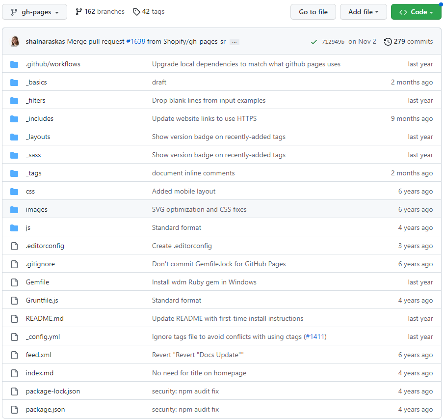
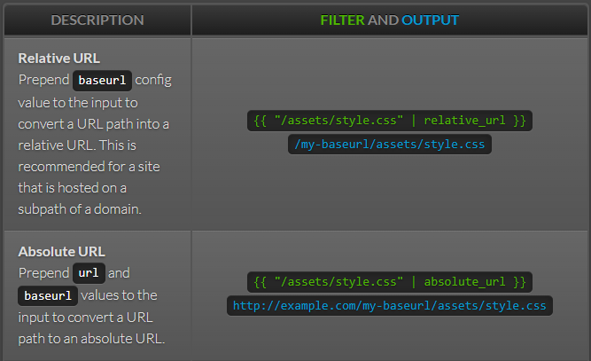

---
redirect_from:
  - /Liquid/:title
  - /Liquid/About
  - /Liquid/关于
  - /Liquid/关于Liquid
---


# About Liquid

For more information, refer to some other documents or view online official pages: [Liquid](https://shopify.github.io/liquid/).

## Liquid Project-gh_pages branch

Here we talk about its project published on Github.

Repository URL: [https://github.com/Shopify/liquid](https://github.com/Shopify/liquid)
the branch: [https://github.com/Shopify/liquid/tree/gh-pages](https://github.com/Shopify/liquid/tree/gh-pages)

*ps. I also saved a copy of the project's gh_pages under folder 'liquid_web'.*

## File Structure

It's a screenshot taken on Dec. 17th, 2022:



### _config.yml

``` yaml
title: Liquid template language
description: Liquid is a template language and accompanying rendering engine. It is built for security, so is perfect for rendering custom templates from your users.

# Build settings
baseurl:                /liquid # the subpath of your site, e.g. /blog/
url:                    https://shopify.github.io # the base hostname & protocol for your site
permalink:              pretty
exclude:
  - README.md
  - CNAME
  - Gemfile
  - Gemfile.lock
  - Gruntfile.js
  - package.json
  - package-lock.json
  - node_modules
  - vendor
  - tags
keep_files:             ["css"]

# Collections
collections:
  basics:
    output: true
  tags:
    output: true
  filters:
    output: true

# Plugins
plugins:
  - jekyll-redirect-from

# Front matter defaults
defaults:
  - scope:
      path: "" # an empty string here means all files in the project
    values:
      layout: default

```

From the codes shown above, we focus on the following points:

- What is `baseurl`?
- What is the plugin `jekyll-redirect-from`?
- What is `keep_files`?

#### What is baseurl?

Well, Liquid has filters processing urls. And one is "absolute_url" and one is "relative_url". If we write a url with filter "relative_url", the url derived will be: "baseurl+the url". Note that *baseurl* is different from *url*, which represent site url. 

*See the Jekyll page: [http://jekyllrb.com/docs/liquid/filters/](http://jekyllrb.com/docs/liquid/filters/)*



#### What is the plugin jekyll-redirect-from?

It is something focused on redirecting. Sounds great!

这是一个专门搞重定向的东东。这玩意看起来很棒！

##### Original Introduction

Give your Jekyll posts and pages multiple URLs.

When importing your posts and pages from, say, Tumblr, it's annoying and impractical to create new pages in the proper subdirectories so they, e.g. `/post/123456789/my-slug-that-is-often-incompl`, redirect to the new post URL.

Instead of dealing with maintaining those pages for redirection, let `jekyll-redirect-from` handle it for you.

[](https://github.com/jekyll/jekyll-redirect-from/actions/workflows/ci.yml)

翻译：

> 为您的杰基尔帖子和页面提供多个网址。
>
> 当从Tumblr导入你的帖子和页面时，在适当的子目录中创建新页面是烦人且不切实际的，因此它们，例如'/post/123456789/my-slug-that-is-经常-incompl'，重定向到新的帖子URL。
>
> 与其处理维护这些页面以进行重定向，不如让“jekyll-redirect-from”为您处理它。

##### More

```yaml
plugins:
  - jekyll-redirect-from
```

Before you put these in the `_config.yml`, you have to install the addon so the environment will have it.

It should be able to be installed in Github Pages. Because I found it in *Liquid*'s `gh-pages` branch. [Link](https://github.com/Shopify/liquid/tree/gh-pages)

