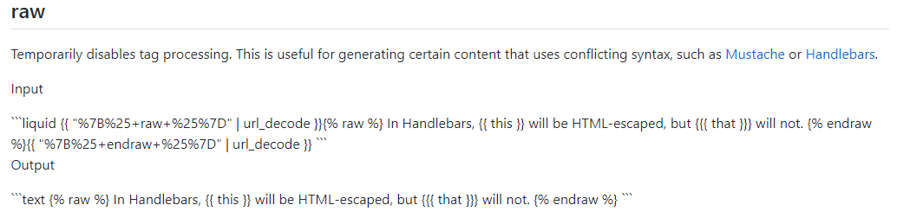
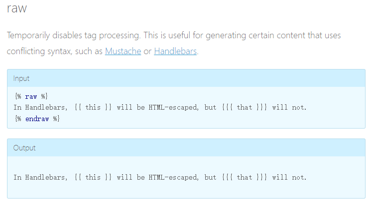
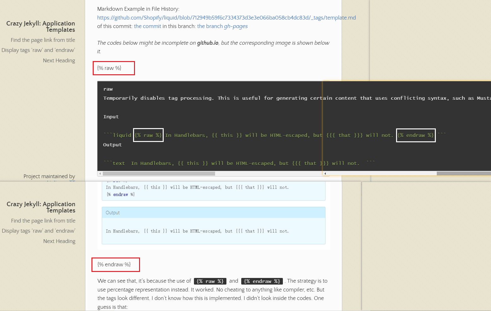

# Crazy Jekyll: Application Templates

[toc]



## Websites good for referencing

1. [https://idratherbewriting.com/documentation-theme-jekyll/index.html](https://idratherbewriting.com/documentation-theme-jekyll/index.html)


## Find the page link from title

example:

```
[Terrible Liquid]({{site.github.url}}{{temppage.url}})
```

while the Markdown format only writes *when location is certain*:

``` markdown
[Terrible Liquid](Terrible Liquid.md)
```




## Display tags 'raw' and 'endraw'

The file is *template.md*.

Markdown Example in File History: [https://github.com/Shopify/liquid/blob/712949b59f6c7334373d3e3e066ba058cb4dc83d/_tags/template.md](https://github.com/Shopify/liquid/blob/712949b59f6c7334373d3e3e066ba058cb4dc83d/_tags/template.md)
of this commit: [the commit](https://github.com/Shopify/liquid/commit/712949b59f6c7334373d3e3e066ba058cb4dc83d#diff-655febbf45dc29667914f8ab0ad967ee42fe66a7fd6c477e65dcefd0a27b793c)
in this branch: [the branch *gh-pages*](https://github.com/Shopify/liquid/tree/gh-pages)
which output: [the official page](https://shopify.github.io/liquid/tags/template/)

<i>The codes below might be incomplete on **github.io**, but the corresponding image is shown below it. </i>

{{ "%7B%25+raw+%25%7D" | url_decode }}



```markdown
raw
Temporarily disables tag processing. This is useful for generating certain content that uses conflicting syntax, such as Mustache or Handlebars.

Input

​```liquid {{ "%7B%25+raw+%25%7D" | url_decode }} In Handlebars, {{ this }} will be HTML-escaped, but {{{ that }}} will not. {{ "%7B%25+endraw+%25%7D" | url_decode }} ```
Output

​```text  In Handlebars, {{ this }} will be HTML-escaped, but {{{ that }}} will not.  ```
```



==[What you see here is the Jekyll site version of complete demonstration. What you see from page is correct writing.]==

```markdown
raw
Temporarily disables tag processing. This is useful for generating certain content that uses conflicting syntax, such as Mustache or Handlebars.

Input

​```liquid {{ "%7B%25+raw+%25%7D" | url_decode }}{{ "%7B%25+raw+%25%7D" | url_decode }} In Handlebars, {{ this }} will be HTML-escaped, but {{{ that }}} will not. {{ "%7B%25+endraw+%25%7D" | url_decode }}{{ "%7B%25+endraw+%25%7D" | url_decode }} ```
Output

​```text {{ "%7B%25+raw+%25%7D" | url_decode }} In Handlebars, {{ this }} will be HTML-escaped, but {{{ that }}} will not. {{ "%7B%25+endraw+%25%7D" | url_decode }} ```
```







{{ "%7B%25+endraw+%25%7D" | url_decode }}



We can see that, it's because the use of `{{ "%7B%25+raw+%25%7D" | url_decode }}` and `{{ "%7B%25+endraw+%25%7D" | url_decode }}`. The strategy is to use percentage representation instead. It worked. No cheating to anything like compiler, etc. But the tags look different. I don't know how this is implemented. I didn't look inside the codes. <del>One guess is that:</del>

> Syntax check must be done before expression evaluation. Otherwise, it's gonna be in chaos again. I tried nested structure. So firstly the usual pair is matched and do react. Then expression is evaluated and "new" pair is found. Then program rerun the process with original information. This thesis is a bit complex, but it should work. 
>
> And you can see that page display the tag! It's because a use a 3rd-level nesting structure. This indicates that, if the thesis is right, the syntax check runs at a maximum time of twice.
>
> 
>
> The actual page you see now is changed to a later version, for better demonstration.

**Another guess is that:**

> Syntax check will be done only once. So the other representation is evaluated and left. The Nesting Structure is never implemented.

**Obviously the latter is easier and simpler.** It's of higher possibility.

We know that, the environment of Github Pages version is: `Ubuntu 22.04.1 LTS`, `Jekyll 3.9.2`, `Liquid 4.0.3`. (Until 2022-12-17)

The filter `url_decode` requires `Liquid 4.0+`, just so well. **So when using Github Pages, this trick can be applied.**


## Next Heading

*to be continued...*





