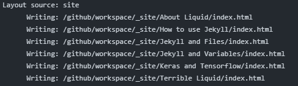

# How to use Jekyll

[toc]

## Websites

- English(Official): [ https://jekyllrb.com/](https://jekyllrb.com/)
- Chinese: [ https://jekyllcn.com/](https://jekyllcn.com/)

Non-official versions might be out-dated or incomplete. Recommend to view the official version.

## YAML

Here is a website providing YAML tutorial in the context of Jekyll: [https://idratherbewriting.com/documentation-theme-jekyll/mydoc_yaml_tutorial.html](https://idratherbewriting.com/documentation-theme-jekyll/mydoc_yaml_tutorial.html)


## Liquid

Jekyll uses *Liquid* templating language. <del>As the repository runs with Liquid, I found no way to show Liquid codes but images.</del>

So, for more information, refer to some other documents or view online official pages: [Liquid](https://shopify.github.io/liquid/).

*I will write an exclusive document about Liquid <del>later</del>由于极其糟糕的编译无限延期.*

[](https://github.com/LiuJiewenTT/MyDoc_A/actions/workflows/jekyll-gh-pages.yml)

Relative Files: [Terrible Liquid](Terrible Liquid.md) or [Terrible Liquid]({{site.github.url}}{{temppage.url}})

## Displaying an index of posts

[Permalink](https://jekyllrb.com/docs/posts/#displaying-an-index-of-posts)

Creating an index of posts on another page should be easy thanks to [Liquid](https://shopify.github.io/liquid/) and its tags. Here’s a simple example of how to create a list of links to your blog posts:



```html
<ul>
  
    <li>
      <a href="{{ post.url }}">{{ post.title }}</a>
    </li>
  
</ul>
```


You have full control over how (and where) you display your posts, and how you structure your site. You should read more about [how templates work](https://jekyllrb.com/docs/templates/) with Jekyll if you want to know more.

Note that the `post` variable only exists inside the `for` loop above. If you wish to access the currently-rendering page/posts’s variables (the variables of the post/page that has the `for` loop in it), use the `page` variable instead.


## Variables in layout

[Permalink](https://jekyllrb.com/docs/layouts/#variables)

You can set front matter in **layouts**, the only difference is when you’re using in Liquid, you need to use the `layout` variable instead of `page`. For example:



```html
---
city: San Francisco
---
<p>{{ layout.city }}</p>

{{ content }}
```




## Permalink

> Permalinks are the output path for your pages, posts, or collections. They allow you to structure the directories of your source code different from the directories in your output.

That's exactly what it can do.

> For example, you might have a page on your site located at `/my_pages/about-me.html` and you want the output url to be `/about/`. In front matter of the page you would set:
>
> ```yaml
> ---
> permalink: /about/
> ---
> ```

And the gloabl setting is very practical.

> To set a global permalink, you use the `permalink` variable in `_config.yml`. You can use placeholders to your desired output. For example:
>
> ```
> permalink: /:categories/:year/:month/:day/:title:output_ext
> ```
>
> Note that pages and collections (excluding `posts` and `drafts`) don’t have time and categories (for pages, the above `:title` is equivalent to `:basename`), these aspects of the permalink style are ignored for the output.
>
> For example, a permalink style of `/:categories/:year/:month/:day/:title:output_ext` for the `posts` collection becomes `/:title.html` for pages and collections (excluding `posts` and `drafts`).

This is very similar to the plugin `jekyll-redirect-from`. But that is not really putting it there. And that can produce many more links.

### permalink's presets

> 摘抄自：[网页链接](https://www.liangzl.com/get-article-detail-13916.html)

其实， permalink 还带有三个预置好的参数。其中默认的参数就是 date 。它的三个参数如下：

- date `/:categories/:year/:month/:day/:title.html`
- pretty `/:categories/:year/:month/:day/:title/`
- none `/:categories/:title.html`

date 和 none 的参数都很好理解，但是 pretty 这个参数结尾的形式就很好玩了。它提醒我们的是：如果最后为 `/:title/` 而非 `/:title.html` 的话，显示出来的网页地址就不会带 `.html` 这个后缀，这样更美观了。所以当你在创建时，也可以通过这样的设置来实现不带后缀的链接地址。

---

奇怪的是，`date`似乎不会生效，`pretty`也读不到类别信息。像这样：(以'pretty'为例)



