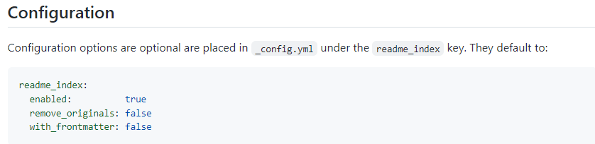

# Jekyll and Files

[toc]

## 部署备注

在GitHub的workflow虽然运行得快，但是真正能访问页面还是要等一等的。

## 文件YAML头

Markdown文件不得留有YAML头，否则编译不出结果。（Github限定）

## 文件名与链接

文件名支持中英文字符，支持空格。只要浏览器支持就行，Github已经支持了。一切都配好了，方心用。

## 插件与配置

Github Jekyll 组合添加了一些插件，并且无法禁用，只能通过设置更改配置。

https://docs.github.com/zh/enterprise-server@3.3/pages/setting-up-a-github-pages-site-with-jekyll/about-github-pages-and-jekyll

### 主页

有一个插件将主页从*index.d*更换成了*README.md*，这个插件也无法禁用，只能修改配置使其不生效。

https://github.com/benbalter/jekyll-readme-index（见*Configuration*）

