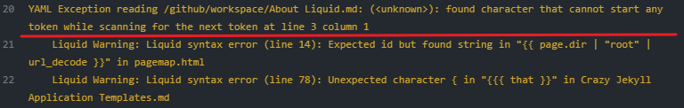
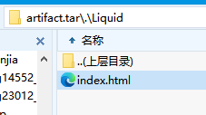

# Jekyll and Plugins

Here we often talk about that of *Github Pages*.

## The Plugins

### jekyll-redirect-from

我没有设置安装，只是在`_config.yml`里写了，但是这里却有了，说明支持的插件会自动搞上。


往上翻记录：


`Generator`都运行了，这下可以确定是安装到了吧？

我下载`Artifacts`，打开压缩包一看：


果然有这个文件。打开一看：


空的。这就很奇怪了。


我加了呀。突然感觉不妙，仔细一看：**不是横杆是下划线**。我再提交试试。还是不行，一番对比下发现，`_config.yml`里没手动设置`site.url`，只设置了`baseurl`，不过插件的介绍里没有强制要求两个都设置，我不懂哪里出了问题。



然后我开始想是不是制表符的原因，我记得最近查相关资料的时候有看到过类似的东西，我觉得应该不是这个问题，但是我可以试试。**然后居然就成功了，😓**。

这一番调试之后终于得出了结论：

如果我设置：

``` yaml
redirect_from:
  - /Liquid/
```

那么会在输入这个链接（不带页面名称）的时候重定向到这个页面。像这样：



<small>*ps.这个文件我保存下来了.*</small>

以下链接会成功重定向：

1. /Liquid/
2. /Liquid/index
3. /Liquid/index.html
4. /Liquid

但是这样的会失败：

- /Liquid/[Your file's name or title]


官方的说法是这样的：

> Redirects including a trailing slash will generate a corresponding subdirectory containing an `index.html`, while redirects without a trailing slash will generate a corresponding `filename` without an extension, and without a subdirectory.
>
> 包含尾部斜杠的重定向将生成包含index.html的相应子目录，而不带尾部斜杠的重定向将生成不带扩展名且不带子目录的相应文件名。