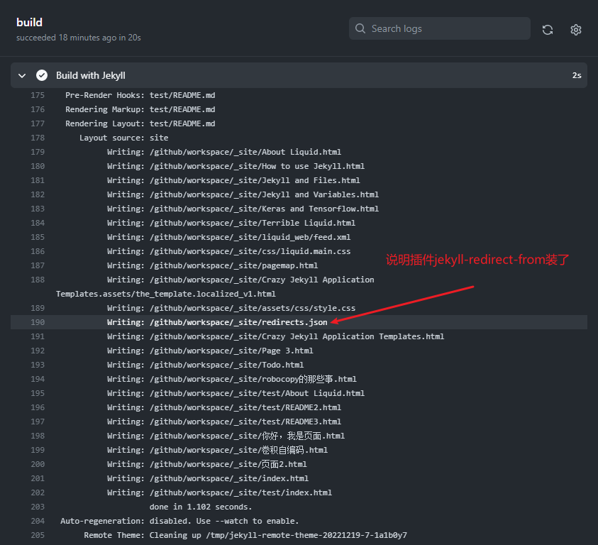
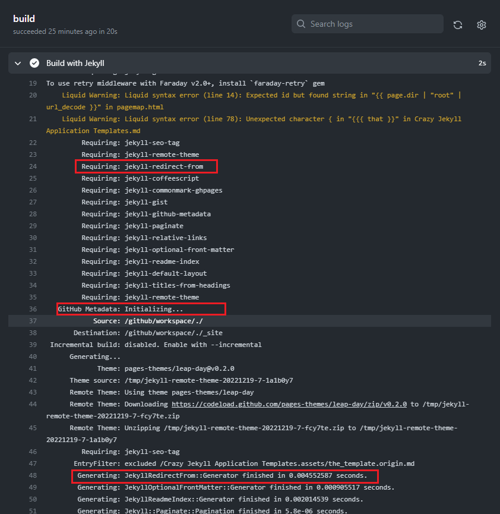
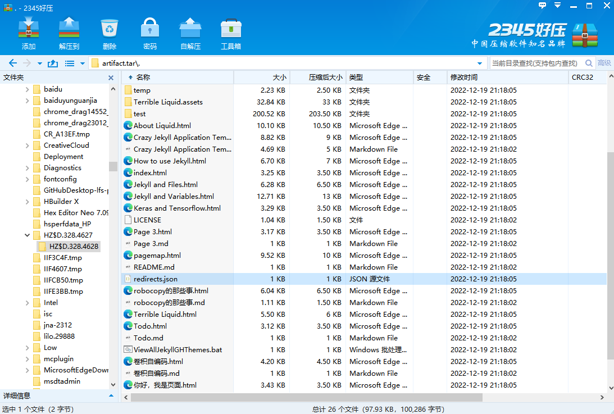
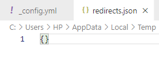
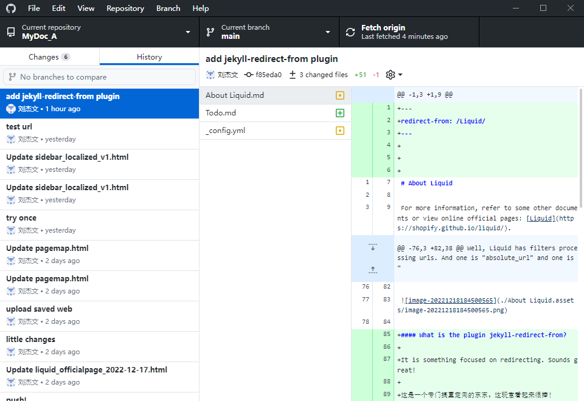

# Jekyll and Plugins

Here we often talk about that of *Github Pages*.

## The Plugins

### jekyll-redirect-from

我没有设置安装，只是在`_config.yaml`里写了，但是这里却有了，说明支持的插件会自动搞上。

往上翻记录：

`Generator`都运行了，这下可以确定是安装到了吧？

我下载`Artifacts`，打开压缩包一看：

果然有这个文件。打开一看：

空的。这就很奇怪了。

我加了呀。突然感觉不妙，仔细一看：**不是横杆是下划线**。我再提交试试。还是不行，一番对比下发现，`_config.yaml`里没手动设置`site.url`，只设置了`baseurl`，不过插件的介绍里没有强制要求两个都设置，我不懂哪里出了问题。