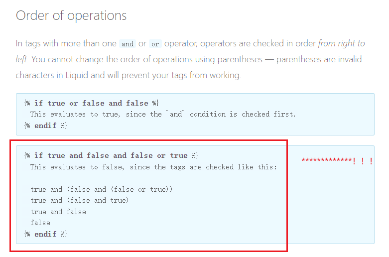

# Terrible Liquid

To record tips and bugs....

[toc]

For more information, refer to some other documents or view online official pages: [Liquid](https://shopify.github.io/liquid/).

See tags from Jekyll website: [here](http://jekyllrb.com/docs/liquid/tags/).

## 吐槽

天天看天天看，照着官方Template都没折腾出来。。。做好模板以后就不轻易动了。。

什么玩意啊，用官方的代码还出错。。

用的时候注意版本限制，*Github Pages*居然用的还是旧版的*Jekyll*，无语。（`v277`用的`v3.9.2`）

## 不要嵌套，不要嵌套！

不管是把*Liquid code*放在哪里，运行指令的不要嵌套不和其他语言混合排版，尽量单独一行，特别是markdown文件中！

**以下不可以**：



1. 啊：raw不raw的离远点。。
2. 啊：`<small><small>`：编译错误！
3. 啊：`[...a]({“% raw %”})`和`[...a]({“% endraw %”})`：编译错误！
4. 啊`<!--  -->`：无效！！照样运行！
5. 啊：strip符号也别加，`{%-`之类的，与注释一起用容易出错。。。
6. 啊：神特么不能嵌套，没有匹配，嵌套必报错！
7. 啊：绝对不要想逻辑上对，因为大概率没有被实现。



**正确**：

在**markdown**中：



```
{“% raw %”}
...something
{“% endraw %”}
```



## 奇葩的优先级



<del>怎么会有这种设定？真够异类</del>。好吧也不是没有，这是一种比较典型的实现了。