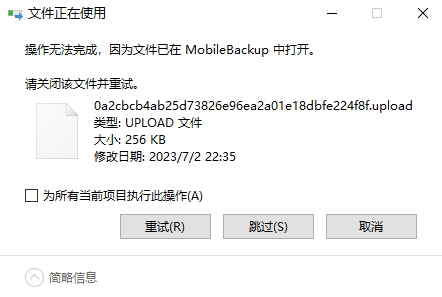

# 在备份中途更改储存位置

通常来说，这种没有暂停功能的过程，是没办法在中途更改储存位置的。


我本以为备份的位置就是那个`iTunes Media`文件夹，没想到是`MobileSync`文件夹。

| Name         | Location                            |
| ------------ | ----------------------------------- |
| iTunes Media |                                     |
| MobileSync   | C:\Users\VM1_user0\Apple\MobileSync |

在Windows版的*iTunes*中，是没有地方更改备份的储存位置的。因此我们只能迂回：使用软链接或符号链接。

要暂停备份的过程，那就要把对应进程挂起。为了实现这个操作，我选择使用*Python*的*psutil*库。

1. 在任务管理器中找到备份的进程，名称是：*MobileBackup* （进程选项卡视图）。

2. 单选它，右键，选择“转到详细信息”。此时我们会被跳转到“详细信息”选项卡。

3. 我们看到此时被选中的进程名称是：*AppleMobileBackup.exe*。我们记住它的*PID*。这里以*8880*为例。

4. 准备好Python，没有就去[安装](https://www.python.org/downloads/)。安装好后在新*cmd*中输入：`pip install psutil`。

5. 进入*python命令行*，输入以下代码（样例）：

   ``` python
   # 准备工作
   import psutil
   
   # 获取进程（的“把柄”）
   p = psutil.Process(8880)	# 此处的数字是前面记下的PID，自行替换。
   
   # 挂起进程以暂停备份
   p.suspend()
   ```

6. 现在进程就被挂起了，备份被暂停了。我们可以到任务管理器中确认一下：

7. 移动/复制到最后，可能会出现这个：
   

8. 遇到上面的情况，需要恢复再挂起，然后再尝试，重复这些步骤直到问题消失。这里有一个样例(在python命令行中)：

   ``` python
   def func3(t):
       p.resume()
       time.sleep(t)
       p.suspend()
       
   func3(1)
   ```

9. 如果文件可以移动了，但是文件夹不行，那除了检查软件外，还要检查恶心的Windows终端，比如*cmd.exe*。如果位置在相应目录下，这个目录就不能被操作，它的父目录也一样不能被操作。

