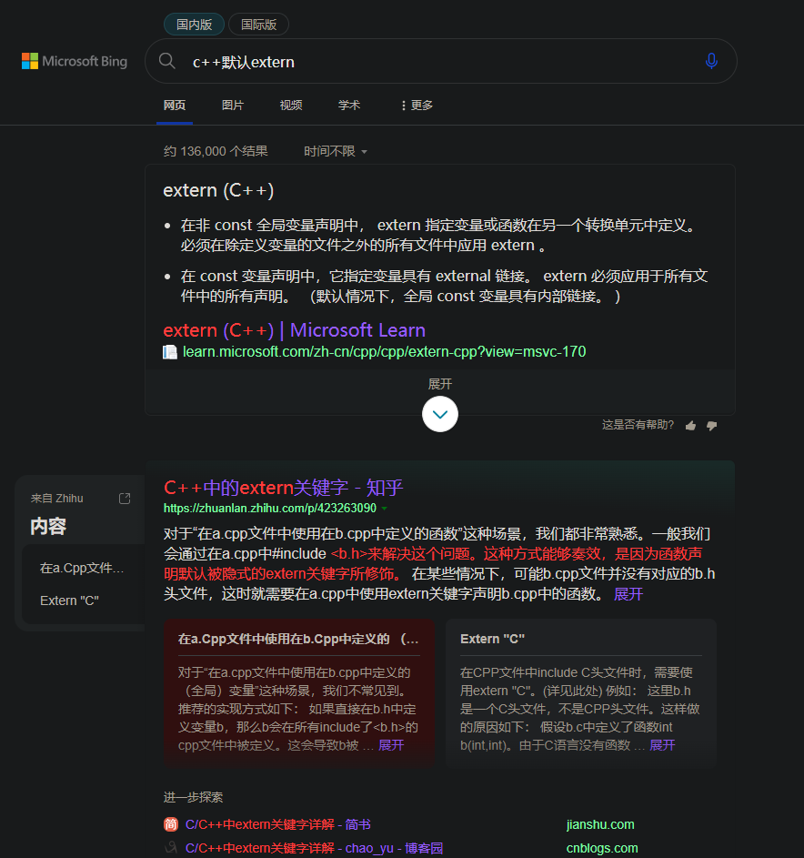
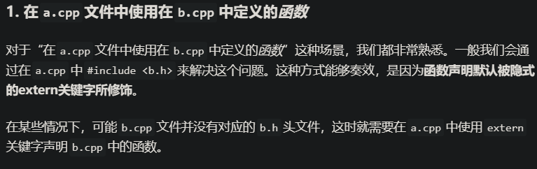

# extern关键字

Links:

- <https://learn.microsoft.com/zh-cn/cpp/cpp/extern-cpp?view=msvc-170>
- <https://zhuanlan.zhihu.com/p/423263090>

上图：

## Summary

- 在非 const 全局变量声明中， extern 指定变量或函数在另一个转换单元中定义。 必须在除定义变量的文件之外的所有文件中应用 extern 。
  - 即声明自带隐式extern修饰，其他地方除定义处都要extern修饰。
- **函数声明默认被隐式的extern关键字所修饰**。

