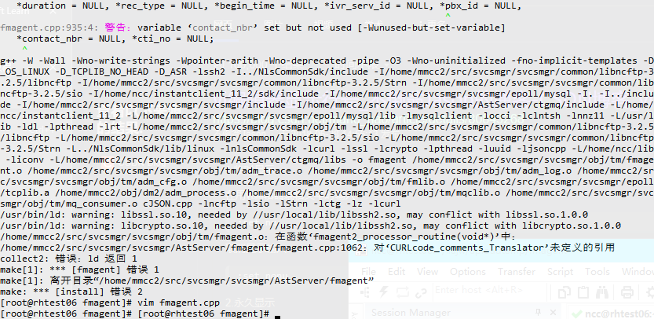
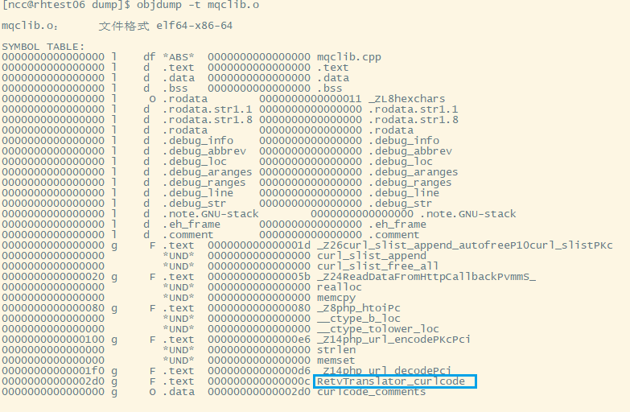
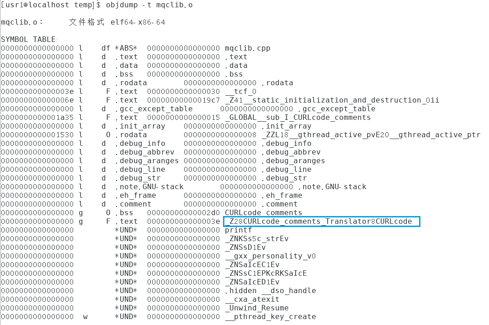
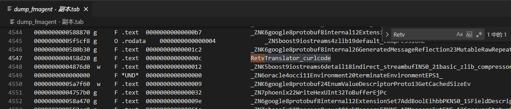
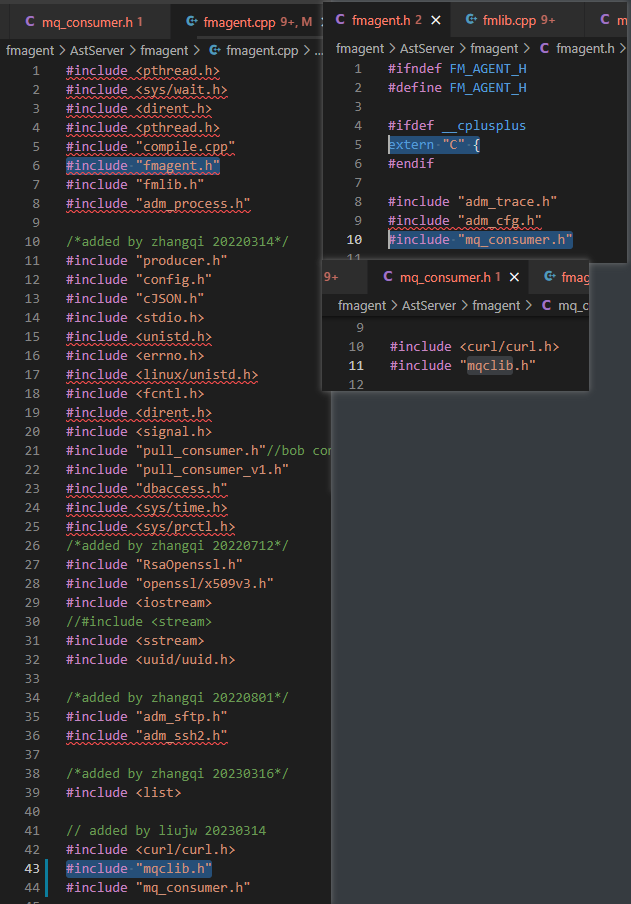

# extern奇遇记

## 2023.3.20

最近几天编译项目的时候出现问题，提示“未定义的引用”。

然而在我的虚拟机上又没有出问题，一切正常。我怀疑过是不是需要用`extern "C"`修饰函数声明，但是看看Makefile，全都是g++编译，我又觉得不太可能。可是当我走到穷途末路，我还是试了一下添加`extern "C"`修饰，结果居然编译通过了！就离谱！

我不知道到底是哪里导致了引用不一致，所以我照网上的方法dump了一下能成功的mqclib.o（命令`objdump -t [something.o]`），这是结果：

可以看到，最后确实是用C的规范调用的。这里名字不一样是因为我中途临时起意重命名了函数，不影响。然后看到我一切都正常的虚拟机编译出来的是什么样子的：

这里还是更名之前的函数。可以得知，在我的虚拟机中，都是用了C++的规范。这里并不是我在虚拟机中就只是把函数定义和`main()`放在一起，放没放在一起都试过，都是通过的，没影响，也都是C++规范的。只能说，这次遇到这样的问题，就是因为fmagent.cpp中使用了C规范的命名。至于为何其他不一定需要`extern "C"`修饰，那就不明白了。

以下是无关紧要的补充信息：

这是从最后生成的fmagent中dump出来的结果：

这里的第五列的数据和链接的mqclib.o当中的信息是一样的。所以这里也无法得知到底是什么造成了fmagent使用C规范调用它。

这里有一个猜测，是嵌套包含造成的，即`extern "C"`来自父级，这就导致其名字与单独编译的.o文件中的名字不一样了。

