# 破解CreatePlus-1.18-0.5.1a对于Create0.5.1+的兼容性

## 准备

本文涉及对象：

1. Minecraft 1.18.2
2. Forge
3. Create 0.5.1+
4. Create Goggles (Create Plus) 1.18.2-0.5.1a

工具：

1. 010 Editor
2. javap <span style="color:grey">(Optional)</span>
3. 文本编辑器（VS Code）<span style="color:grey">(Optional)</span>
4. Java Decomplier <span style="color:grey">(Optional)</span>

## 情景描述

*Create Plus* 的原作者没有为1.18.2的版本更新对于Create 0.5.1+的兼容性支持，导致使用最新*机械动力*的玩家无法使用这个作者的Mod。

## 问题来源

*Create* 的作者修改了目录，导致旧mod无法引用到正确的新位置。

## 行动目的

破解mod，修改其中的引用关系使其能够兼容最新的机械动力。

## 成果下载


---

## 破解教程

本文将从确认问题到修复问题的全过程讲述操作细节。

按照文章开头处的信息配置好客户端，启动游戏，经过加载后出现此图：

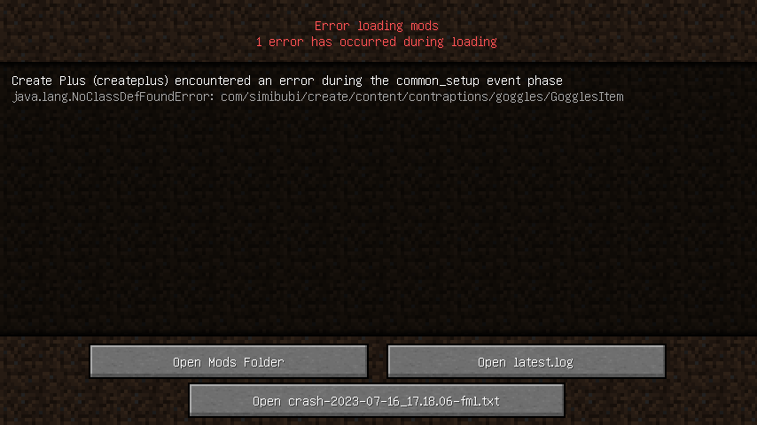

这里我们注意到一个关键信息：

> **NoClass<span style="color:red">Def</span>FoundError**

熟悉编译的朋友知道，编译会记录下对于目标的引用，并且通常编译后的文件都是可以被查看引用表的。这里的**Def**通常会联想到*Definition*，也就是这里的说法。

既然引用是被保留的，那我们一定有办法再次修改。我们先定位问题代码。可以使用IDE搜索整个jar范围的class，比如我们搜索"*GogglesItem*"。没有趁手Java IDE的朋友，可以使用jd-gui (Java Decomplier) 转成源代码操作。

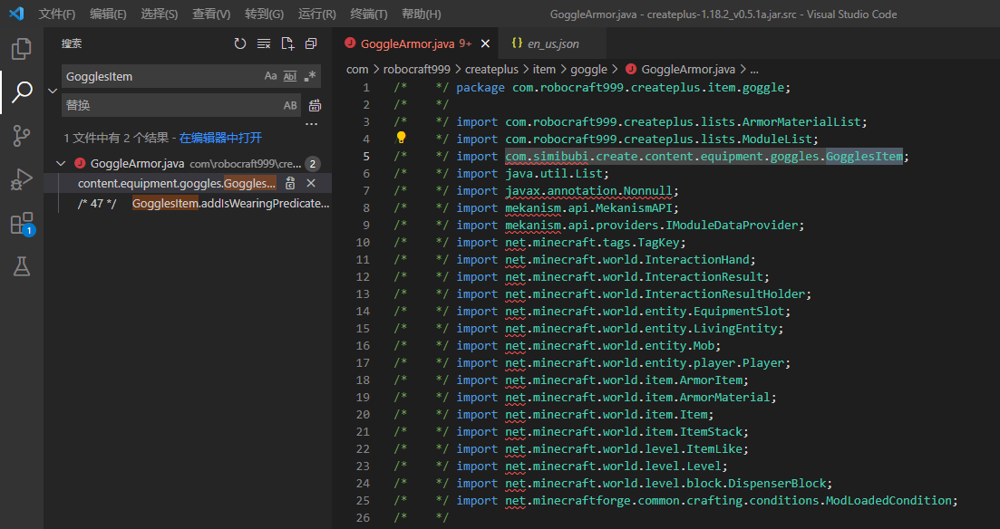

> 此图是已修改过的源码。原第5行：
>
> ``` java
> import com.simibubi.create.content.contraptions.goggles.GogglesItem;
> ```
>
> > <strong style="color:red">contraptions</strong>被替换成了<strong style="color:red">equipment</strong>（见下方解释）。

我们确认到：受影响文件只有这个*GoggleArmor*(.class)。

然后我们打开最新的Create（比如0.5.1.b），我们在压缩包查看器内就可以直接搜索*GogglesItem*或*goggles*：

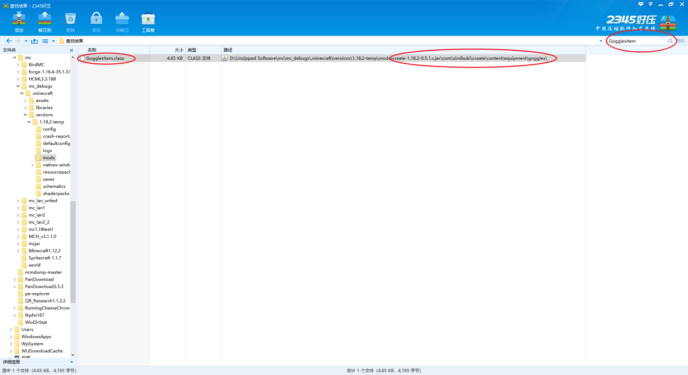

我们发现路径从"contraptions"变成了"equipment"，也就是这里发生了引用的改变，导致原本的mod无法正确引用。<strong style="color:red;background:white;">现在问题得以确认。</strong>

有了代码我们可是直接改，但是由于没有部署好编译环境我无法返编译，我只能选择编辑class文件（Java字节码文件）。我们使用压缩包查看器取出并打开jar中的对应class文件：GoggleAmor.class，随后在010 Editor中打开改二进制文件。

初次打开该类型文件，010 Editor会问是否安装解析扩展，我们选最新的那个就行了。根据解析，我们可以看到：

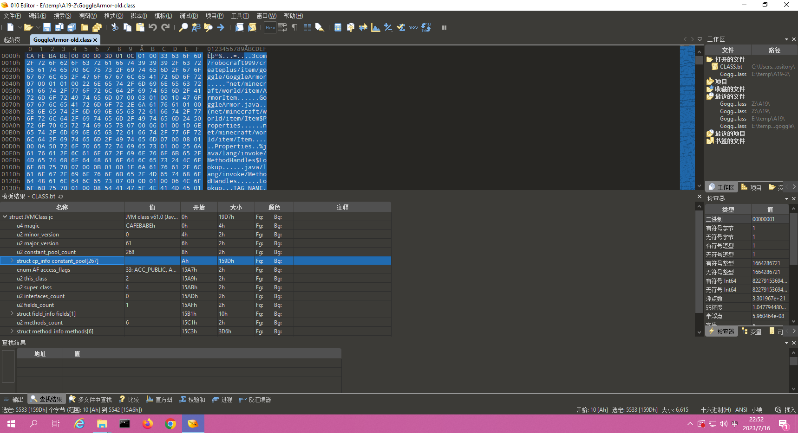

我们可以搜索一下资料，关于java class的符号表的资料。比如这个链接：[路遥：Android 逆向笔记 - Class 文件格式详解](https://zhuanlan.zhihu.com/p/66800054). （貌似网页上的格式有点问题）

上面推荐的资料中有几个比较重要的点，这里单独强调：

> 1. 
>    >`tag` 标识为 10。`class_index`的值是 7，这是一个常量池索引，指向常量池中的某一项数据。**注意，常量池的索引是从 1 开始的，所以这里指向的其实是第 6 个数据项**。
>    
>    我这里的显示项目略有不同：
>    
>    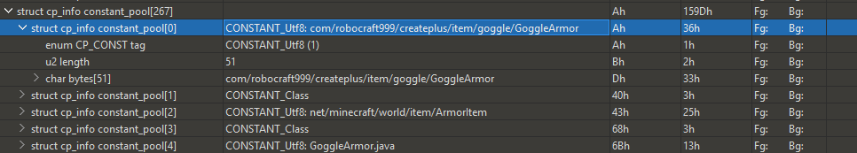
>    
>    

接下来我们修改内容：

搜索*contraptions*：

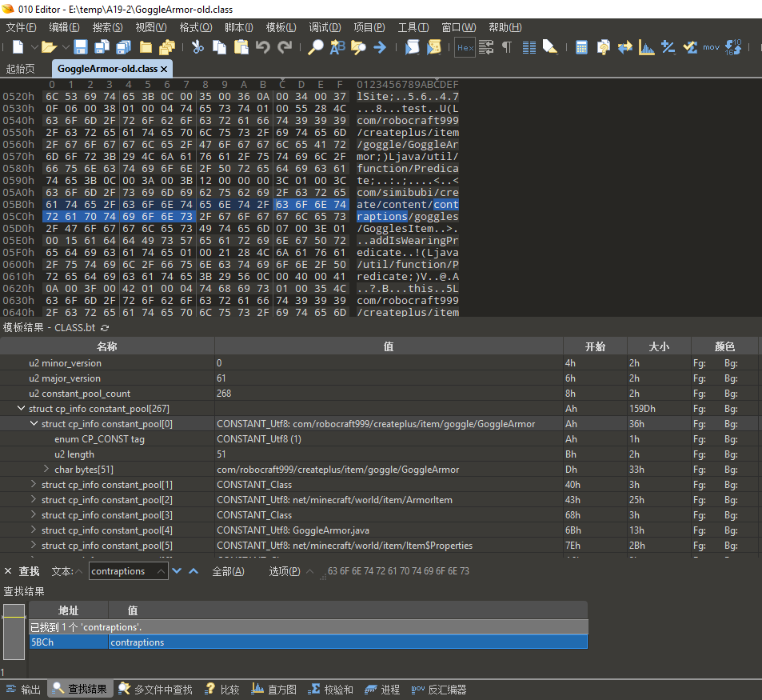

右键高亮处，点击“”，就跳转到相应变量了：

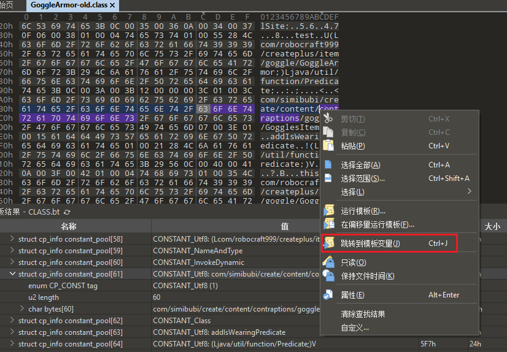

我们在“插入”的输入模式下修改内容。（这是因为“插入”模式总比“覆盖”模式稳妥，但是你要是很熟悉，那没事。）

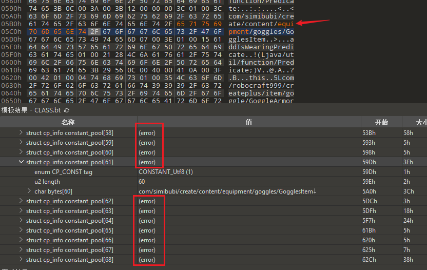

这里修改了字符串，但范围也应该修改。字符数组的长度应当匹配，因为它是以这个数组来分组数据的。我们可以看到，二进制值还是相邻的，紧跟在后面的。我试过补充0，但似乎不合适。这里最妥当的做法就是修改这个`u2 length`的值。

> contraptions
> equipment

我们数一下，减少了3个字符。也就是说，*60*应当改为*57*。

> 如果不改长度，我们可能会遇到...null....。大概是“空引用”的错误。

至于那一堆的“error”，我们在选项页左上角的那个刷新点一下，重新解析一遍，就正确了。

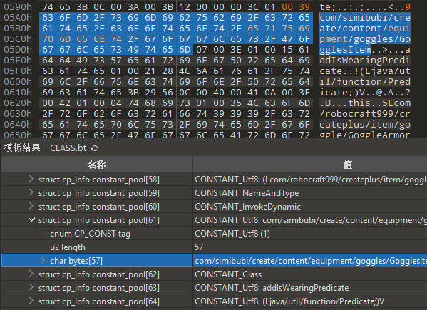

注意到这里的数组下标是*61*，而使用`javap -verbose GoggleArmor.class`得到的信息中标号却是*62*。这就是前面再次强调的标号问题了。从数组元素0开始编号，起始编号为1。

进一步检查，我们可以使用*VS Code*查看这些信息：先执行：

``` shell
javap -verbose GoggleArmor.class > ct1.txt
```

然后打开并搜索“contraptions”。或者：

``` shell
javap -verbose GoggleArmor.class | findstr contraptions
```

比如我这里得到了这样的结果：

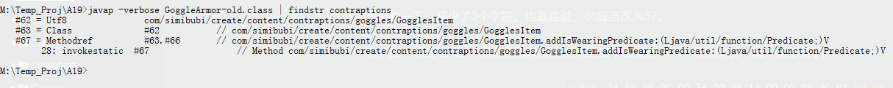

我们注意到，除了第一行，也就是编号*62*，其他的都没有直接使用到，而是使用了`#`号来引用目标。也就是说，只需要修改第62项，那么其他的引用也会随之一起更改，我们无需进一步操作，没有遗漏。

我们保存好编辑过的*GoggleArmor.class*并覆盖mod的jar文件中对应的那个文件，然后尝试启动游戏进行测试。

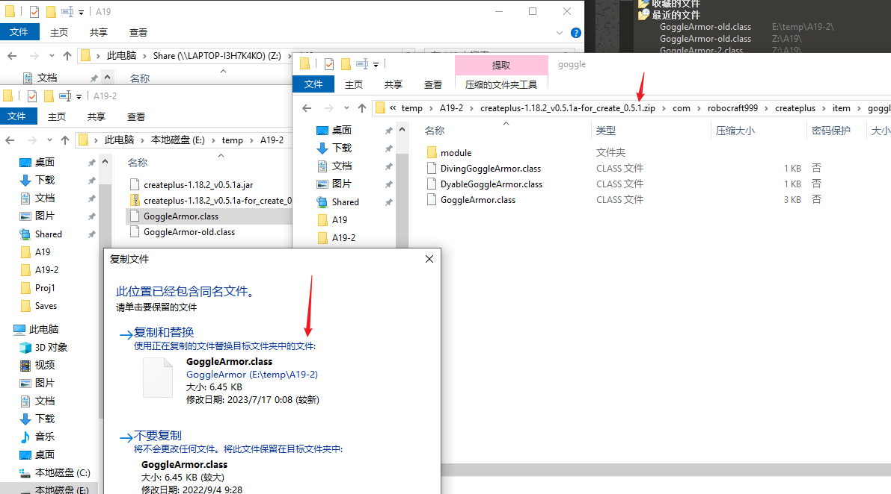

上图改`.jar`成`.zip`进行替换操作是不可取的，文件格式上会出问题：

比如，HMCL启动器会不读取到作者和版本信息：

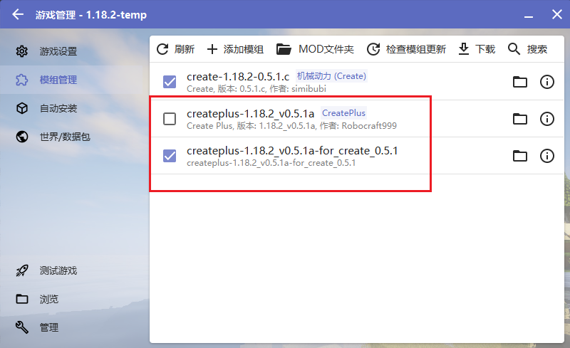

比如，启动遇到错误并崩溃：

> ... zip END ....

所以不要改扩展名！

这样的才是对的：

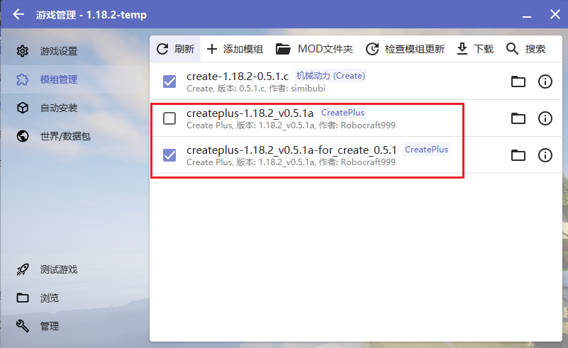

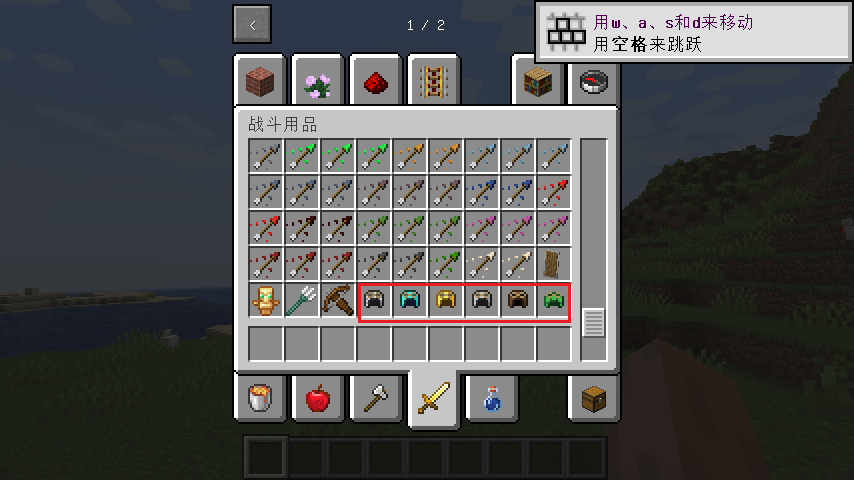

如上图，现在我们确认了改造成功!