# 四光影对比1

## Contents

[toc]

## PBR资源包

Weed Eater 128x LabPBR

**对此材质包的适配效果对比见[四光影对比2.md](四光影对比2.md)**。

## 测试项目

环境光遮蔽(AO)和反射

## 测试光影列表

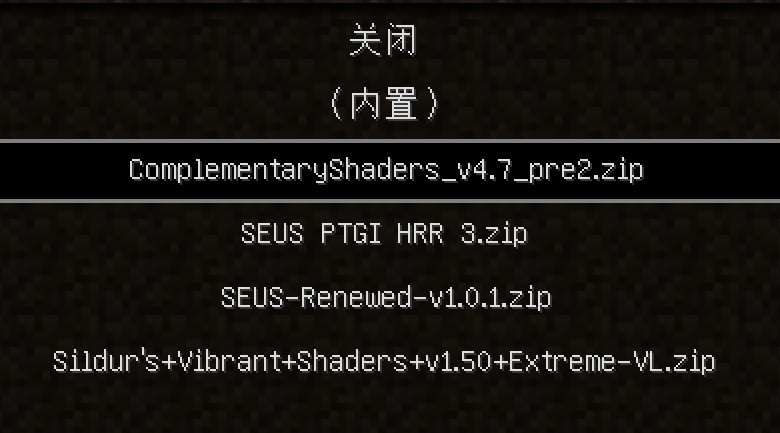

## 正文

### SEUS PTGI HRR 3

AO:

效果非常好，很真实，左侧房子没有漏光到正面。

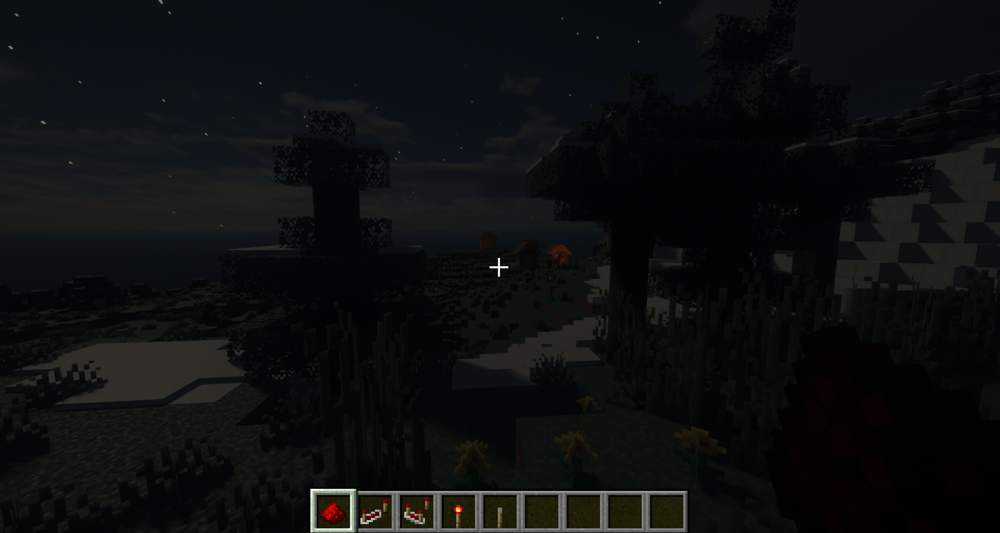

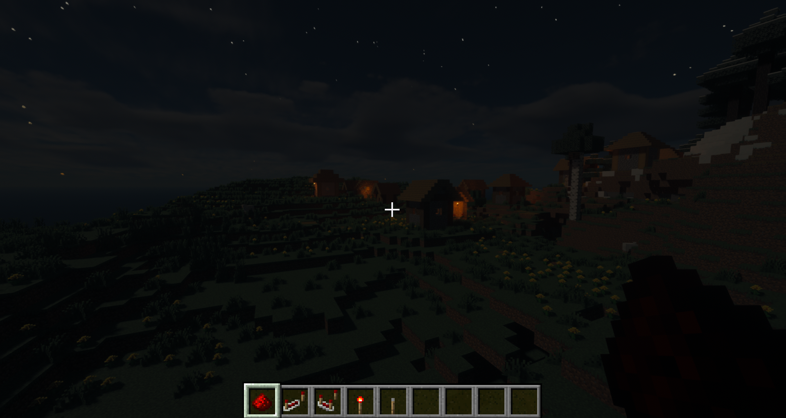

反射：

非常好，非常真实。

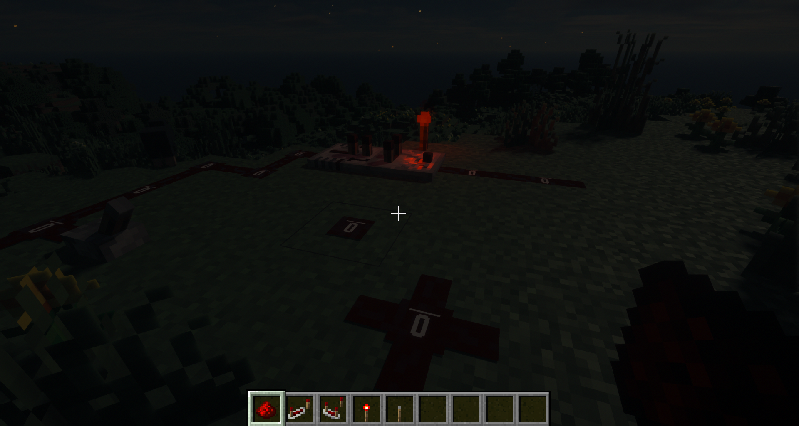

### SEUS Renewed v1.0.1

AO:

一般，漏光明显。

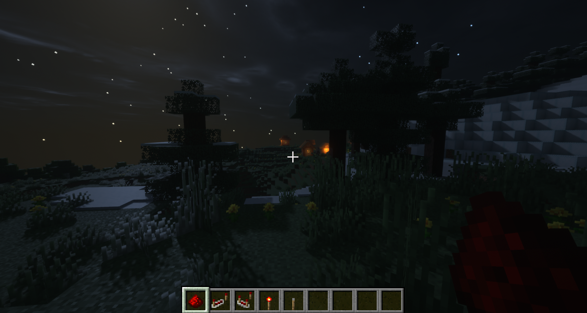

反射：

风格非金属面反射（见上图草地效果），此处不见效果，一般。

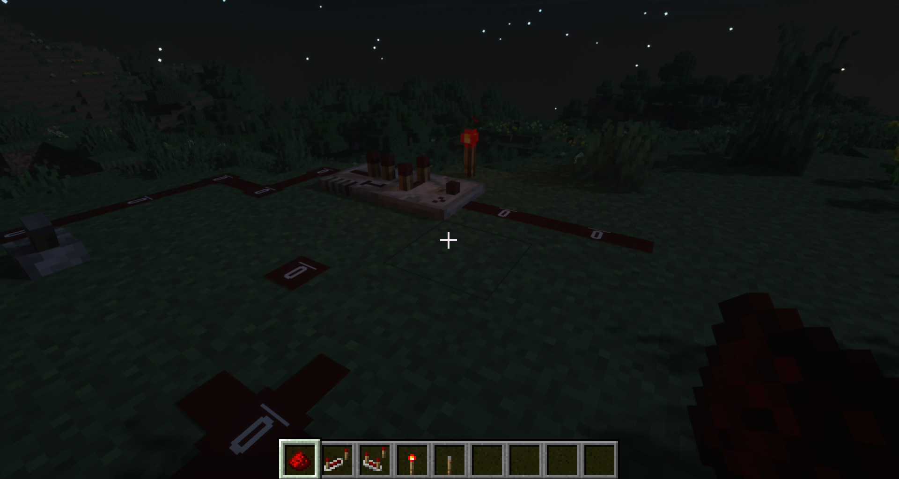

### Complementary v4.7 pre2

AO: 

不错，漏光似乎更少

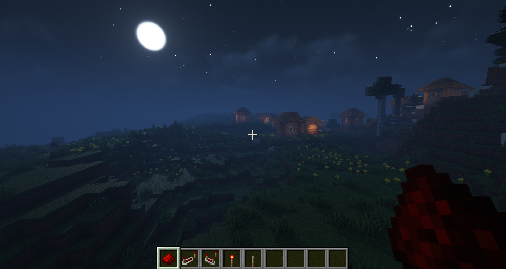

反射：

反射噪点比过去版本少，效果也还行，可能和资源包兼容不完美，塑料感偏重，但也非常优秀！

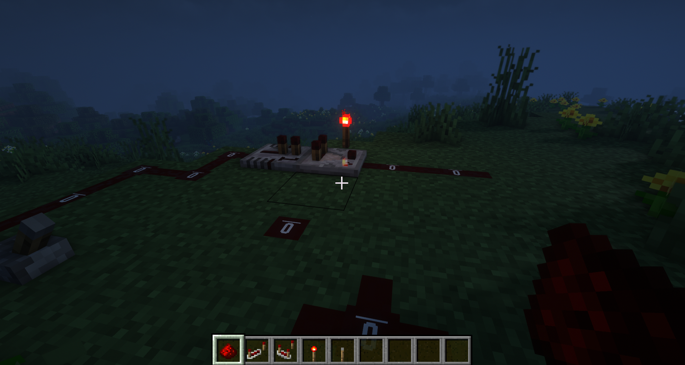

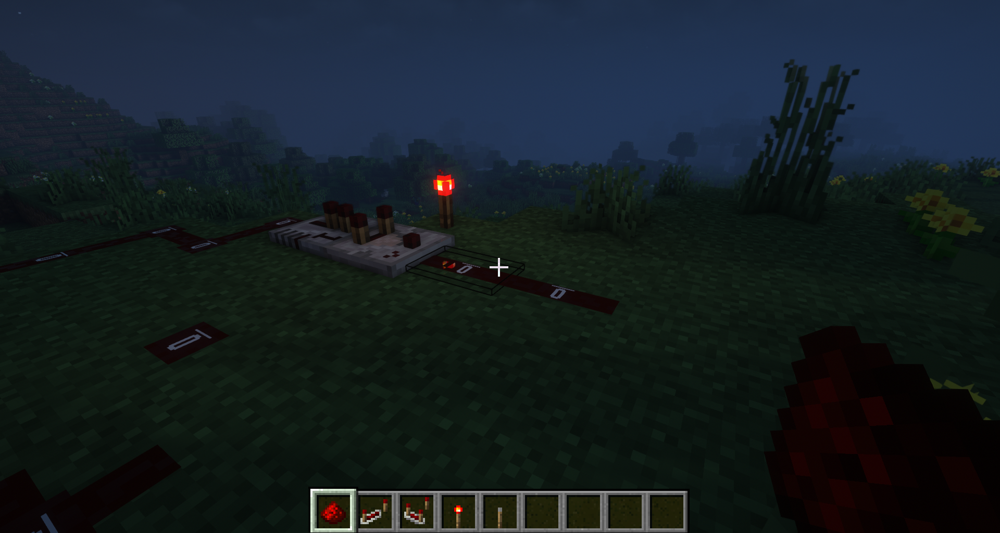

### Sildurs' Vibrant v1.50

AO:

还行，比较一般，可能比renewed略好一点。

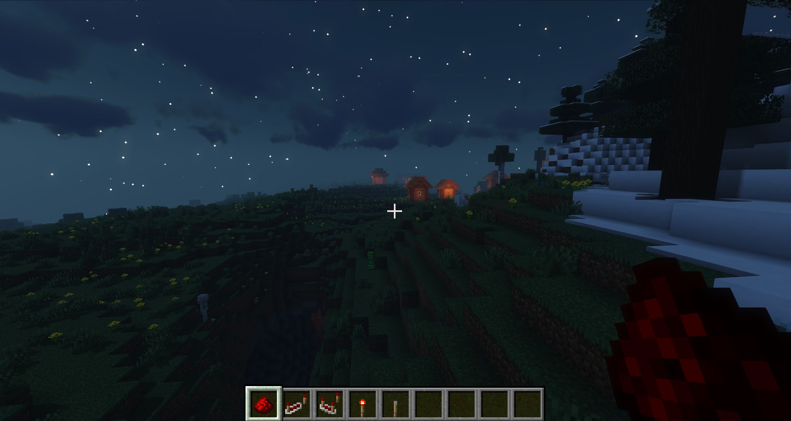

反射：

几乎形同摆设。应该和这个资源包有一些关系，别的资源包可能会好得多。

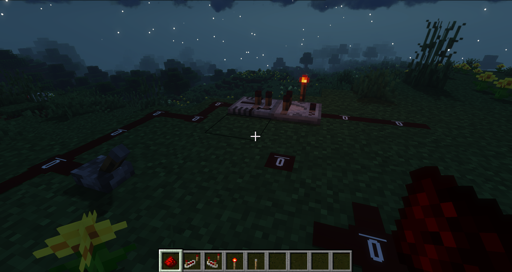

## 结语

AO效果最好的还得是*SEUS PTGI HRR 3*，反射效果似乎*SEUS PTGI HRR 3*和*Complementary v4.7 pre2*不相上下，深入反射对比见[四光影对比2.md](四光影对比2.md)。