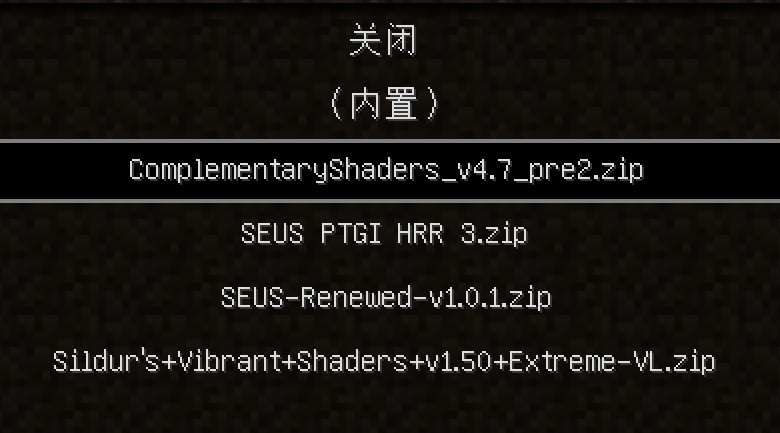
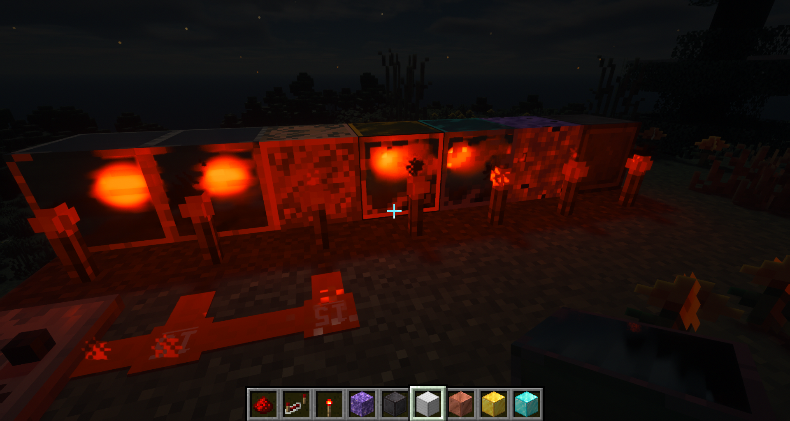
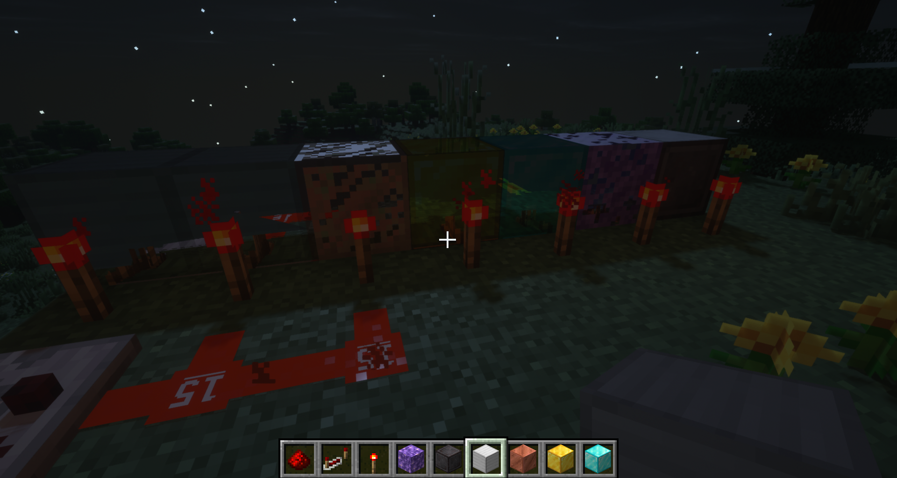
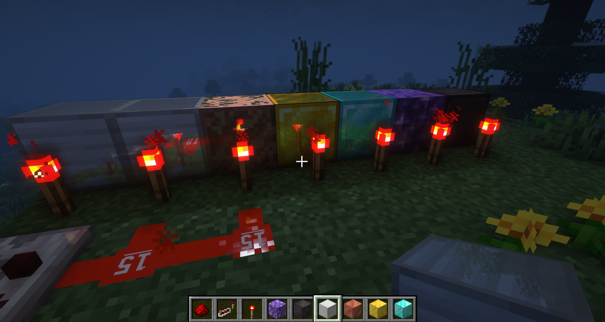
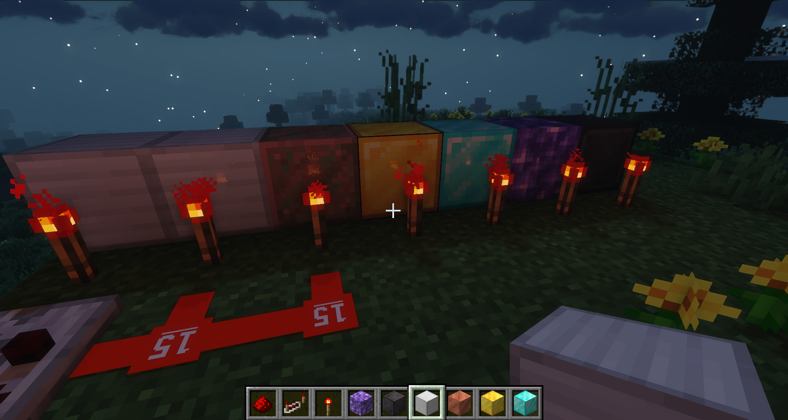

# 四光影对比2

## Contents

[toc]

## PBR资源包

Weed Eater 128x LabPBR

## 测试项目

反射

## 测试光影列表

## 反射专项

SEUS PTGI HRR3: 

哦！这太糟了。它与这个材质包完全没有缘分，这个材质包不适合这个光追。

SEUS Renewed v1.0.1: 

效果一般般，对贴图有一些复杂一点的支持，所以看上去有点怪，还行吧。

Complementary v4.7 pre2: 

这几种中算是最满意的了。

Sildurs' Vibrant v1.50：

最左侧的SSAO，屏幕空间光追几乎没用。整体效果一般，对这个材质包的适配果然不好。

## 结语

如果是我的话，我选择用*Complementary v4.7 pre2*搭配*Weed Eater 128x LabPBR*。