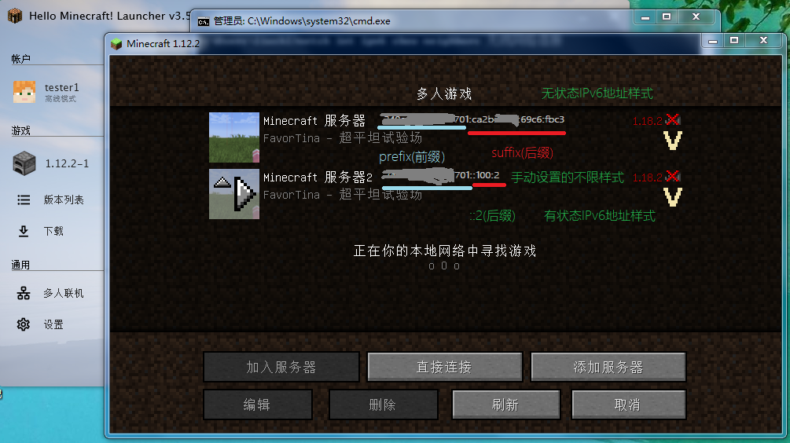

# 使用IPv6进行MC联机

使用IPv6意味着双方都应该有IPv6地址。

很多路由器和光猫，甚至运营商可能会禁掉ICMP协议，所以可能ping不通。但是只要IPv6地址是通过测试的，那就可以正常连接游戏，不碍事。

无状态获得的公用地址的有效期可能比临时的要长，但是临时的就是出于隐私方面的考虑，自行决定。

如果要测试，推荐两个网址：

1. <http://ipv6-test.com>
2. <http://test-ipv6.com>

拓展阅读：

即便IPv6都是公网IP了，但是前缀是会变的，而静态IP和IPv4一样都需要去申请的。如果觉得地址太长不方便，那就需要固定前缀、自定义后缀。

不过，如果使用的是有状态IPv6，那么IP有效期可能会比较短，比如两小时，而且也不会再出现临时IPv6地址了，此外安卓设备无法获取IPv6地址。而使用无状态IPv6，那么IP地址会比较长，有效期也比较长，比如三天，并且会有临时IPv6地址，此外安卓设备能获取到IPv6地址（因为Google就是不给支持DHCPv6，只支持SLAAC，国产手机也一样，我的OPPO也不行）。

链接：

1. <https://machbbs.com/v2ex/520717>
2. <https://blog.csdn.net/weixin_44589991/article/details/115766130>

