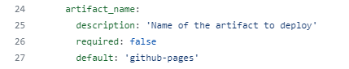

# 使用GitHub Pages Jekyll工作流配置使用自定义artifact名称

首先说说有什么用呢？因为我们已经可以改变使用的分支了，也可以设置很长的artifact过期时间了，所以我们可以考虑允许他人直接下载制作好并打包好的网站，也就是artifact。

下载的时候默认都是`github-pages`这样丑陋又千篇一律的名称的`.zip`文件。我们希望每个项目的包都能有它自己的名称。

> 本文将以我的项目`FetchRPlayer`的`docs_generation`分支进行举例说明。

我希望包的名称将会是：“FetchRPlayer Pages(Generated)”。

在查找`actions/upload-pages-artifact@v1`的文件以寻找改变过期时长的过程中，我还发现了一个可输入数据：`name`。


> 来源：<https://github.com/actions/upload-pages-artifact/blob/main/action.yml>

我们注意到，这里的`github-pages`正是通常下载时收到的文件名。

于是我们修改workflow：

> 原文：
>
> ``` yaml
> - name: Upload artifact
>   uses: actions/upload-pages-artifact@v1
> ```
>
> 改后：
>
> ``` yaml
> - name: Upload artifact
>   uses: actions/upload-pages-artifact@v1
>   with:
>     name: "FetchRPlayer Pages(Generated)"
> ```
>
> (设置过期天数也是这里，如果拷贝这段注意一下合并。)

保存，提交！你以为这就可以了吗？事情还没完，因为此时你会在部署阶段得到这样的报错信息并失败：


> Error: No uploaded artifact was found!

最下面那个什么URL错误想了想不知道是什么鬼，干脆先不想，就考虑上面的“找不到文件”这个错误好了。我以为是因为前面设置好分支后rerun deploy (job)的原因可能会话不连续artifact不在现在这个机器上，于是我还全部重新运行了一遍jobs，但是结果还是如此。

一番冷静后我想到：既然前面打包的时候都可以改名，那是不是这里也可以改名？如果不是又怎么识别？难道传递的是默认名称的包过来部署完才改的名吗？我感觉不对劲，我的逻辑有问题，想当然了。于是我找到`deploy-pages`查看它的内容：



> 来源：<https://github.com/actions/deploy-pages/blob/main/action.yml>

诶，还真是！默认也是`github-pages`，这就对上了。

于是我们修改workflow：

> 原文：
>
> ``` yaml
> # Deployment job
>   deploy:
>     environment:
>       name: github-pages
>       url: ${{ steps.deployment.outputs.page_url }}
>     runs-on: ubuntu-latest
>     needs: build
>     steps:
>       - name: Deploy to GitHub Pages
>         id: deployment
>         uses: actions/deploy-pages@v2
> ```
>
> 改后：
>
> ``` yaml
> # Deployment job
>   deploy:
>     environment:
>       name: github-pages
>       url: ${{ steps.deployment.outputs.page_url }}
>     runs-on: ubuntu-latest
>     needs: build
>     steps:
>       - name: Deploy to GitHub Pages
>         id: deployment
>         uses: actions/deploy-pages@v2
>         with:
>           artifact_name: "FetchRPlayer Pages(Generated)"
> ```
>
> (添加了`with`和输入`artifact_name`键。)

这就可以啦！