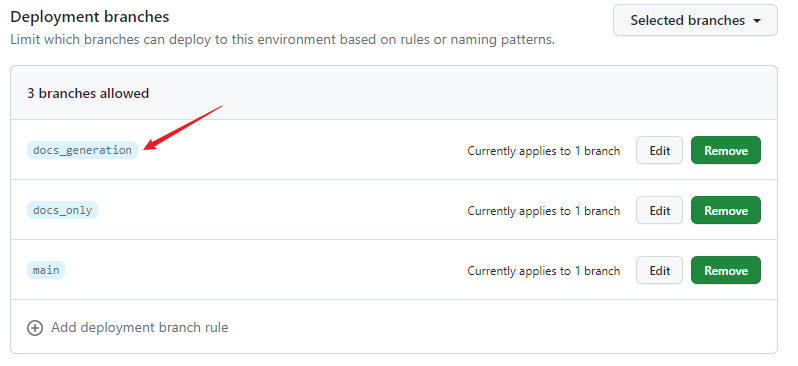
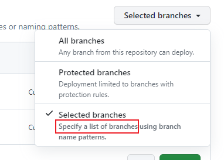

# 使用GitHub Pages Jekyll工作流配置使用非默认分支

> 本文将以我的项目`FetchRPlayer`的`docs_generation`分支进行举例说明。

在创建workflow的时候是可以编辑的，这个时候我们对给出的默认配置做出如下修改：

> 原文：
>
> ``` yaml
> on:
>   # Runs on pushes targeting the default branch
>   push:
>     branches: ["main"]
> ```
>
> 改后：
>
> ``` yaml
> on:
>   # Runs on pushes targeting the default branch
>   push:
>     branches: 
>       - docs_generation
> ```

> 原文：
>
> ``` yaml
> jobs:
>   # Build job
>   build:
>     runs-on: ubuntu-latest
>     steps:
>       - name: Checkout
>         uses: actions/checkout@v3
> ```
>
> 改后：
>
> ``` yaml
> jobs:
>   # Build job
>   build:
>     runs-on: ubuntu-latest
>     steps:
>       - name: Checkout
>         uses: actions/checkout@v3
>         with: 
>           ref: 'docs_generation'
> ```
>
> (添加了`with`和输入`ref`键)

做完这些工作，我们还要配置一下环境。本来如果我们在选择部署方式的时候如果选择了“Deploy from a branch”，然后在页面上选择好分支并保存，那么这个环境配置的工作网站就帮我们做了。现在是我们自己配的，那就要我们自己设置了。

与*Pages*一样，都在设置（*Settings*）中，我们点击左侧*Code and automation*分区中的*Environments*，添加对应分支的“准许”规则：



我们看到右上角的`Selected branches`:



以及上面一行灰色语句：

> Limit which branches can deploy to this environment based on rules or naming patterns.

两者很明确地表明，如果我们不设置，按照项目的默认配置我们将不能成功部署网站。后果就像是这样：


我们Rerun部署（*deploy*）工作（*job*），同时勾选调试输出，我们会得到这样一行信息：

> Branch "docs_generation" is not allowed to deploy to github-pages due to environment protection rules.

这里的<em style="background:yellow;color:red">environment protection rules</em>很明确地指向了前面提到的环境配置。

---

参考的链接：

1. <https://github.com/actions/checkout/discussions/277>
2. (<span style="color:grey">未参考但确实有用的链接</span>)<https://github.com/withastro/docs/issues/1376>

