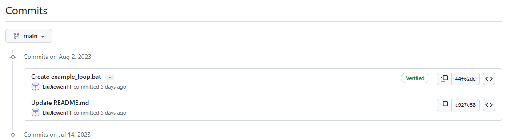

# 给git的commit和tag使用签名

本文涉及的参考链接：

1. <https://blog.csdn.net/easylife206/article/details/131039449>
2. <https://git-scm.com/docs/signature-format>


[toc]


---

## Page predefine section

This section is to store some codes of HTML for better viewing experience.

<style type="text/css">
	summary.signed-commit-badge.signed-commit-badge-large.verified {
		--color-success-fg: #1a7f37;
		--color-border-default: #d0d7de;
		--base-text-weight-medium: 500;
		font-family: -apple-system,BlinkMacSystemFont,"Segoe UI","Noto Sans",Helvetica,Arial,sans-serif,"Apple Color Emoji","Segoe UI Emoji";
		word-wrap: break-word;
		box-sizing: border-box;
		cursor: pointer;
		vertical-align: middle;
		user-select: none;
	    background: none;
	    height: 24px;
	    margin-right: 8px;
	    display: inline-block;
	    padding: 0 7px;
	    font-size: 12px;
	    font-weight: var(--base-text-weight-medium, 500);
	    white-space: nowrap;
	    border: 1px solid transparent;
	    border-radius: 2em;
	    border-color: var(--color-border-default);
	    padding-right: 10px;
	    padding-left: 10px;
	    line-height: 22px;
	    list-style: none;
	    transition: 80ms cubic-bezier(0.33, 1, 0.68, 1);
	    transition-property: color,background-color,box-shadow,border-color;
	    color: var(--color-success-fg);
	}
     summary.signed-commit-badge.signed-commit-badge-large.verified {
        margin-left: 8px;
    }
</style>


---

## Main - 正文

最近，Github开始要求更严格的*2FA*了。收到邮件后，我进行了相关的设置后，突然发现账户安全有关于ssh的东西。然后就看到几个和密钥相关的东西。


我很好奇，正好我已经“比较熟悉”ssh了，所以就尝试着上传我的公钥。然后就看到密钥被分成两种，一种是验证用的(Authentication)，另一种是签名用的(Signing)。这里的签名其实就是用于确认签名的。这个时候我才知道，原来openssh也是可以做“签名”这件事的。一番了解，得知从**openssh 8**开始就支持给随机数据加密等等了，而git也是在**2.34版本（Windows版是2.33）**开始支持使用ssh的key给**commit和tag**进行**签名**了。

> 网上有说法，签名功能在OpenSSH 8.7出问题了，建议使用8.8以后的版本。

那么为什么这玩意有必要呢？因为，虽然能提交到你的git已经是有权限了，但是如果有人就是设法拿到权限了，那这会是另一条保障。在配置git的时候，只需要设置好邮箱和用户名就可以了，所以如果其他人用了你的配置，然后不知怎么地你或他把这些commit提交了，那你要怎么区分：**“这些commit中的我不是我？”**

> 首先，为什么要对 Git 提交做签名呢？那是因为在 Git 中很容易伪造提交身份。
>
> 我们知道，Git 要求在提交前指定作者名字和邮箱：
>
> ```go
> git config user.name 涛叔
> git config user.email hi@taoshu.in
> ```

在这项改动之后，凡是签了名（并且通过验证）的提交，在github上都会有一个新的标识，像这样：



如图，旧的提交没有进行签名，就不会有这个`verified`标识。

<div style="margin:0 auto;"><summary class="signed-commit-badge signed-commit-badge-large verified ">Verified</summary></div>

虽然 GitHub 支持展示 SSH 签名信息，但是签名和鉴权用的密钥需要分别上传。上传的时候需要指定类型。哪怕是使用同一个密钥也得额外再传一次。

上传公钥之后，GitHub 就会展示对应的 SSH 签名。


在个人设置里，可以选择是否开启警惕模式(Vigilant Mode)。

ssh的key怎么生成我就不提了，网络上很多资料。这里讲讲怎么给git的repository设置使用key。

---

### 1 配置

> 以下内容部分摘自页面顶部提及的[链接1](https://blog.csdn.net/easylife206/article/details/131039449)。

考虑到大多数 Git 用户都有自己的 SSH 密钥，不支持 SSH 签名岂不是很浪费？**于是 Git 2.34 集成了 SSH 签名功能**。

**我们需要添加如下配置**：

```go
# 使用 SSH 签名
git config gpg.format ssh

# 指定 SSH 私钥文件
git config user.signingKey ~/.ssh/id_ed25519.pub

# 指定可信公钥列表文件
git config gpg.ssh.allowedSignersFile "$HOME/.config/git/allowed_signers"

# 开启自动签名（可选）
git config commit.gpgsign true
git config tag.gpgsign true
```

**一番操作之后就准备好了**。接下来所有的 Git 提交都会使用 SSH 签名。如果没有开启自动签名，则可以在提交的时候通过`-s`参数来临时开启。

> 关于利用ssh密钥对文件进行签名和验证的资料，以及可信公钥列表文件的信息，见：
>
> 1. 如何使用SSH签名和验证：<{{site.github.url}}/aka/digital_key/ssh/how-to-sign-and-verify-a-file>

### 2 手动验证命令

在默认配置下，我们看不出签名后的提交跟普通提交有什么区别。如果想展示签名信息，需要指定`--show-signature`参数：

```
> git show --show-signature head
commit 6292a43f184e8a347b6c8b4fe08191920c0e22a5
Good "git" signature for hi@taoshu.in with ED25519 key SHA256:19/J4WKT7flBNcfmqQUqyAZeH4TdhMf5f0u+a4fZj1c
Author: 涛叔 <hi@taoshu.in>
Date:   Wed Aug 24 07:55:54 2022 +0800
...
```

这个时候我们就看到了`Good "git" signatures ...`验证消息。

回想我们前面的例子，当`-n`的值为`file`的时候，验签信息是`Good "file"...`。现在的信息是`Good "git"...`，说明 Git 使用的参数是`-n git`。

但有个问题，Git 到底把签名信息存到了什么地方呢？答案是 commit 或者 tag 对应的 object。

> 引用：本处的“我”指[链接1](https://blog.csdn.net/easylife206/article/details/131039449)原文作者。
>
> “如果你不了解 Git 的存储模型，可以阅读我的另一篇文章。”

---

来看看git官网给的信息（[链接2](https://git-scm.com/docs/signature-format)）：

1. tag
   1. sign: `git tag -s`
   2. verify: `git verify-tag [-v]` or `git tag -v`
2. commit
   1. sign: `git commit -S`
   2. verify: `git verify-commit [-v]` or `git show --show-signature`
3. mergetag
   1. sign: `git merge` on signed tag
   2. verify: `git show --show-signature`

> 详见官网。

### 链接附属信息

1. [链接1](https://blog.csdn.net/easylife206/article/details/131039449)：

   > 参与文献：
   >
   > - https://www.agwa.name/blog/post/ssh_signatures
   > - https://blog.dbrgn.ch/2021/11/16/git-ssh-signatures/
   > - https://git-scm.com/docs/signature-format
   >
   > > 本文转载自：「 涛叔的博客 」，原文：https://url.hi-linux.com/155hC ，版权归原作者所有。欢迎投稿，投稿邮箱: editor@hi-linux.com。