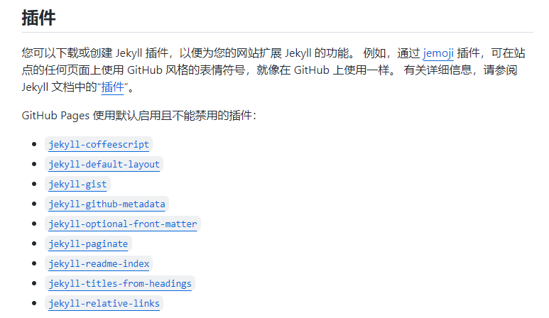
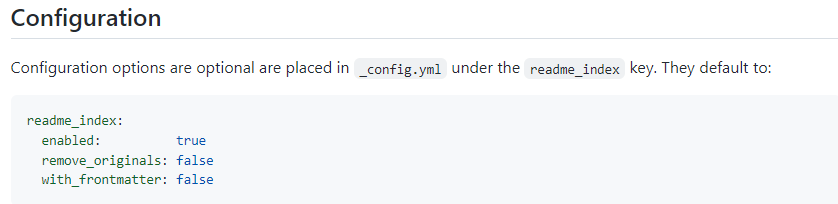
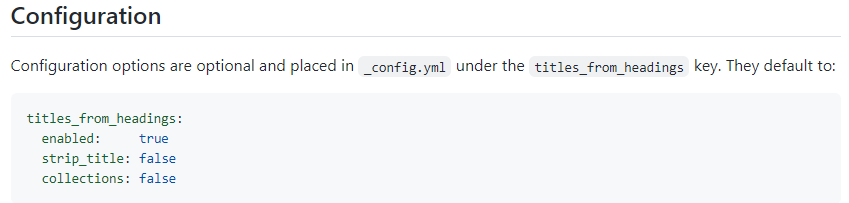
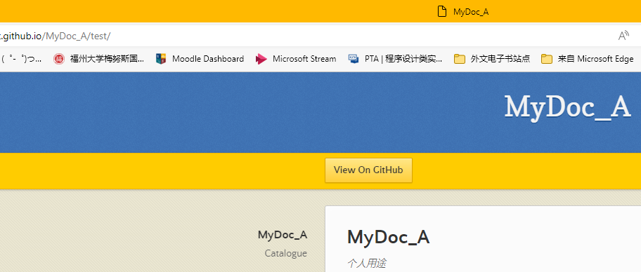
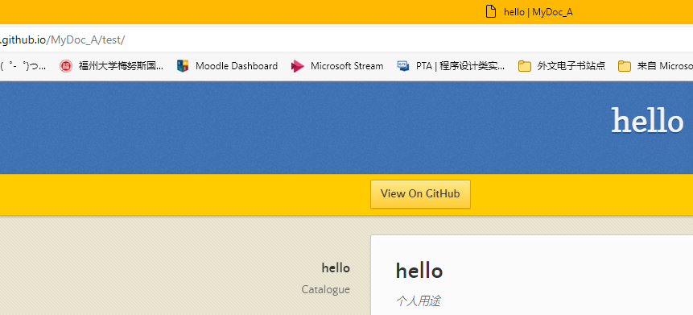

# Jekyll and Files

[toc]

It's really special with *Github Pages*!

About GitHub Pages and Jekyll: [https://docs.github.com/en/pages/setting-up-a-github-pages-site-with-jekyll/about-github-pages-and-jekyll](https://docs.github.com/en/pages/setting-up-a-github-pages-site-with-jekyll/about-github-pages-and-jekyll)

## 部署备注

在GitHub的workflow虽然运行得快，但是真正能访问页面还是要等一等的。

## 文件YAML头

Markdown文件不得留有YAML头，否则编译不出结果。（Github限定）

## 文件名与链接

文件名支持中英文字符，支持空格。只要浏览器支持就行，Github已经支持了。一切都配好了，方心用。

*但是有的模板的书签不支持中文，而标签和类目也似乎是同样的原因不能正常工作，未得到证实。*

## Markdown文件的问题

Github Pages(v277, 截止到2023-01-23)，Jekyll 3.9.2，Liquid 4.0.3：

1. <del>不能使用`iframe`，这会导致处理终止，后续内容消失。</del>。`iframe`不是 *self-closing tag*，应当这么写：

   ``` html
   <iframe style="height:400px" src="www.baidu.com"></iframe>
   ```

## 插件与配置

Github Jekyll 组合添加了一些插件，并且无法禁用，只能通过设置更改配置。

[https://docs.github.com/zh/enterprise-server@3.3/pages/setting-up-a-github-pages-site-with-jekyll/about-github-pages-and-jekyll](https://docs.github.com/zh/enterprise-server@3.3/pages/setting-up-a-github-pages-site-with-jekyll/about-github-pages-and-jekyll)



### 所有支持的插件

支持列表: [https://pages.github.com/versions/](https://pages.github.com/versions/)

### 主页

有一个插件将主页从*index.md*更换成了*README.md*，这个插件也无法禁用，只能修改配置使其不生效。

[https://github.com/benbalter/jekyll-readme-index](https://github.com/benbalter/jekyll-readme-index)（见*Configuration*）



### 标题

插件：jekyll-titles-from-headings

插件名：**Jekyll Titles from Headings**

[https://github.com/benbalter/jekyll-titles-from-headings](https://github.com/benbalter/jekyll-titles-from-headings)

*A Jekyll plugin to pull the page title from the first Markdown heading when none is specified.* 

> 如果没有指定标题，则使用第一个heading。



#### 标题显示

如果标题与库名相同，则不重复显示，如图：



否则同时显示在网页标题中：




> 这个插件看起来对中文标题友好！