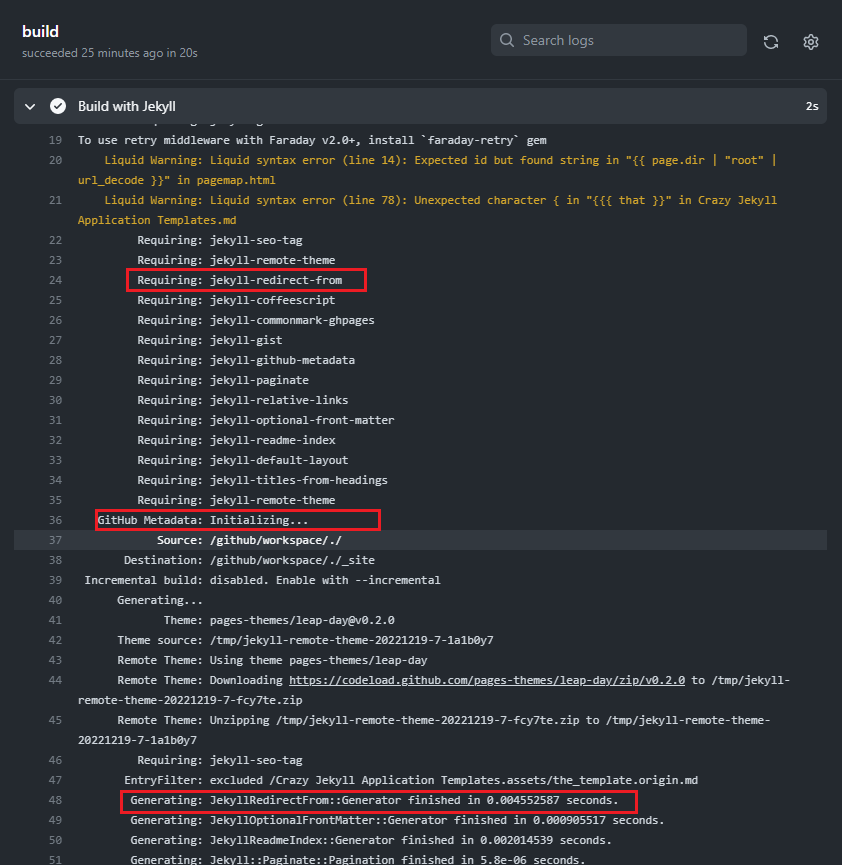
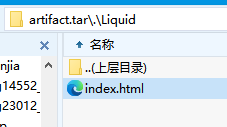
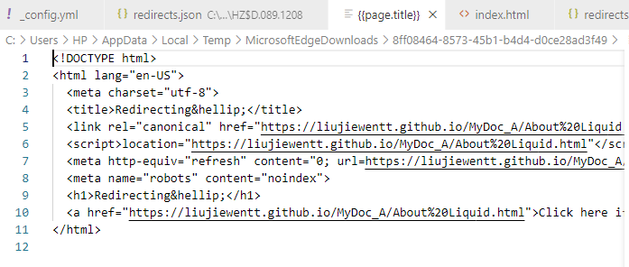

# Jekyll and Plugins

Here we often talk about that of *Github Pages*.

[toc]

## The Plugins

### jekyll-redirect-from

#### 结论

*（还没写）*

#### 过程记录

我没有设置安装，只是在`_config.yml`里写了，但是这里却有了，说明支持的插件会自动搞上。


往上翻记录：



`Generator`都运行了，这下可以确定是安装到了吧？

我下载`Artifacts`，打开压缩包一看：


果然有这个文件。打开一看：


空的。这就很奇怪了。


我加了呀。突然感觉不妙，仔细一看：**不是横杆是下划线**。我再提交试试。还是不行，一番对比下发现，`_config.yml`里没手动设置`site.url`，只设置了`baseurl`，不过插件的介绍里没有强制要求两个都设置，我不懂哪里出了问题。


然后我开始想是不是制表符的原因，我记得最近查相关资料的时候有看到过类似的东西，我觉得应该不是这个问题，但是我可以试试。**然后居然就成功了，😓**。

这一番调试之后终于得出了结论：

如果我设置：

``` yaml
redirect_from:
  - /Liquid/
```

那么会在输入这个链接（不带页面名称）的时候重定向到这个页面。像这样：



<small>*ps.这个文件我保存下来了.*</small>

打开来看，就只是一个重定向网页而已，效果长这样：


打开产生的`redirects.json`:

``` json
{"/Liquid/":"https://liujiewentt.github.io/MyDoc_A/About%20Liquid.html"}
```

这时候不为空了。

> 关于这个redirects.json文件，官方的说法是这个拿来给你用的。所以这只是个列表，插件不会用到，因为可以取消这个输出。所以它确确实实就只是提供给你用的。


以下链接会成功重定向：

1. /Liquid/
2. /Liquid/index
3. /Liquid/index.html
4. /Liquid

但是这样的会失败：

- /Liquid/[Your file's name or title]
- /Liquid/[Your file's name or title].html

最后显示的就只是那个原本的页面的链接。


官方的说法是这样的：

> Redirects including a trailing slash will generate a corresponding subdirectory containing an `index.html`, while redirects without a trailing slash will generate a corresponding `filename` without an extension, and without a subdirectory.
>
> 包含尾部斜杠的重定向将生成包含index.html的相应子目录，而不带尾部斜杠的重定向将生成不带扩展名且不带子目录的相应文件名。


至于那个设置`site.url`的事啊，我注释掉测试了一下，发现没有影响，说明那东西不是强制要求设置的。

上面的链接我改成这样试一下：

``` yaml
redirect_from:
  - /Liquid/About Liquid
```

然后`/Liquid/[Your file's name or title]`和`/Liquid/[Your file's name or title].html`都能成功重定向了，另外`/Liquid/`也成功了，但这时再`/Liquid/index`或`/Liquid/index.html`就不行了。因为按照官方的说法，它两不存在。

我下载`Artifacts`检查一下：


这时候名字就不一样了。

**由此得出一个结论，就是：**

1. **无论怎么设置，最后能访问到的链接就是原原本本写在YAML头里的，不会设置为文件夹就可以后加文件名或者标题就可以访问。一切原汁原味。**
2. 这玩意可以有空格！
3. 对中文友好！（另外测试了，没放图）


我想试试这样：



```yaml
redirect_from:
  - /Liquid/{{page.title}}
```



开测！


寄！



输入链接，因为不是html，Edge让我下载，我一看，这就是它的文件名了，这文件就是之前的那个重定向文件，汗！

（这会找到点东西，我试试这个：）

``` yaml
redirect_from:
  - /Liquid/:title
  - /Liquid/About
  - /Liquid/关于
  - /Liquid/关于Liquid
```

`/Liquid/:title`这似乎有希望，这好像是YAML的语法。结果：不行。输出：`:title.html`

**结论：不可以使用Liquid变量，只能手动。**

另外，由于产生的文件不含YAML头，也没被include，所以这些不会被包括在`site.pages`变量里，也不会在`pagemap.html`中列出。

由于官方没有提供额外的链接设置的方式，我想用它来重定向图片链接的想法破灭了。（那个json文件改变不了任何东西。）