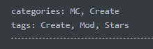
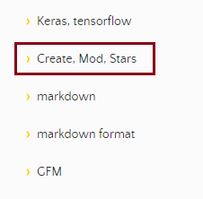
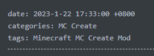
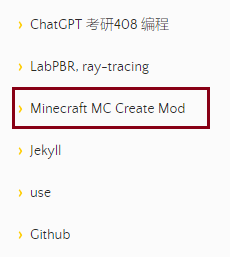

# YAML Front Matter

如果你要设置：

1. 日期(date)
2. 类编(categories)
3. 标签(tags)

这里为了使用方便，统一不使用`category`和`tag`，而采用相应的`categories`和`tags`。

## Date

``` yaml
date: 2023-5-8 20:49:00 +0800
```

最后一个参数是与UTC时间的偏移。相信我，这个参数是有必要的。

## Categories and Tags

他们是相同的格式，都是使用相应的数组表示方法。

``` yaml
categories: [classA, class B, newclass]
tags: [tag1, tag2, tag3]
```

**以下**用法是**错误**的：

---

**第一种**：使用逗号分隔。

``` yaml
tags: Create, Mod, Stars
```



结果：

> 被识别为：`Create, Mod, Stars`一个标签，是的，就**一个！**
>
> 有图为证：

**第二种**：使用单纯空格分隔

``` yaml
tags: Minecraft MC Create Mod
```



结果：

> 被识别为：`Minecraft MC Create Mod`一个标签，是的，就**一个！**
>
> 有图为证：

---

现在我们回到上面正确的用例：

``` yaml
categories: [classA, class B, newclass]
tags: [tag1, tag2, tag3]
```

我们注意到其中有空格，可是`yaml`作为一种极其离谱又死板格式的语言，真的可以这样包含空格而不出错吗？（比如被分开）其实这个问题上面的错误示范就可以推导出结论。

---

让我们看看这个尝试的验证结果：

``` yaml
tags: [tag1, tag2, tag 3, tagB]
```

看到结果：


一切正常，空格不受影响。

---

另外，遍历展示的时候注意分隔格式，不然就会变成这样：


---

至于其中是否需要双引号号，似乎不是必要，看起来没什么区别：

``` yaml
tags: ["tag1", "tag2", "tag 3", "tagB"]
```

结果和上面的是一样的。