# Install and Launch CentOS

Option when installing:

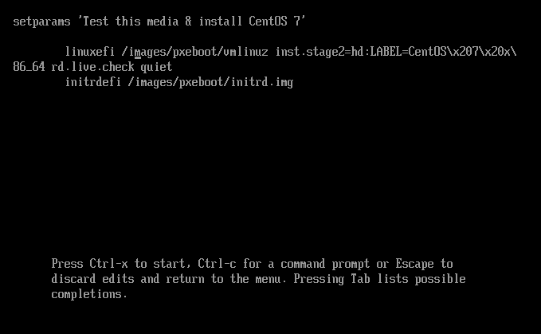

## Install

On launch there will be a Linux Logo shown. Then there is a GUI.

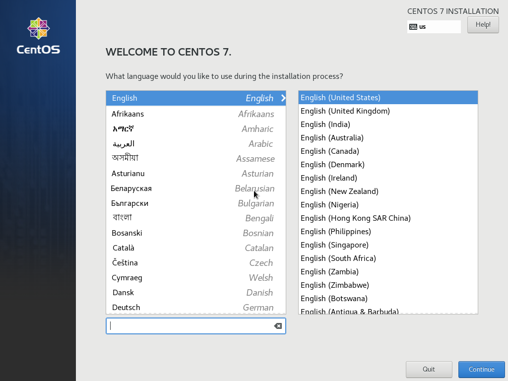

有简体中文可选。

基本环境我选了 *GNOME桌面* 。

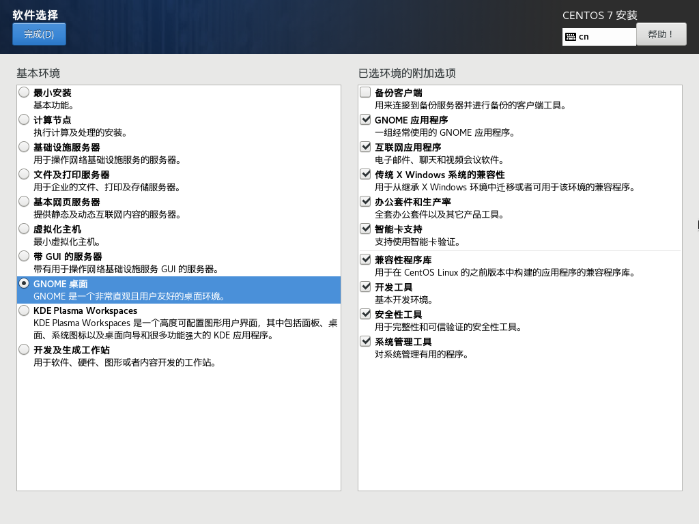

设置网络：

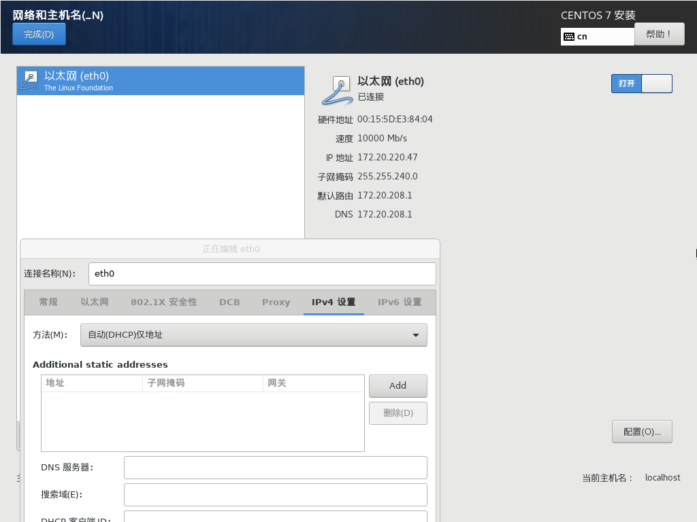

安全策略：（不懂）

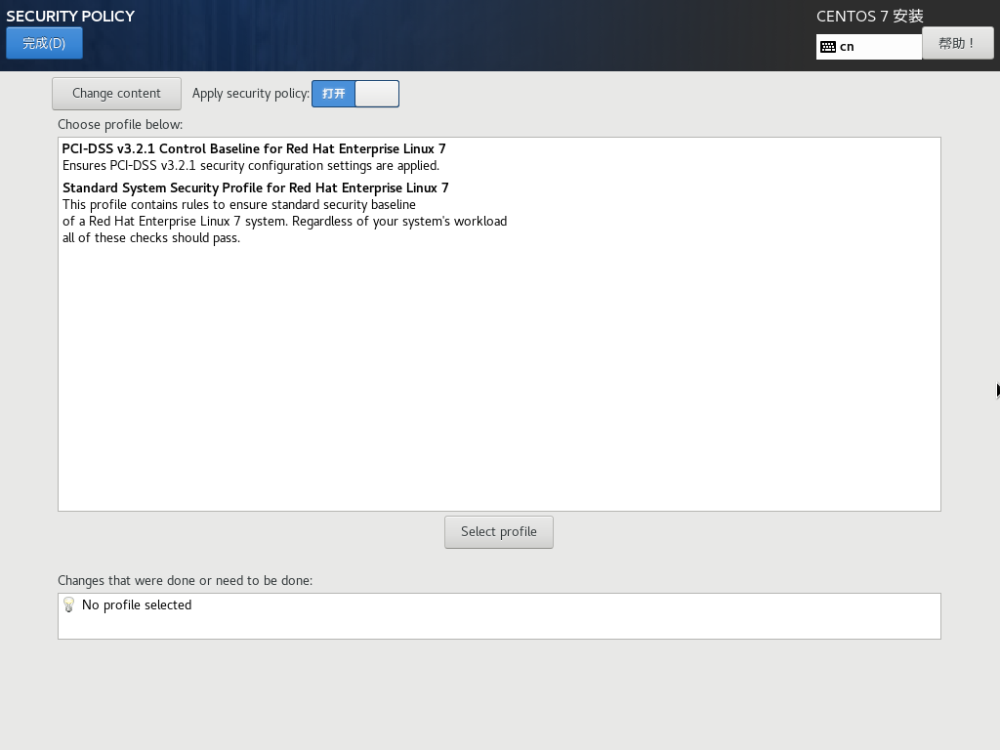

配置总览：

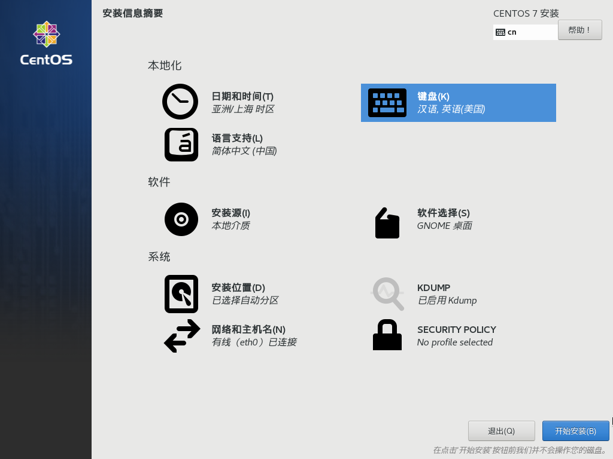

安装中：

完成安装：

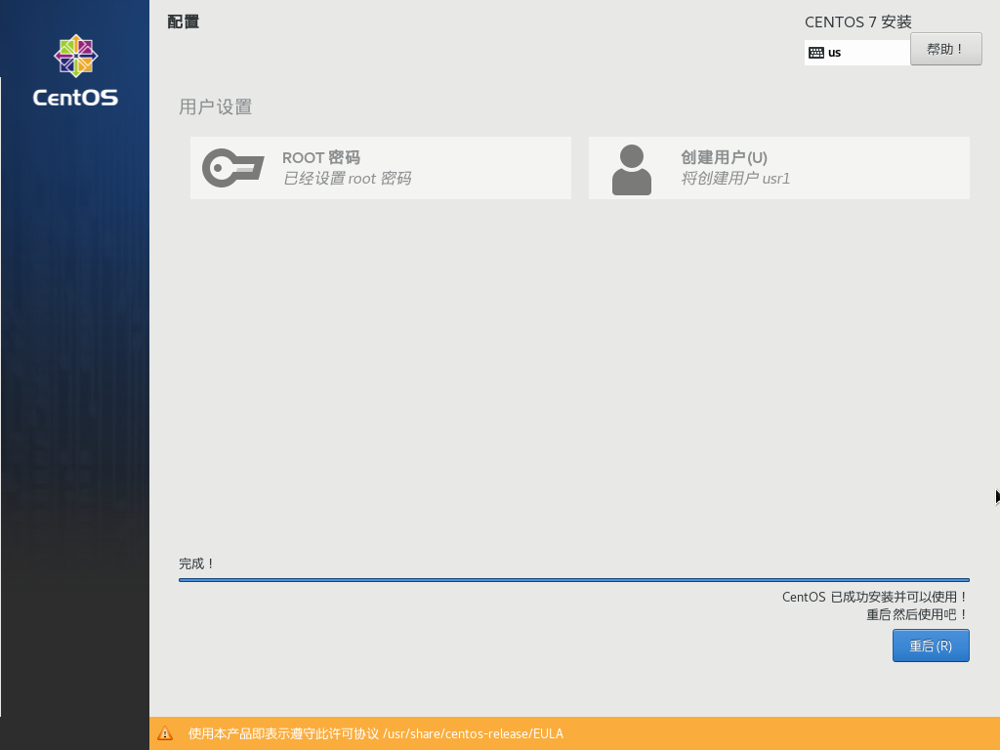

重启后要求接受协议，可以看到，CentOS 7 是以GPLv2发行的。这就是CentOS 7 Linux EULA。

## Launch

启动时会出现命令行界面，稍后加载出GNOME桌面，出现GUI：

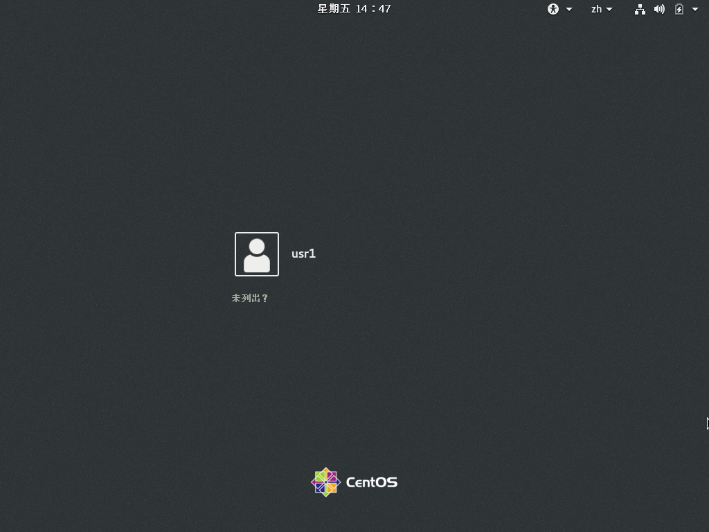

两种模式：

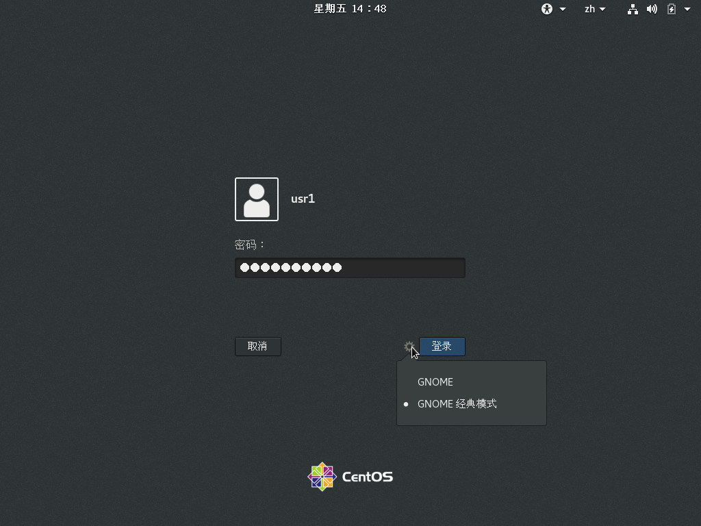

还挺像苹果的：

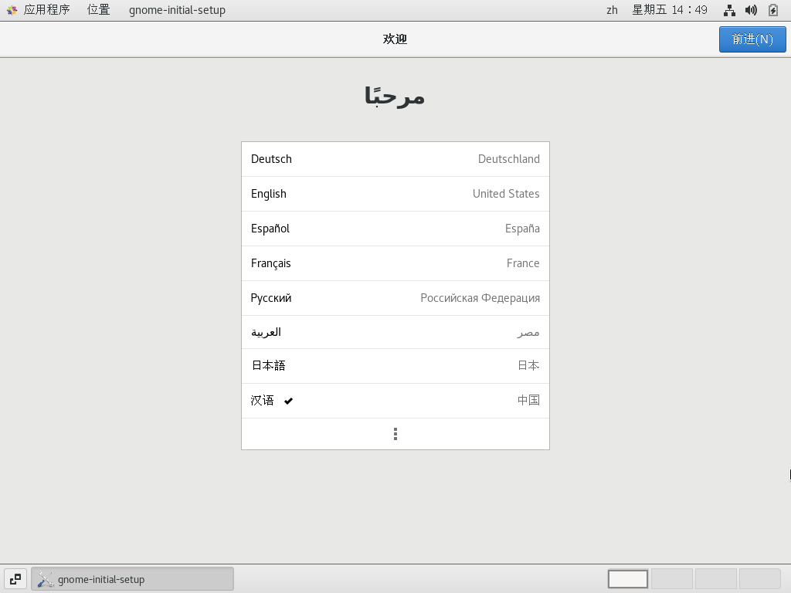

三种拼音：

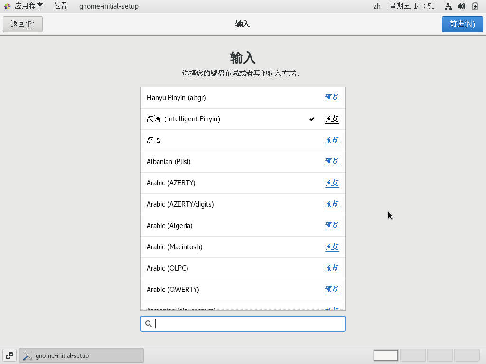

跳过在线账户登录，完成：

然后是引导：

## End

系统信息：

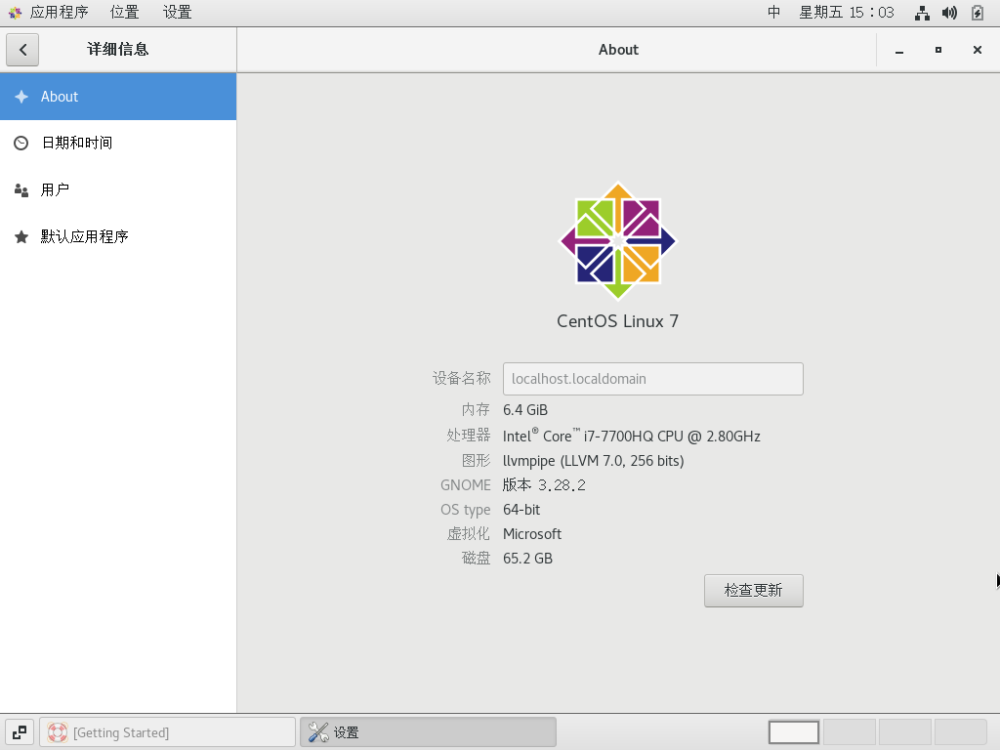

