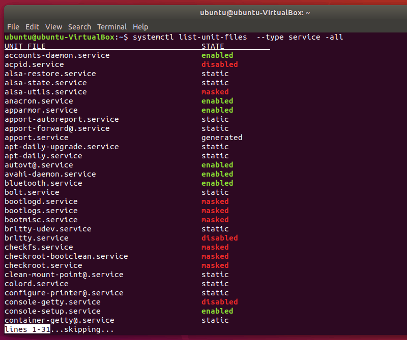

# Linux列出和管理服务

links: 

1. <https://cloud.tencent.com/developer/article/1877558>

## 1

我从 systemd 开始，因为它被广泛接受。

#### 1、列出所有服务

为了管理服务，你首先需要知道系统上有哪些服务可用。你可以使用 systemd 的命令列出 Linux 系统上的所有服务：

```bash
systemctl list-unit-files --type service -all
```

复制



*systemctl list-unit-files*

此命令将输出所有服务的状态。服务状态有启用enabled、禁用disabled、屏蔽masked（在取消屏蔽之前处于非活动状态）、静态static和已生成generated。

与 grep 命令 结合，你可以仅显示正在运行的服务：

```bash
sudo systemctl | grep running
```

复制


*Display running services systemctl*

现在，你知道了如何引用所有不同的服务，你可以开始主动管理它们。

**注意：** 下列命令中的 `<service-name>` 应该用你想管理的服务名代替。（比如：network-manager、ufw 等）

#### 2、启动服务

要在 Linux 中启动服务，你只需使用它的名字：

```bash
systemctl start <service-name>
```

复制

#### 3、停止服务

要停止 systemd 服务，可以使用 `systemctl` 命令的 `stop` 选项：

```bash
systemctl stop <service-name>
```

复制

#### 4、重启服务

要重启 systemd 服务，可以使用：

```bash
systemctl restart <service-name>
```

复制

#### 5、检查服务状态

你可以通过打印服务状态来确认你已经成功执行特定操作：

```bash
systemctl status <service-name>
```

复制

这将以以下方式输出：


*systemctl status*