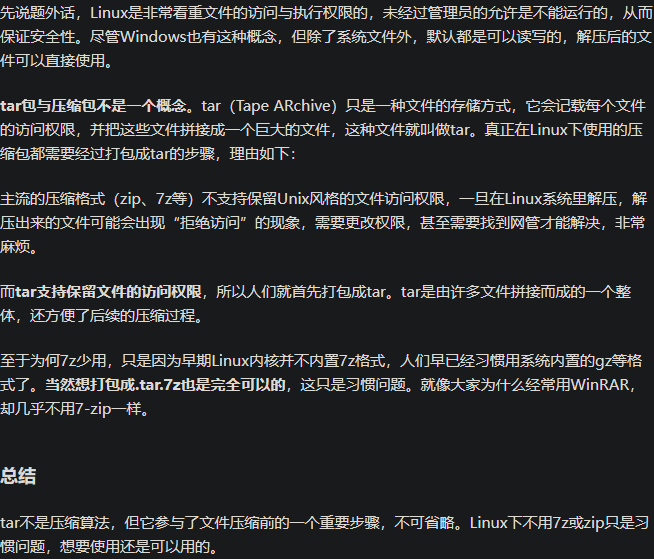

# 为什么Linux用tar.gz而不是zip

links:

1. 【[为什么 Linux 要用 tar.gz，很少用 7Z 或 ZIP?](https://www.zhihu.com/question/335911358)】

## 1

> 因为 7z 和 zip 压缩格式都不能保留 unix 风格的文件权限，比如解压出个可执行文件要重新 chmod chown 才能恢复正常。而 tar 格式可以。而 tar 本身不提供压缩，无非就是把包括所有文件的內容和权限拼成一个文件而己，所以用另外如 gzip 格式压缩。为什么是 gzip，因为几乎所有 linux 都支持而已。
>
> 作者：LdBeth
> 链接：<https://www.zhihu.com/question/335911358/answer/755424668>
> 来源：知乎
> 著作权归作者所有。商业转载请联系作者获得授权，非商业转载请注明出处。

> 在备份特定文件这件事上，tar.gz用的非常非常多。但其他事情就不一定。
>
> 为什么 Linux 要用 tar.gz，很少用 7Z 或 ZIP？ - 沙包妖梦的回答 - 知乎 <https://www.zhihu.com/question/335911358/answer/761230811>
>
> > ps. 这条回答有很多信息，可以好好看看。

> 因为 tar 无可替代。
>
> 7z跟zip都是打包+压缩的软件。
>
> tar是打包，gz是压缩。
>
> tar的压缩后端是可以换的，可以换成bz2，Z，xz等等。甚至可以换成7z，zip。
>
> 但tar作为打包软件目前无人能替代。7z，rar，zip等软件都无法正确的给Linux文件与目录进行打包，无法记录Linux文件权限位字段以及符号链接等。
>
> 所以这个问题也没啥可以疑惑的，单纯就是没有一个软件的设计理念与功能完整度能跟tar相比拟而已。
>
> 作者：pansz
> 链接：<https://www.zhihu.com/question/335911358/answer/2595914959>
> 来源：知乎
> 著作权归作者所有。商业转载请联系作者获得授权，非商业转载请注明出处。

> 如果你在意的是压缩算法，那么 gz 是 gzip 的缩写，用的压缩算法和 zip 是一路货。
>
> 另外其实现在 Linux 已经转用 tar.xz 了，比如 deb （debian/ubuntu 用的软件包格式）好几年前就用 tar.xz 了。xz 和 7z 也是一路货。
>
> 如果你在意的是 tar.gz 是两段，先 tar 再 gz，那是因为 linux 受 unix 哲学「一个工具只做好一件事」的影响。
>
> 至于为什么没搞出 [tar.zip](https://link.zhihu.com/?target=http%3A//tar.zip) 这样的东西？这是因为当年 zip 的官方软件是个共享软件，不是自由软件。所以 Linux 不能直接用或者移植。那既然重写的话，就没有必要做的和 zip 一样，毕竟 gz 只用管压缩，不用管打包。
>
> 作者：weakish
> 链接：<https://www.zhihu.com/question/335911358/answer/756012027>
> 来源：知乎
> 著作权归作者所有。商业转载请联系作者获得授权，非商业转载请注明出处。

> zip是最拉的，连文件名编码都不保存，Windows上的zip包拿到Linux上unzip解压会乱码。
>
> 7z是一个俄罗斯Windows程序员开发的，代码是开源的，压缩算法LZMA也是开源的，官方没有直接提供Linux支持。第三方在Linux上的实现叫做xz，算法用的也是LZMA，但貌似不支持多线程，速度不如Windows上的7z。7z解压后的文件名不会乱码。Linux上通过Wine也可以良好运行7z图形客户端。
>
> 另外还有一个第三方的实现叫做p7zip，还支持解压rar文件，而且不乱码
>
> 作者：eechen
> 链接：<https://www.zhihu.com/question/335911358/answer/2469477687>
> 来源：知乎
> 著作权归作者所有。商业转载请联系作者获得授权，非商业转载请注明出处。

> 想要用7-zip来备份的话还得先用tar打包到管道里 。
>
> 另外，7-zip是需要额外安装的。而且p7zip更新好像并不是很快啊 。

> 
>
> 为什么 Linux 要用 tar.gz，很少用 7Z 或 ZIP？ - 张浩扬穿JK的回答 - 知乎 <https://www.zhihu.com/question/335911358/answer/2448721579>

> 