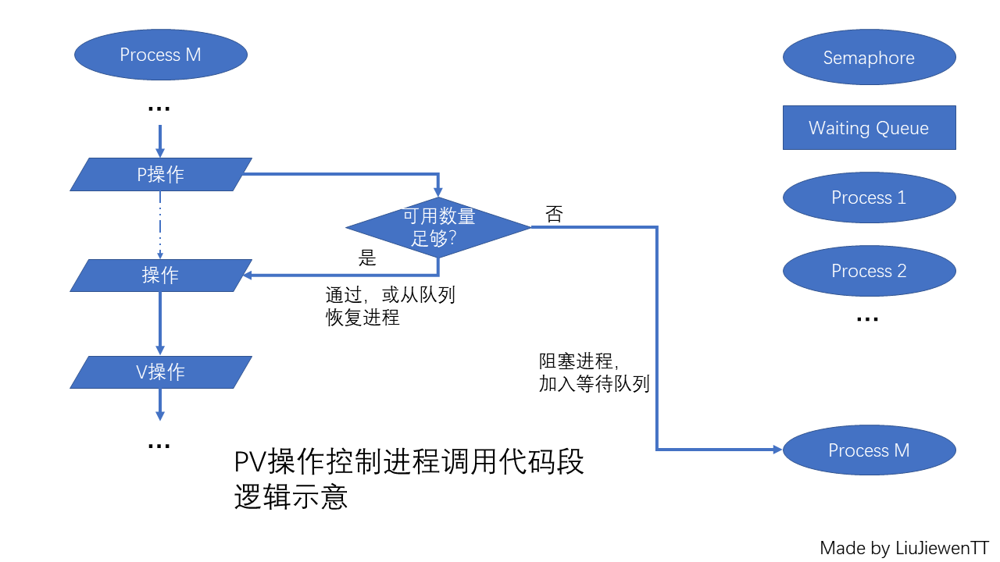

# 信号量

内容摘抄自网络，内容可能有修改。

links:

1. <https://blog.csdn.net/weixin_43914272/article/details/108317212>

2. <https://cloud.tencent.com/developer/article/1557367>

3. <https://baike.baidu.com/item/信号量>

4. <https://cloud.tencent.com/developer/article/1673387>

   ## Mine

信号量：*Semaphore*，也被称作 *信号灯*。

信号量指示可用资源数量。P操作申请资源，信号量减小；V操作释放资源，信号量增大。

如果获取不到资源，那就进入队列，阻塞当前进程。当有资源空闲，队列弹出对象，恢复一个进程，从而完成有序的分配。

由于c不是那么方便，在不使用STL容器的前提下，只能使用循环队列。此时队列初始有序，而分配保持有序，进入队列也保持有序，全过程保持了有序性。至于分配的标识，可以使用值非空，或者是指针。如果指针追尾，必定是开始或停止的情况。

> 若sem减1后小于零，则该进程被阻塞后**进入与该信号相对应的队列**中，然后转进程调度。

所以semop实现了锁，并且会设置排队，唤醒是从队列中逐渐访问的。



## 1


## 2

sem_op : 如果其值为正数，该值会加到现有的信号内含值中。通常用于释放所控资源的使用权；如果sem_op的值为负数，而其绝对值又大于信号的现值，操作将会阻塞，直到信号值大于或等于sem_op的绝通常用于获取资源的使用权；如果sem_op的值为0，则操作将暂时阻塞，直到信号的值变为0。

``` c
struct   sembuf{
	 unsigned short  sem_num;//第几个信号量，第一个信号量为0
     short  sem_op;//对该信号量的操作。
     short _semflg;
 };
```

也就是说，如果当前信号为0，此时p操作-1，无法完成，将会阻塞，直到可用量足够。

``` c
int    semop(int   semid, struct    sembuf   *_sops, size_t  _nsops);

功能：用户改变信号量的值。也就是使用资源还是释放资源使用权。
返回值：成功返回0，失败返回-1；
参数：

   _semid : 信号量的标识码。也就是semget（）的返回值。

  _sops是一个指向结构体数组的指针。

 struct   sembuf{
	 unsigned short  sem_num;//第几个信号量，第一个信号量为0
     short  sem_op;//对该信号量的操作。
     short _semflg;
 };
sem_num:  操作信号在信号集中的编号。第一个信号的编号为0；
sem_op : 如果其值为正数，该值会加到现有的信号内含值中。通常用于释放所控资源的使用权；如果sem_op的值为负数，而其绝对值又大于信号的现值，操作将会阻塞，直到信号值大于或等于sem_op的绝通常用于获取资源的使用权；如果     	
sem_op的值为0，则操作将暂时阻塞，直到信号的值变为0。
_semflg: IPC_NOWAIT //对信号的操作不能满足时，semop()不会阻塞，并立即返回，同时设定错误信息。
SEM_UNDO //程序结束时(不论正常或不正常)，保证信号值会被重设为semop()调用前的值。这样做的目的在于避免程序在异常情况下结束时未将锁定的资源解锁，造成该资源永远锁定。
nsops：操作结构的数量，恒大于或等于1。
```

## 3

是在[多线程](https://baike.baidu.com/item/多线程/1190404?fromModule=lemma_inlink)环境下使用的一种设施，是可以用来保证两个或多个关键[代码段](https://baike.baidu.com/item/代码段/9966451?fromModule=lemma_inlink)不被并发调用。在进入一个关键代码段之前，[线程](https://baike.baidu.com/item/线程/103101?fromModule=lemma_inlink)必须获取一个信号量；一旦该关键代码段完成了，那么该线程必须释放信号量。其它想进入该关键代码段的线程必须等待直到第一个线程释放信号量。为了完成这个过程，需要创建一个信号量VI，然后将Acquire Semaphore VI以及Release Semaphore VI分别放置在每个关键代码段的首末端。确认这些信号量VI引用的是初始创建的信号量。

### 描述

以一个停车场的运作为例。简单起见，假设停车场只有三个车位，一开始三个车位都是空的。这时如果同时来了五辆车，看门人允许其中三辆直接进入，然后放下车拦，剩下的车则必须在入口等待，此后来的车也都不得不在入口处等待。这时，有一辆车离开停车场，看门人得知后，打开车拦，放入外面的一辆进去，如果又离开两辆，则又可以放入两辆，如此往复。

在这个[停车场系统](https://baike.baidu.com/item/停车场系统/2960753?fromModule=lemma_inlink)中，车位是[公共资源](https://baike.baidu.com/item/公共资源/2760349?fromModule=lemma_inlink)，每辆车好比一个线程，看门人起的就是信号量的作用。