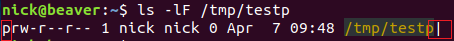

# 命名管道

links：

1. <https://www.cnblogs.com/sparkdev/p/11008978.html>


## 1 [Linux 命名管道 ](https://www.cnblogs.com/sparkdev/p/11008978.html)

[前文](https://www.cnblogs.com/sparkdev/p/10997135.html)中笔者介绍了管道，本文接着介绍命名管道。文中演示所用环境为 Ubuntu 18.04 desktop。

**命名管道(named pipe)又被称为先进先出队列(FIFO)**，是一种特殊的管道，存在于文件系统中。命名管道与管道非常类似，但是又有自身的显著特征：

- 命名管道可以用于任何两个进程间的通信，而不限于同源的两个进程。
- 命名管道作为一种特殊的文件存放在文件系统中，而不是像管道那样存放在内核中。当进程对命名管道的使用结束后，命名管道依然存在于文件系统中，除非对其进行删除操作，否则该**命名管道不会自行消失**。

和管道一样，命名管道也只能用于数据的**单向传输**，如果要用命名管道实现两个进程间数据的双向传输，建议使用两个单向的命名管道。

### 创建命名管道

**在命令行上创建命名管道**
可以通过命令行命令 mkfifo 或 mknod 创建命名管道：

```
$ mkfifo /tmp/testp
$ mknod /tmp/testp p
```

可以通过 ls 命令查看命名管道的文件属性：



输出中的第一个字符为 p，表示这个文件的类型为管道。最后的 | 符号是有 ls 命令的 -F 选项添加的，也表示这个一个管道。

**在程序中创建命名管道**
在程序中创建命名管道，可以使用 mkfifo 函数，其签名如下：

```
#include <sys/types.h>
#include <sys/stat.h>

int mkfifo(const char *pathname, mode_t mode);
```

参数 pathname 是一个字符串指针，用于存放命名管道的文件路径。参数 mode 用于表示指定所创建文件的权限。该函数调用成功时返回 0；调用失败时返回 -1。
mkfifo 函数是一个专门用来创建命名管道的函数，而另外一个函数 mknod 却可以兼职创建命名文件，其函数签名如下：

```
#include <sys/types.h>
#include <sys/stat.h>

int mknod(char *pathname, mode_t mode, dev_t dev);
```

创建命名管道只是 mknod 函数的功能之一，它的前两个参数和 mkfifo 函数相同。在创建命名管道时，为第三个参数 dev 传递 0 就可以了。该函数调用成功时返回 0；调用失败时返回 -1。

### 在程序中使用命名管道

下面的 demo 模拟一个生产者进程和消费者进程，二者通过命名管道传输数据。生产者的代码如下：

[](javascript:void(0);)

```
#include <limits.h>
#include <unistd.h>
#include <stdlib.h>
#include <stdio.h>
#include <string.h>
#include <fcntl.h>
#include <sys/types.h>
#include <sys/stat.h>

#define FIFO_NAME "/tmp/testp"
#define BUFFER_SIZE 4096
#define TEN_MEG (1024 * 1024 * 10)

int main(void)
{
    int pipe_fd;
    int res;
    int open_mode = O_WRONLY;
    int bytes_sent = 0;
    char buffer[BUFFER_SIZE + 1];

    if(access(FIFO_NAME, F_OK) == -1)
    {
        res = mkfifo(FIFO_NAME, 0777);
        if(res != 0)
        {
            fprintf(stderr, "Could not create fifo %s\n", FIFO_NAME);
            exit(EXIT_FAILURE);
        }
    }

    printf("Process %d opening FIFO O_WRONLY\n", getpid());
    pipe_fd = open(FIFO_NAME, open_mode);
    printf("Process %d opened fd %d\n", getpid(), pipe_fd);

    if(pipe_fd != -1)
    {
        while(bytes_sent < TEN_MEG)
        {
            res = write(pipe_fd, buffer, BUFFER_SIZE);
            if(res == -1)
            {
                fprintf(stderr, "Write error on pipe\n");
                exit(EXIT_FAILURE);
            }
            bytes_sent += res;
        }
        (void)close(pipe_fd);
    }
    else
    {
        exit(EXIT_FAILURE);
    }
    printf("Process %d finished\n", getpid());
    exit(EXIT_SUCCESS);
}
```

[](javascript:void(0);)

把上面的代码保存到文件 namedpipedemo.c 中。
消费者的代码如下：

[](javascript:void(0);)

```
#include <limits.h>
#include <unistd.h>
#include <stdlib.h>
#include <stdio.h>
#include <string.h>
#include <fcntl.h>
#include <sys/types.h>
#include <sys/stat.h>

#define FIFO_NAME "/tmp/testp"
#define BUFFER_SIZE 4096

int main(void)
{
    int pipe_fd;
    int res;
    int open_mode = O_RDONLY;
    int bytes_read = 0;
    char buffer[BUFFER_SIZE + 1];

    memset(buffer, '\0', sizeof(buffer));

    printf("Process %d opening FIFO O_RDONLY\n", getpid());
    pipe_fd = open(FIFO_NAME, open_mode);
    printf("Process %d opened fd %d\n", getpid(), pipe_fd);

    if(pipe_fd != -1)
    {
        do
        {
            res = read(pipe_fd, buffer, BUFFER_SIZE);
            bytes_read += res;
        } while (res > 0);
        (void)close(pipe_fd);
    }
    else
    {
        exit(EXIT_FAILURE);
    }
    printf("Process %d finished, %d bytes read\n", getpid(), bytes_read);
    exit(EXIT_SUCCESS);
}
```

[](javascript:void(0);)

把上面的代码保存到文件 namedpipedemo2.c 中。并分别编译这两个程序：

```
$ gcc -Wall namedpipedemo.c -o pipe1
$ gcc -Wall namedpipedemo2.c -o pipe2
```

先在一个终端中执行生产者：


然后在另一个终端中执行消费者：


结果是二者完成数据传输后都返回了：


### 删除命名管道

删除命名管道和删除一个普通文件没有什么区别：

```
$ rm /tmp/testp
```

这就可以了！

**参考：**
《Linux 程序设计》
《Linux 环境下 C 编程指南》