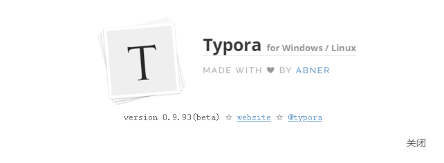

# Some Markdown Formats

Here is a list of common formats of markdown used by several renderers.

1. [GFM](#GFM "Github Favored Markdown")

There are some **renderer**s. View them [here](Some Markdown Renderers.md)

## GFM

*GFM*, short for *Github Favored Markdown*.

For writing referencing: <https://docs.github.com/en/get-started/writing-on-github/getting-started-with-writing-and-formatting-on-github/basic-writing-and-formatting-syntax>

## Applications

## Typora

I'm using beta version(0.9.93) of Typora.

> **Typora** is using [GitHub Flavored Markdown][GFM].

[GFM]: https://help.github.com/articles/github-flavored-markdown/	"See on Github.com"

