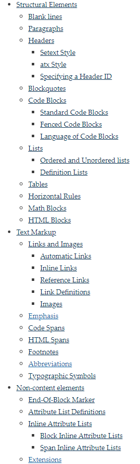
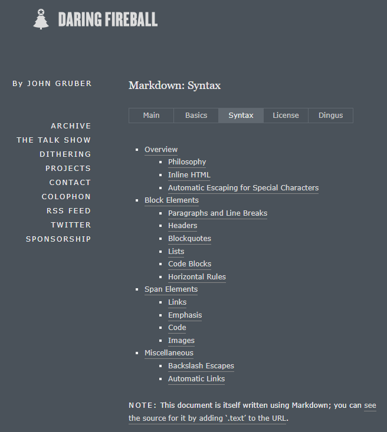

# Some Markdown Renderers

Here introduce 3 renderer first:

1. [kramdown](#kramdown)
2. [redcarpet](#redcarpet)
3. [rdiscount](#rdiscount)

There are some **format**s. View them [here](Some Markdown Formats.md)

## kramdown

Github repo: [https://github.com/gettalong/kramdown](https://github.com/gettalong/kramdown)

### kramdown introduction

> kramdown is a fast, **pure Ruby** Markdown superset converter, using a strict syntax definition and supporting several common extensions.

### kramdown supported syntax

**My words to say:**
It **cannot** render highlight syntax`==`. But `<mark>` HTML label should be supported. (Known from online information)

For quick reference, view this: [https://kramdown.gettalong.org/quickref.html](https://kramdown.gettalong.org/quickref.html)

Link: [https://kramdown.gettalong.org/syntax.html](https://kramdown.gettalong.org/syntax.html)

## redcarpet

Github repo: [https://github.com/vmg/redcarpet](https://github.com/vmg/redcarpet)

### redcarpet introduction

> Redcarpet is **a Ruby library** for Markdown processing that smells like butterflies and popcorn.

> This library is written by people
>
> Redcarpet was written by [Vicent Martí](https://github.com/vmg). It is maintained by [Robin Dupret](https://github.com/robin850) and [Matt Rogers](https://github.com/mattr-).
>
> Redcarpet would not be possible without the [Sundown](https://www.github.com/vmg/sundown) library and its authors (Natacha Porté, Vicent Martí, and its many awesome contributors).

### redcarpet supported syntax

Some can be saw from repo's [README](https://github.com/vmg/redcarpet#and-its-like-really-simple-to-use).

**My words to say:**
It can <mark>highlight texts!</mark> (Known from online information)

## rdiscount

Github repo: [https://github.com/davidfstr/rdiscount/](https://github.com/davidfstr/rdiscount/)

Home Page: [https://dafoster.net/projects/rdiscount/](https://dafoster.net/projects/rdiscount/)

Docs (i cant access it): [https://rdoc.info/github/davidfstr/rdiscount/master/RDiscount](https://rdoc.info/github/davidfstr/rdiscount/master/RDiscount)

### rdiscount introduction

*rdiscount* is the ruby extension of *Discount* processor. It uses the processor.

> Discount is an implementation of John Gruber's Markdown markup language in **C**. It implements all of the language described in [the markdown syntax document](https://daringfireball.net/projects/markdown/syntax) and passes the [Markdown 1.0 test suite](https://daringfireball.net/projects/downloads/MarkdownTest_1.0.zip).

Discount was developed by [David Loren Parsons](https://www.pell.portland.or.us/~orc). The **Ruby extension** is maintained by [David Foster](https://github.com/davidfstr).

### rdiscount supported syntax

**My words to say:**
It **cannot** render highlight syntax`==`. But `<mark>` HTML label should be supported. (Known from online information)

These are supported by the supper, *Discount* processor.
Link: [https://daringfireball.net/projects/markdown/syntax](https://daringfireball.net/projects/markdown/syntax)

## Applications

### Github Pages

Its default renderer is *kramdown*.