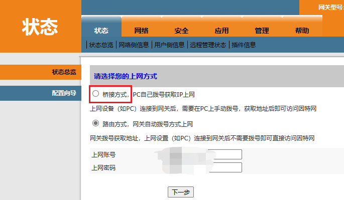

# 2023-08-06 光猫操作实践2

文接[上回](2023-7-8 光猫操作实践.md)：

这一次，我是在寻找光猫改桥接的路上有了新的收获。

使用普通管理员账户登录进入高级后台，发现除了配置向导有提到改桥接，其他地方都没有。于是我尝试通过这里把光猫改成桥接模式。



但是一路走下去，发现还是失败了，**没有效果**！

> 在实践过程中，我的经验是：路由器和光猫都是各种奇奇怪怪的东西特别多，远不如桌面系统那么清晰，像运营商给的光猫，那都是各种奇怪的问题各种不生效的结果。

在这个过程中，我主要参考了这篇教程：

> 发布时间`2023-03-05 17:03:54`，暂时还可用。（不可用状态：{{page.allow_download_doc}}）
>
> link:[](https://www.1234f.com/sj/technique/xxzl/20230305/346.html)
>
> > 记得关tr069

<small style="color:grey">因为本文是在后来补写的，过程没有实时记录，因此下文为综合网络资料进行的简略描述。</small>

还是和上文一样的地方，然后查看相同的文件，然后看看有什么Key可用，优先用*3*，不行用*2*，然后拼串。

> 哦对了，在拿到超管账户后发现超管的文件有一个单独的版本，然后虽然界面上还是找不到usb备份，但文件中能看到相关的信息，也就是上文所提内容。内容如下：
>
> ---
>
> 拼串（大致内容）：
>
> 
>
> ``` http
> http://192.168.1.1:8080/usbbackup.cmd?action=backup&subarea=[?]&set1_sessionKey=[?]
> ```
>
> 
>
> > Content not revealed now.
>
> 
>
> 而这之前需要启用：
>
> 
>
> ``` http
> http://192.168.1.1:8080/usbbackup.cmd?action=backupeble&enabled=1&set2_sessionKey=[?]
> ```
>
> 
>
> > Content not revealed now. 
>
> 

拼串：



``` http
http://192.168.1.1:8080/telandftpcfg.cmd?action=add&telusername=admin&telpwd=admin&telport=23&telenable=1&ftpusername=useradmin&ftppwd=ftpadmin&ftpport=21&ftpenable=1&set3_sessionKey=XXXXXXXXX
```



> Content not revealed now. 



这些操作我写成了一套自动化脚本，省去上述除了登录的所有步骤，一键开启telnet功能。

> Content not revealed/published now.

接着使用telnet登录进光猫继续操作。现在的Windows大多数是没有自带telnet功能的，但是可以有，需要到Windows功能里添加。或者你使用第三方telnet客户端应该也是可以的。

> telnet登录进去后，输入`su`进入*Busybox*，再输入`exit`退出*Busybox*，命令提示符变成`>`，输入`telecomadmin get`即可得到超级密码。

众所周知，`su`是进入Linux系统管理员账户，那么就一定需要系统管理员账户的密码，关于获取这个密码，有dalao（“魔爷”）开发了工具。

> 有的人拿去收费，有的人干脆贴脸叫嚣自己写的，只能说：🤡。不过收费虽然不违反开源精神（尽管似乎本来就不开源），但有一点点冒犯共享精神，在原作者开放免费下载的前提下还有人在零成本的网络上提供收费下载以此盈利，只能说多少都有点算是在吸血了，不太好，但也不用太谴责，这件事见仁见智了。
>
> 由于上文教程提供免费下载但不免费提供解压密码，我转而直接在网上搜寻工具：
>
> 
>
> link: [免费，天邑su串号修改地区修改工具](https://www.chinadsl.net/forum.php?mod=viewthread&tid=170647)
>
> 
>
> > Content not revealed now. 
>
> 

上文那篇教程我就只能看到这里了，再往下就要付费了。我还没尝试改桥接，下回再说吧。

---

> 在“网络”-》“远程管理”里，可以关闭`tr069`相关的内容。我也不清楚怎样，先截图备份备份吧。至于关了无法上网，网友的说法是：“投诉率不要啦？”

> 在“网络”-》“网络设置”里，对应的上网端口那里，底下有一个：
>
> - [x] 不启用PPPoE路由桥混合模式
> - [ ] PPPoE路由桥混合模式
>
> 改一下说不定能生效改桥接。改桥接的事**暂时还没试**。