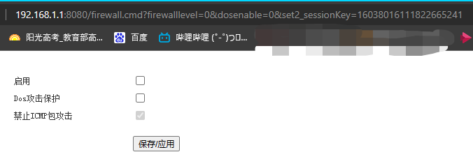

# 2023-7-8 光猫操作实践

电信光猫（假设网关地址是`192.168.1.1`）进入到网关后台默认是新的简化界面，要操作高级设置需要到旧版界面。

> 5分钟无操作将会自动退出登录，回到登入界面

进入这个页面的地址是：`192.168.1.1:8080`。随后它会跳转到`http://192.168.1.1:8080/login.html`要求登入。

这个用户名和密码输入光猫背后的“*默认终端配置账户*”和“*默认终端配置密码*”即可登入。不过此时只是普通管理账户，不是超级管理员账户。

> 关于获取超级管理员账户和密码，这里有一篇教程：<https://blog.csdn.net/imalter/article/details/123057226>。不过似乎已经不能用了，我再看看。

浏览器登录进去后按F12打开控制台，转到“Source”栏目。在上面那个链接我们知道，我们可能需要一个`sessionKey`（实际是`sessionKey2`）。由于需要查找key和拼接URL，我们可以先尝试一下别的。比如：

 

看到上述信息，我们在`Ctrl+F`查找“sessionKey”，我们第一个匹配项就是key的值：

我们使用curl根据刚才的信息尝试连接（刚才尝试过，不过是旧的sessionKey，所以不一样）：

如果错了，得到这样：

如果正确，得到这样：

> 1. -d 是POST，后接数据。
> 2. -H 是设置Header，这里设置type

现在我们开始尝试获取教程：先到“管理”，然后是“设备管理”（这里和教程就不太一样了）：

接着我们查看源代码：

教程查找的是`sessionKey2`，但是这里我已经找不到这个字样了，不知道被放到哪里去了。

这是教程图：

教程找到相关js：

现在连"usb"都查找不到了。

仔细翻了翻文件，根本找不到。只能说，可能换位置了，或者干脆就隐藏了、不给了。

在MenuCT.js中可以看到各页面的名称。其中就有防火墙：`firewall.html`。不过真的很有限啊：

只能说根本没有用，太简陋了。

但是此时我取消勾选Dos攻击保护，保存，随后链接里居然爆出了那个key！

> http://192.168.1.1:8080/firewall.cmd?firewalllevel=0&dosenable=0&set2_sessionKey=16038016111822665241

活久见！那么赶紧继续操作试试。

莫得。

---

2023-08-06: 已有[后文](2023-08-06 光猫操作实践2.md)。