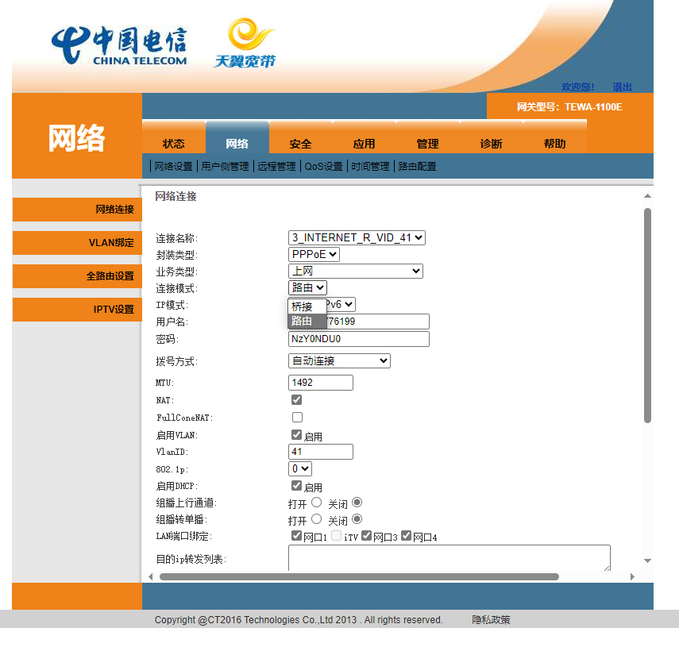

# 2024-01-22 再探光猫

此时我的自动开启telnet的脚本还能使用，但是魔爷的工具似乎已经不能获取su了。不记得之前可不可以，忘了，好像也没存下来。上次只是关了tr069上报，但是没有删除。（不过通过F12似乎有机会删除，没尝试过。）

即便没有su，但是可以用telnet直接输入以下命令下掉连接：

```
ifconfig "veip0.1" down
```

> 这里的`veip0.1`是tr069的接口名称。

这次找到了光猫路由改桥接的位置，如下图所示：
`网络`》`【用于上网的连接】`



今日就这样了。（内容关联：A22）