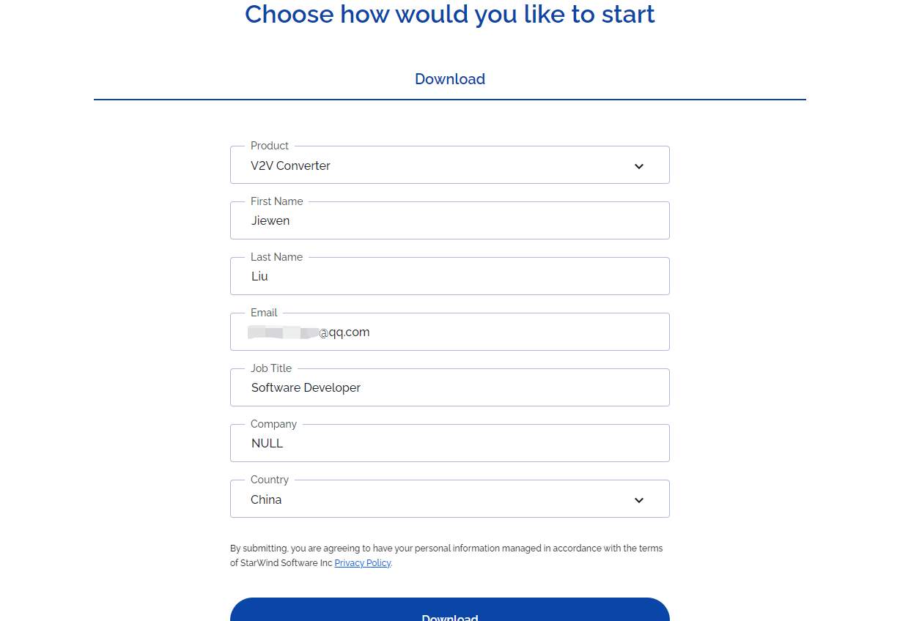
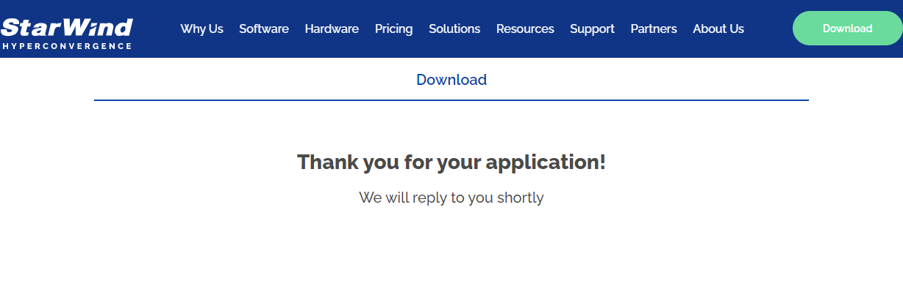
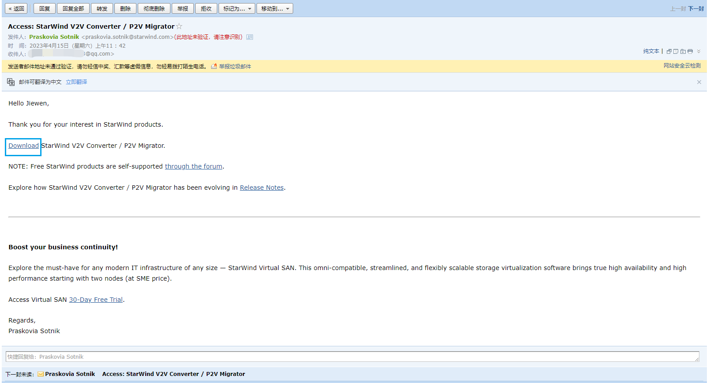
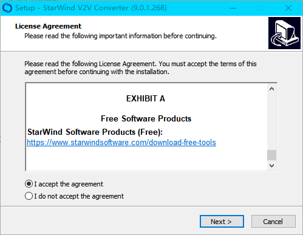
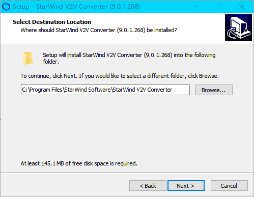
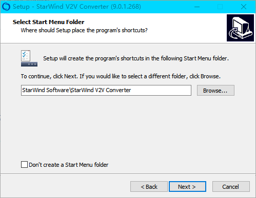
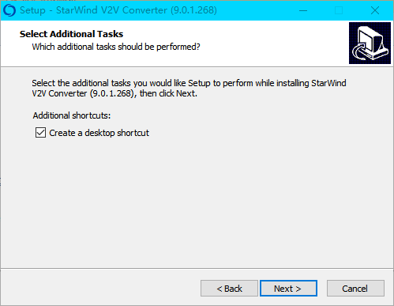
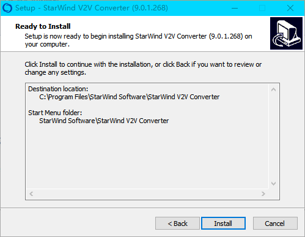
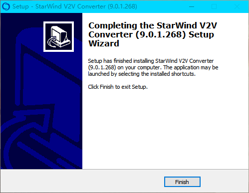

# StarWind V2V Converter下载与安装教程

## Contents

[toc]

## Download - 下载

*StarWind V2V Converter / P2V Migrator*。官网链接：<https://www.starwindsoftware.com/starwind-v2v-converter>。

进去后一路往下拉，有个表单要填，表单名叫：“*Choose how would you like to start - Download*”，填完点下面的*Download*按钮就行了。像这样即可：

随后你会看到这个：

并且浏览器没有弹出任何下载项，这是正常的，请不要惊慌，它说: 

> We will reply you shortly

这是什么意思呢，意思是它很快就会联系你，怎么联系呢？电话或邮件，刚刚的表单就有填邮箱的一项，它会向那个邮箱发送邮件：

就是这样。点击那个*Download*就可以开始下载了。

## Install - 安装

运行安装程序，接受协议，然后点击下一步：

选好安装位置：

选择在【开始菜单】中的样式，也可以勾选下面的选项不添加到【开始菜单】：

选择是否添加快捷方式到桌面，图片里是默认添加，我后来又取消勾选了，因为我觉得这东西不常用没必要：

确认一下信息点击*Install*开始安装：

安装中途会弹出命令行窗口随后立马关闭，内容我也没看清。最后点*Finish*完成安装并退出：

(完)