# 虚拟机转换方法

links:

1. (2016)<https://www.jianshu.com/p/594d0e399f83>
2. (2019)<https://www.jianshu.com/p/838af57bdc88>

Extending Materials:

1. (2020)【[关于Hyper-V和VMware共存](https://zhuanlan.zhihu.com/p/161578626)】

## Mine

从2019的那份链接得知使用*StarWind V2V Converter / P2V Migrator*。官网链接：<https://www.starwindsoftware.com/starwind-v2v-converter>。

详细下载与安装教程见【[StarWind V2V Converter下载与安装教程](StarWind V2V Converter下载与安装教程.md)】。

打开软件，看到这样的界面：

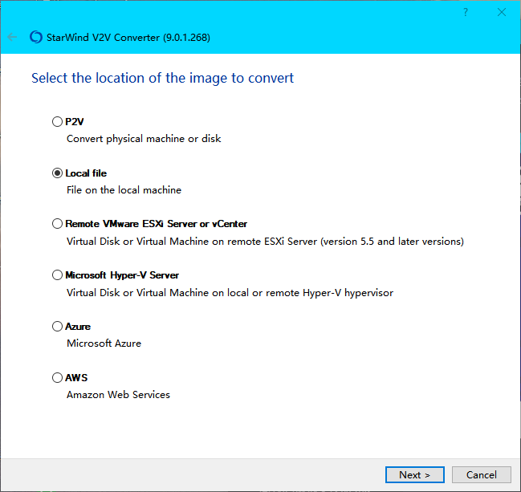

由于我导出了虚拟机，又无法再次导入回Hyper-V，所以这里我选择*Local file*这个选项试一下。

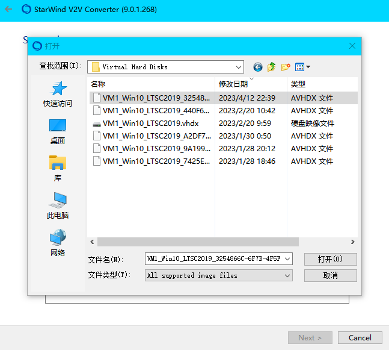

我选择时间最新的`.avhdx`硬盘文件试试吧。我发现都不行，那就`.vhdx`试试吧。

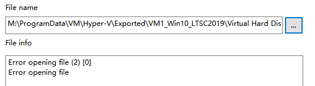

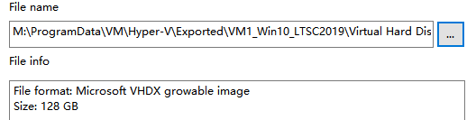

也只有`.vhdx`成功打开。往下走试试。

我选择把转换结果先存在本地：

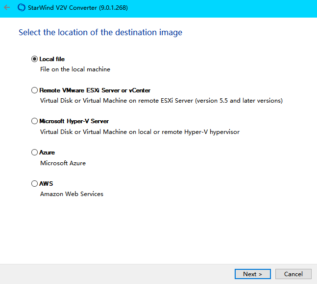

由于要换VMware了，我选对应的硬盘格式，即*VMDK*。

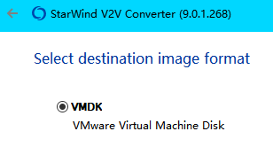

我就这样了：

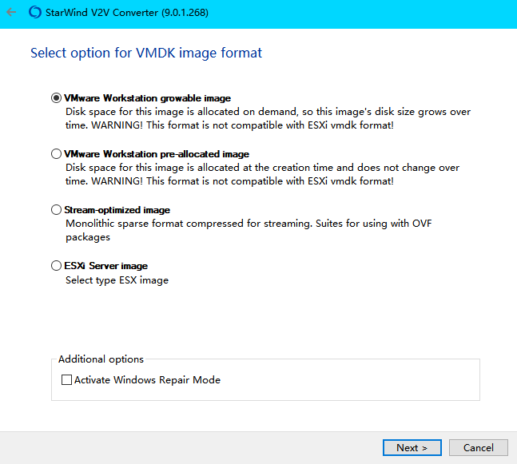

可以看到转换后的大小（注意这里是0，也就是空硬盘，这时候应该想想是不是有差异硬盘可以合并了）：

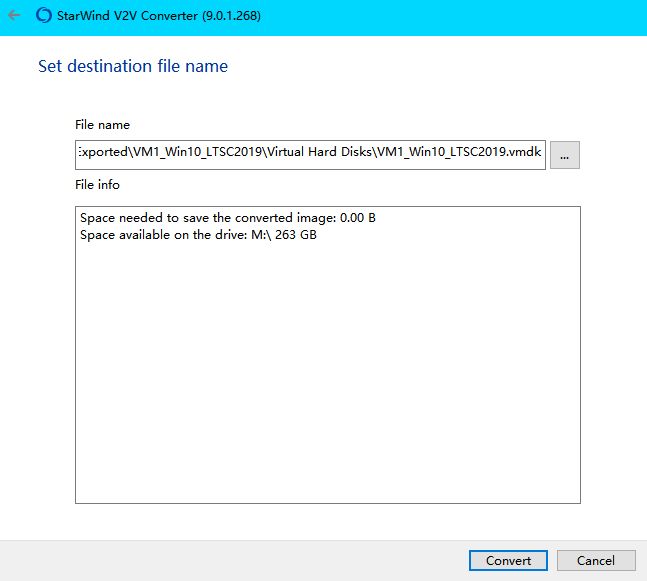

完成后还会弹出*StarWind*的宣传网页，不用管它。

在VMware中新建虚拟机，一路快进到“选择磁盘”，选择“使用现有虚拟磁盘”，然后点击下一步：

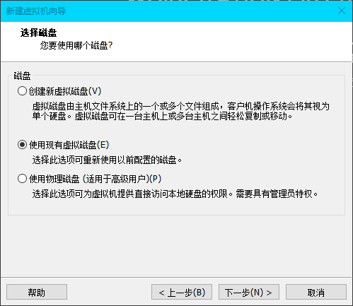

找到先前的`.vmdk`文件，然后继续下一步：

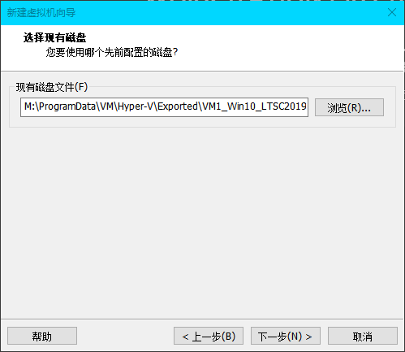

继续快进到完成，然后试试：

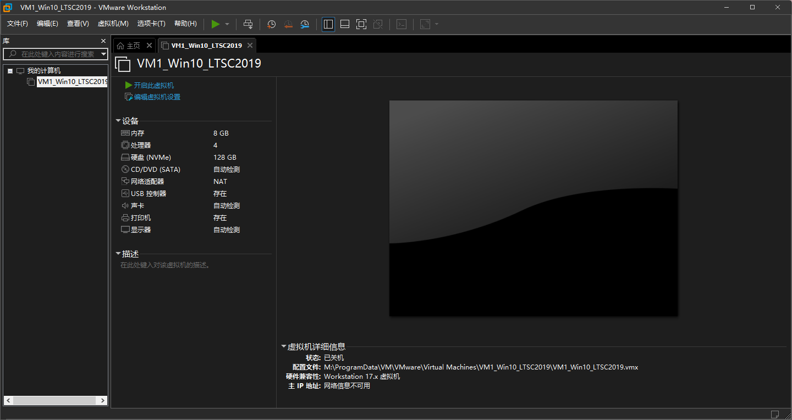

结果莫得，那个`.vhdx`还是最开始那个空硬盘，完蛋玩意！

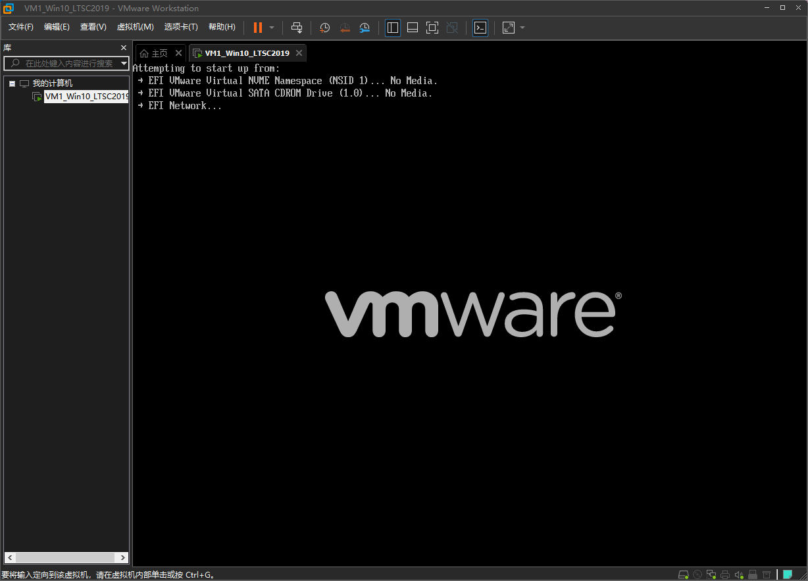

我试试别的虚拟机直接从Hyper-V服务器导出`.vmdk`。

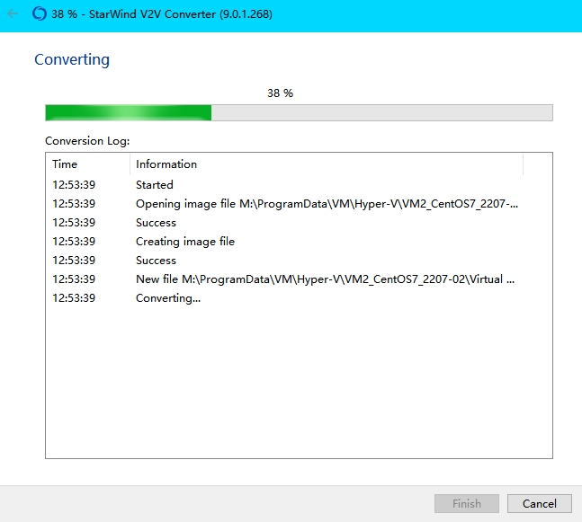

全部略过，现在将<strong style="color:red">结论</strong>：

1. 来自Hyper-V的硬盘无论是Windows系统的还是Linux系统的，统统要用UEFI引导，而不是BIOS引导，不然无法启动。
2. VMware硬盘类型，就按对应系统推荐的去选，没有问题的。
3. 如果来自Hyper-V的硬盘有很多差异硬盘，那自己复制一份出来做合并，合并完再转换。合并的方法见【[../Hyper-V合并avhdx磁盘](../Hyper-V合并avhdx磁盘.md)】。