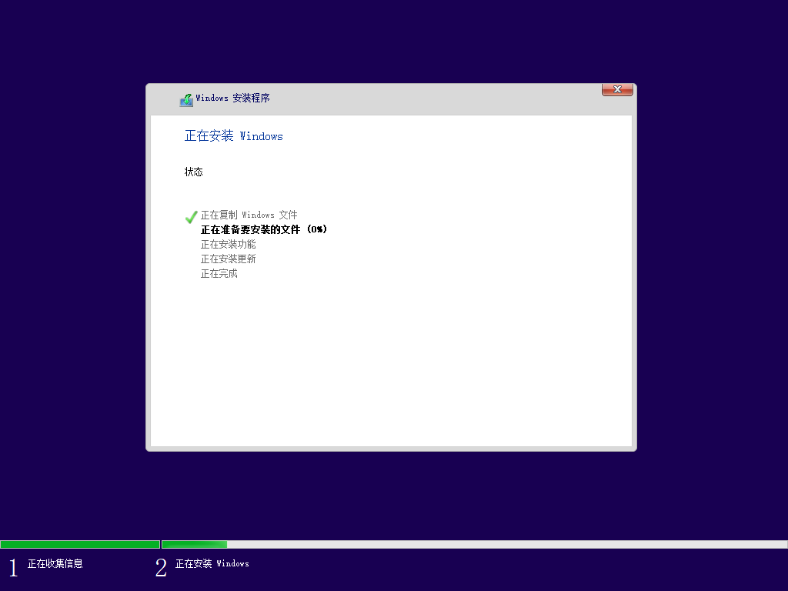

# HyperV创建Win虚拟机

[toc]

# 创建Win10_LTSC_2019的虚拟机

使用第二代虚拟机，安装按`F2`进入安装界面。

> 按了`F2`之后稍等一会，（我这里还挺久的）
>
> 一闪而过，开始转圈圈：
>
> 
>
> 然后会出现安装界面：
>
> 
>
> > 在这之前长这样：
> >
> > 
> >
> > 有时还会显示“Press any key to boot from CD or DVD...”：
> >
> > 
> >
> > 然后不管按什么都会这样：
> >
> > 
>
> 我选择好就到下一步。
>
> 两个选项，点击“现在安装”。
>
> 
>
> 然后出现：
>
> 
>
> 接受许可，下一步。
>
> 
>
> 这里我的虚拟机是空硬盘，我选择第二个选项。
>
> 
>
> 然后就是分配空间：
>
> 
>
> 这里可以点新建，然后会出现4个分区，只有一个可以用于安装系统。如果不管，直接点击”下一步“，也会开始安装，如图：
>
> > 选中磁盘，点击”新建“。不管它，直接点”应用“。
> >
> > 
> >
> > 这时出现提示：
> >
> > 
> >
> > 点击确定，出现四个分区：
> >
> > 
> >
> > 这四个中，只有这默认选中的这一个能继续安装系统。
> >
> > > 另外三个，都会出现提示，并且无法点击”下一步“：
> > >
> > > 
> >
>
> 选中第四个，点击”下一步“，开始安装。
>
> 开始安装：
>
> 
>
> > 这个时候我强制关机，再次进入后发现和点击”新建“的结果是差不多的。都分了四个分区：
> >
> > 
>
> 自动重启一下：
>
> 
>
> 准备就绪：
>
> 
>
> 又重启了一下，进入windows初始化
>
> 
>
> 选好区域，点”是“
>
> 
>
> 键盘布局，选好拼音就行了
>
> 
>
> 可以不管，点击”跳过“
>
> 
>
> 个人不推荐使用联机账户登录，没必要
>
> 
>
> 设置密码，确认密码
>
> 设置安全问题
>
> 问是否发送信息，这里是虚拟机，那就没必要了，点击”否“：
>
> 
>
> 隐私设置这边无所谓了，随便选，然后点击”接受“：
>
> 
>
> > 2023-1-28补充：“量身定制的体验”关掉吧，没必要，会有任务计划，占CPU还没用。或者把位置以外的都关闭。或者都关了。
>
> 然后就是等了：
>
> 
>
> 

## 配置网络交换机

网友([link](https://blog.csdn.net/Qwertyuiop2016/article/details/126440731))：

> Windows10开启虚拟机的话，会有一个Defaullt Switch的默认网路，这个网络会给虚拟机自动分配ip和dns，奇葩的是每次分配的IP都是不固定的。
>
> 所以需要自己建个网络，让虚拟机里的IP固定。有三种网络：外部(桥接)、内部(Nat)和专用(不知道)。一般选择内部(Nat)就足够了，桥接的话有一些小问题，比如只支持有线网卡桥接。
>
> 新建虚拟机网络交换机->内部->改个名字点应用就创建完成了

## 删除磁盘

直接在管理界面，点击”删除“，然后应用。

> 如图
> 
> 

## 激活LTSC

找到配置，在开启了管理员权限的powershell中运行。

貌似失效了。

