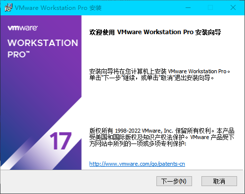

# 安装VMware

这里以*VMware Workstation Pro 17*的安装作为示例：

运行程序，点击下一步：

接受协议，点击下一步：

把WHP勾选上，如果你的电脑开启了*Hyper-V*的话，不然无法共存：

后面随便，点下一步：

选择不检查更新，不加入体验计划，这些浪费性能的东西在国内一点用处也没有：

最后算是个性化选项了，关于在哪些地方创建快捷方式：

最后点安装，就开始了，等待一会：

这玩意搞事，我的这个文本编辑器拼命闪烁，不知道什么按键还是什么强调。然后注意到旧版网络适配器会被删除，以及添加了开机启动项。关于添加开机启动项这件事，可能是因为*17*这个版本的新增功能开机能自动启动虚拟机的功能吧。

反正似乎有幺蛾子，安装过程不要做别的事，好生等着，我去给你买些橘子。。咳咳，串戏了。

反正这样就安装完了，自己去搞定密钥的事情吧。