# 修复rm加迁移造成的损害

由于之前rm命令误操作，删除了很多不应该删除的东西，最近从Hyper-V转移到了VMware，没法正常开机，只能通过带`rescue`字样的启动项启动。为了修复这个问题，我查找资料并编写了这份文档。

## Mine

直接看到最底吧。rm造成的影响没有完全消除，现在只是能正常启动了而已。

---

我查找了这篇文章【[centos进入救援模式并修复文件系统（7、8）](https://blog.csdn.net/weixin_44654338/article/details/121486194)】，可以借鉴一下。

> 只能说，国内还有太多人用不好*Markdown*了，这可太糟了。会用Markdown应该是每个现代人的基本素养，更是每个开发者应该会的基本技能！

**下面我简单说一下过程**：

### 准备过程

首先进到VMware对应虚拟机的设置中，“*CD/DVD*”加载系统的安装镜像，并在设备状态那边全部勾选，特别是“启动时连接”这一项。

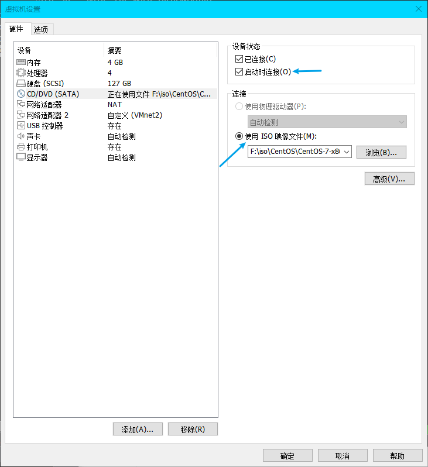

由于我的Linux不是BIOS启动的，而是UEFI启动的，所以开机的时候疯狂点鼠标（为了第一时间重定向输入到虚拟机）和`Esc`进到开机选项（或者如链接所言，右键虚拟机到电源选择“打开电源是进入固件”）。这时候我选择带有`CDROM`的启动项。

> 注意，如果此时按`Enter`没有反应，检查上一步到底勾选好了没有。

进入后选择“Troubleshooting”选项启动。然后选择“Rescue a CentOS Linux system”。

在随后的界面，救援系统已经加载好了，问你挂载原系统的方式，我们输入`1`（即“Continue”）并回车以进入读写模式。

**接下来就是开始修复了**。

### 修复

先回车进入*shell*。

> ..."Return" to get a shell:

然后我们输入这条命令检查一下文件系统是不是`xfs`：`df -h -T`。我们关注结果中的这几个：

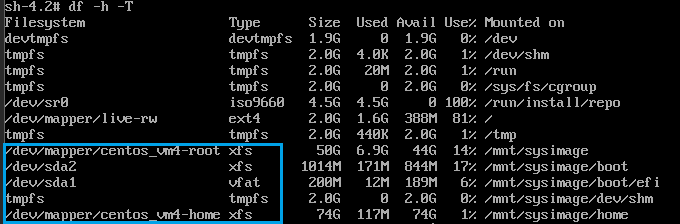

> 如是”ext“文件系统我们可以直接进行检查修复操作，如果是”xfs”则需要卸载文件系统检查或修复。

我按照教程输入这条命令检查返回值是否为零（即正常）：`xfs_ncheck /dev/mapper/centos_vm4-root ;echo $?`：

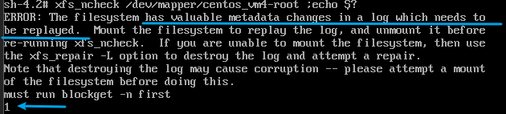

我没有意识到这对不对，于是检查了一下另一条：`xfs_ncheck /dev/mapper/centos_vm4-home ;echo $?`：

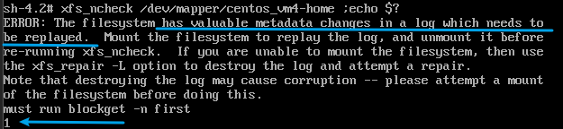

我还是没有意识到什么不合适，于是我按照链接开始尝试修复：`xfs_repair /dev/mapper/centos_vm4-root ;echo $?`：

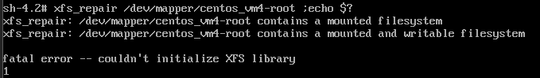

这就是前面提到的“xfs的需要先卸载再说”。

于是我运行：`umount /dev/mapper/centos_vm4-home`，然后在运行一遍：`xfs_ncheck /dev/mapper/centos_vm4-home ;echo $?`：

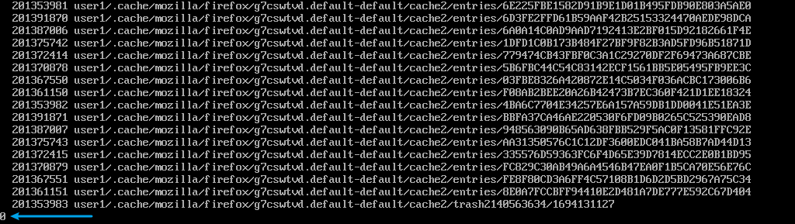

为零，正常。那么同样操作另一个试一下：`xfs_ncheck /dev/mapper/centos_vm4-root ;echo $?`。然后发现`busy`。

查看链接，是强行操作的：`umount -lf /mnt/sysimage`。然后我`df -Th`检查一下，已经卸载掉了：

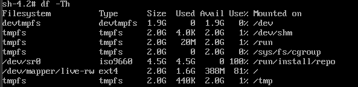

现在我再运行一下去检查：`xfs_ncheck /dev/mapper/centos_vm4-root ;echo $?`：

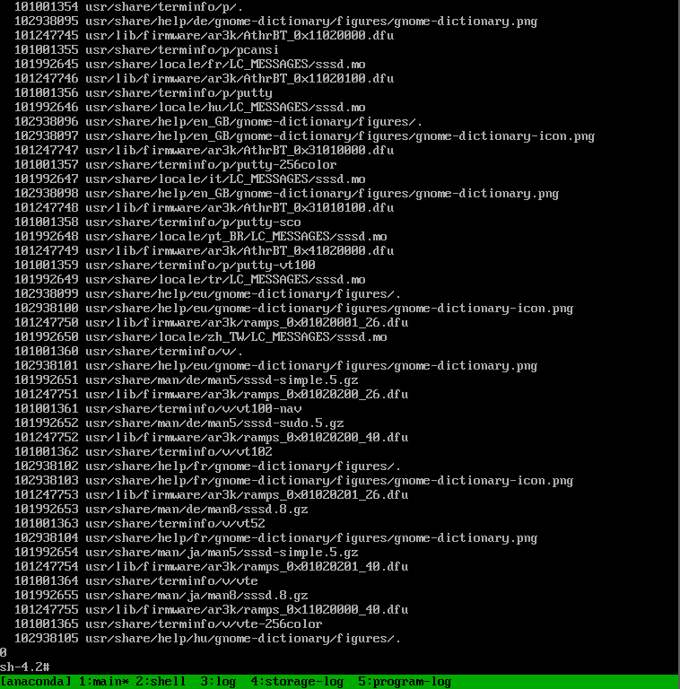

一通操作得出0，我懵了。然后尝试修复`xfs_repair /dev/mapper/centos_vm4-root ;echo $?`：

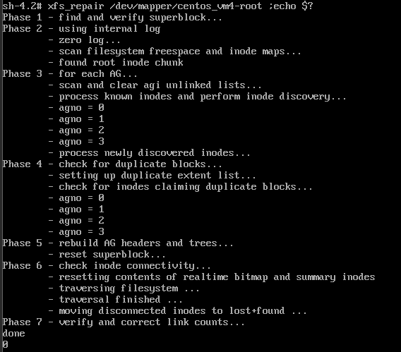

我懵的！说明可能不是这个问题。

### 再来

我的启动错误是GNOME桌面进不去：

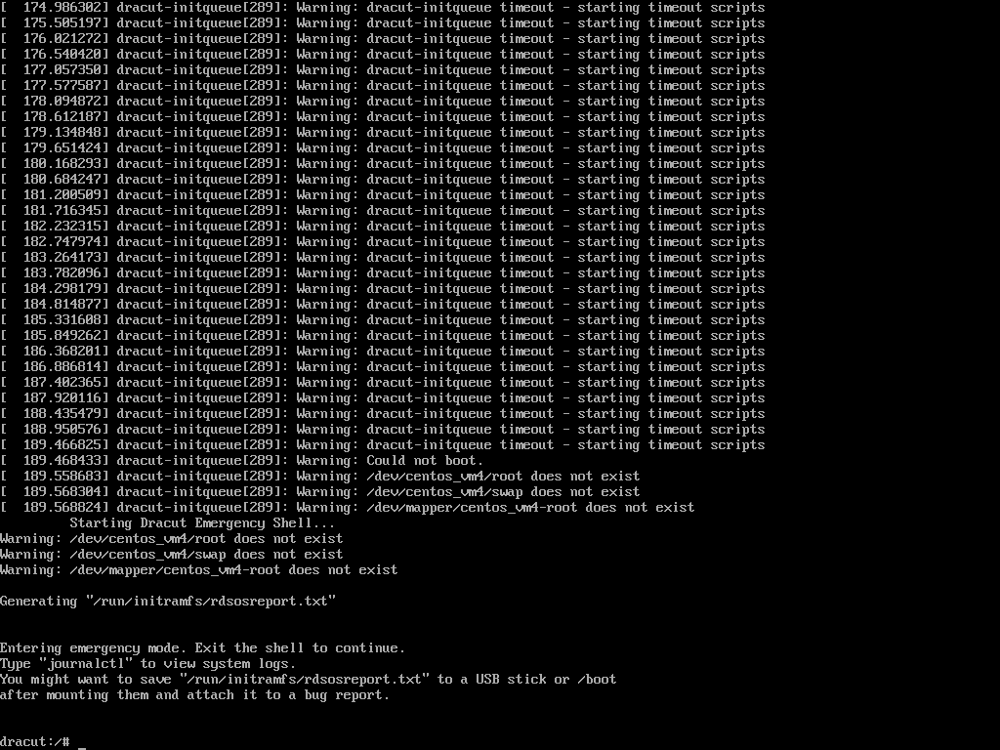

links:

1. <https://blog.csdn.net/xminyang/article/details/83214854>（不太符合）

   > 在安装CentOS时，若出现“Warning: /dev/root does not exist, could not boot” ，一般情况下是因为未找到安装系统盘的所在位置（例如：U盘），这时只需找到其位置，并对配置稍作修改即可。

2. <https://blog.csdn.net/u011608191/article/details/126720475>（这个比较符合）

   > 在shell命令行中执行如下命令，可以找到相关的lvm虚拟卷。然后临时进入系统
   >
   > dracut:/# lvm vgscan
   > dracut:/# lvm vgchange -ay 
   > dracut:/# exit
   > 进入系统之后，重新生成相关的内核启动文件
   >
   > [root@localhost ~]#  dracut -f
   > [root@localhost ~]#  grub2-mkconfig -o /boot/grub2/grub.cfg
   >
   > 然后重启系统即可。
   > ------------------------------------------------
   > 版权声明：本文为CSDN博主「hysloge」的原创文章，遵循CC 4.0 BY-SA版权协议，转载请附上原文出处链接及本声明。
   > 原文链接：https://blog.csdn.net/u011608191/article/details/126720475

进系统前的那些命令做完之后，会卡住，说找不到设备。此时再通过还能进去的带"rescue"的启动项进入系统，然后执行后面的命令：

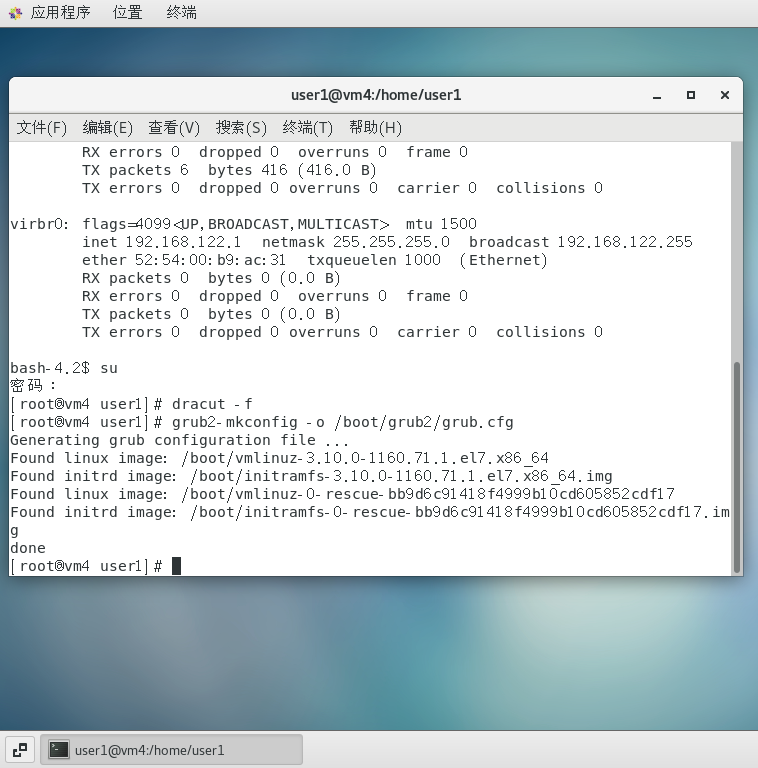

然后我`reboot`重启。可以看到关机界面提示有东西变了。

然后就正常了。看起来还是有点不一样，不过没什么大碍应该。

> 就是不知道VMware用ssh连接怎么那么慢，另一个似乎就好很多。/xk