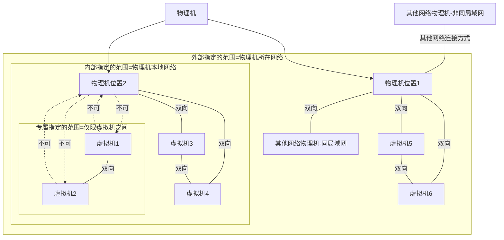
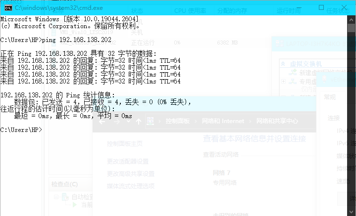
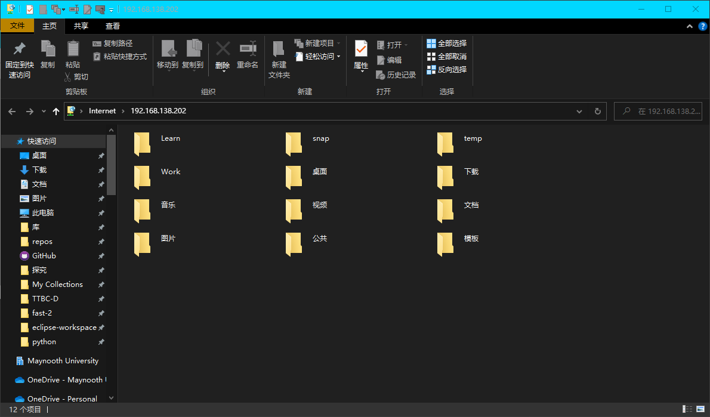
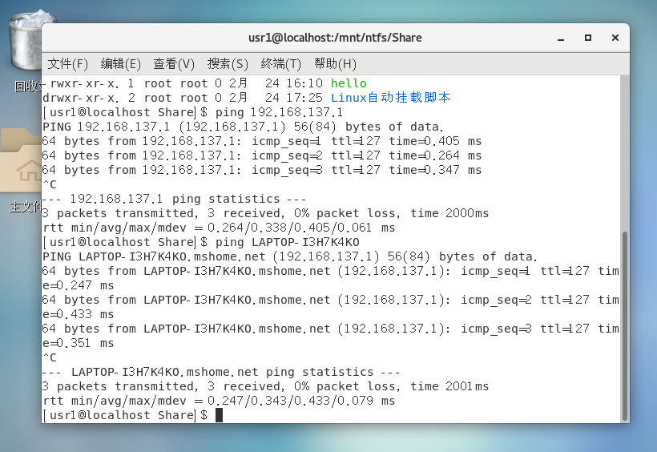

# 配置虚拟交换器

想要上网，通常默认虚拟交换器就实现了。

讲讲外部、内部、专用三种应该怎么选：

这里有个可以参考的链接：[link](https://blog.csdn.net/qq_35363270/article/details/103164460).

我这里给大家画张图就明白了：

我从上面的链接摘抄如下**关键信息**：

1. 外部网络配置：(**虚拟机和物理网络、本地主机都能通信，在网络中等同于一个宿主机，有跟宿主机相同网段的IP地址**)
2. 内部网络：（**虚拟机和虚拟机之间，虚拟机和宿主机之间通讯，可以通过宿主机访问物理网络**）
3. 专用网络（**一个独立的虚拟网络，与其他网络完全隔离**）

此外，如果是内部或者专用，那么虚拟机需要**手动设置IP**，不能使用DHCP，否则无法连接成功。

这样懂了吗？

## 样例

### 专用

如下“内部”的配置，能够ping通，能够FTP。这个时候物理机不会多出一个网卡，因为不连接物理机。

其他配置也是可以的，例如：

| 编号 | IP              | 掩码          | 网关          |
| :--: | --------------- | ------------- | ------------- |
|  1   | 192.168.138.202 | 255.255.255.0 | 192.168.138.1 |
|  2   | 192.168.138.204 | 255.255.255.0 | 192.168.138.1 |

可以ping通，可以FTP。

### 内部

这是虚拟机之间的，与物理机无关。我这样配置两台CentOS7虚拟机IP：

| 编号 | IP            | 掩码          | 网关        |
| :--: | ------------- | ------------- | ----------- |
|  1   | 192.168.1.202 | 255.255.255.0 | 192.168.1.1 |
|  2   | 192.168.1.204 | 255.255.255.0 | 192.168.1.1 |

经测试能够连接成功，互相通信。（能够ping通，能够使用FTP。）

但是，物理机无法ping通`192.168.1.1`、`192.168.1.202`、`192.168.1.204`，虚拟机无法ping通`192.168.1.1`。这里可能是我网段设置不合适吧，不太清楚。本来要是能ping通，那传文件就很容易。但是不通，那就只能虚拟机用物理机名去挂载文件夹了。

---

2023.3.7：

要在虚拟机和物理机之间ping通，要给物理机也设置ip和网关，例如这样的配置：

|  编号  | IP              | 掩码          | 网关          |
| :----: | --------------- | ------------- | ------------- |
|   1    | 192.168.138.202 | 255.255.255.0 | 192.168.138.1 |
|   2    | 192.168.138.204 | 255.255.255.0 | 192.168.138.1 |
| 物理机 | 192.168.138.2   | 255.255.255.0 | 192.168.138.1 |

这张图是在物理机上ping通了虚拟机。

也能访问虚拟机FTP。

## 离谱的事

另外，有一件很离谱的事：如果你的虚拟机能够上网了，那一定是共享了物理机的网络。关于怎么搞，建议看那篇：【[../Windows/被HyperV搞坏热点](../Windows/被HyperV搞坏热点.md)】。如果你成功实现了虚拟机和热点都能上网，这件离谱的事就出现了：在虚拟机上ping通物理机需要你启用物理机的个人热点，因为名称的解析会是`192.168.137.1`。这样保证能ping通之后，就可以挂载物理机文件系统到虚拟机了。

如图。

---

2023.3.7：

关于这件离谱的事，可能是因为我本来就没有配置好互联，这里只是通过热点的137网段间接实现了连接吧。