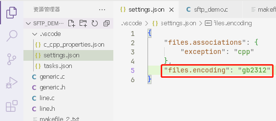

# VSCode为项目设置字符编码

<strong><em style="color:red;background-color:white">为了你的注释安全，请总是设定项目的默认编码！</em></strong>

---

其实除了设置全局的默认编码，以及临时设置单个文件的编码，你还可以设置整个项目使用特定的编码。

现在VSCode默认都是使用UTF-8编码，然而我最近接触的老项目都是使用GB2312编码，经常会忘记修改编码就保存，导致丢失中文，出现大量“锟斤拷”。

为了避免再出现因为忘记而导致注释全废的情况，我上网搜了搜，然后自己试了一下，可以这样实现这个目标：

1. 打开项目所在的文件夹下的`.vscode/settings.json`文件，没有就自己创建。
2. 添加这一项：`"files.encoding": "gb2312"`。
3. 保存并退出，重新打开已打开的文件就能看到效果了。

样例：

``` json
{
    "files.encoding": "gb2312"
}
```

截图：

