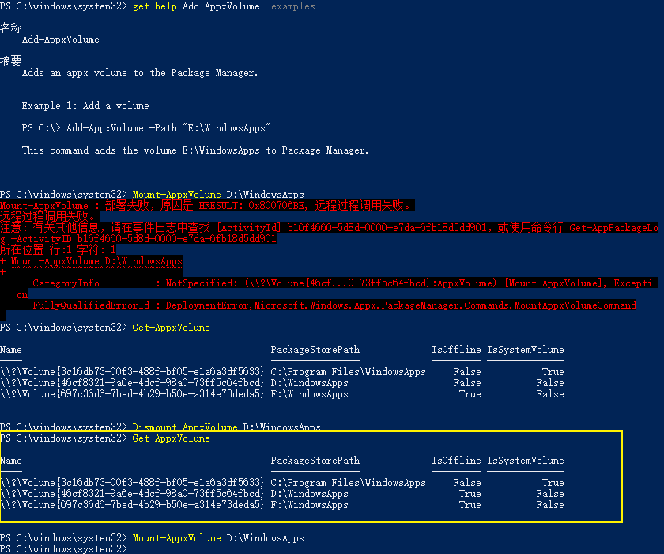

# 开机总是运行wsappx

开机总是运行wsappx，CPU和硬盘的占用率都被拉高，电脑的响应也变慢。这个问题是我在换了一个更大的系统盘(物理意义上)然后又插入了一个新盘之后出现的。

2023年3月23日，我终于找到了部分原因。在可用前，相关UWP应用总是显示脱机状态，找不到设备（大意如此）。经查找确实如此。

刚开机的时候就如上图黄色框中的状态一般，D盘中的UWP应用是脱机不可用的，点进去就闪退。通过`Get-AppxVolume`命令我们终于知道，它所在的“卷”在`IsOffline`项下显示为`True`，即脱机状态。（运行`AppxVolume`等同于`Get-AppxVolume`。）而下一条命令`Mount-AppxVolume D:\WindowsApps`则是使其上线，上一条命令`Dismount-AppxVolume D:\WindowsApps`则是使其下线。挂载卷的同时，我们观察任务管理器，这时候发现`wsappx`运行了好一会，CPU占用率也高，符合症状，由此我们可以大致认定是开机没有默认装载这个卷的问题。不过具体怎么解决，一劳永逸，暂时还没有发现。有时候，可能是更新完系统之后，就不会出现为挂载的现象，有可能是更新久不知道怎么久挂载上了吧。

发现这个观察的点，来源于这篇文章对我的启发：[Link](https://www.cnblogs.com/Dearmyh/p/16151040.html)。在脱机状态使用`Get-AppXPackage -AllUsers | Foreach {Add-AppxPackage -DisableDevelopmentMode -Register "$($_.InstallLocation)\AppXManifest.xml"}`命令去重新注册全部包，报错信息中除了说有的正在运行中，还有`0x80073d0d`代码的错误。网络上有不少`0x80073d0`甚至`0x80073d2`的错误解释，但这个就很少。所以如果出现了这个错误代码，不妨检查一下是不是脱机状态。

更多相关命令的信息见：<https://learn.microsoft.com/zh-cn/powershell/module/appx/?view=windowsserver2022-ps>。