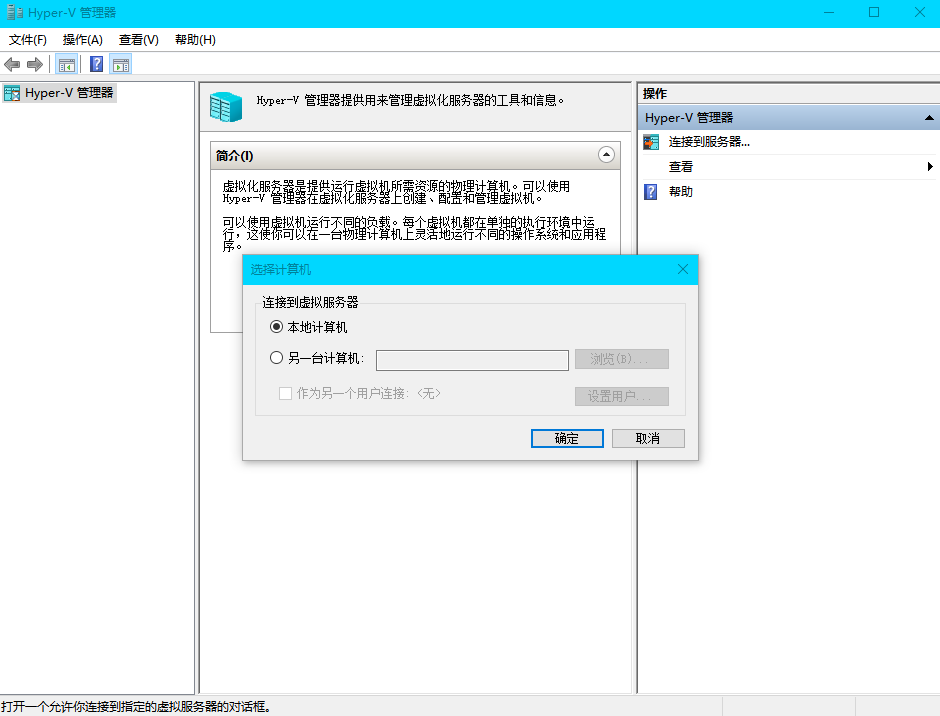
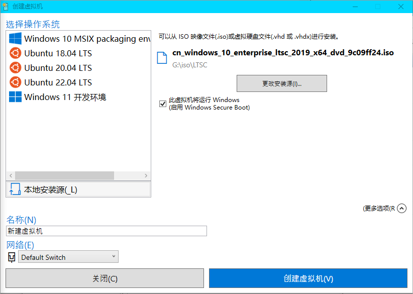

# 最简单的创建虚拟磁盘系统的方法

[toc]

## 方法概述

创建Hyper-V虚拟机，并安装系统镜像，随后命令行添加虚拟机的虚拟磁盘到Windows启动引导列表中（作为一个项）。

> 注：虚拟磁盘在外接的硬盘上似乎不能被识别到。原因不清楚。

先说一下，可能有的人搞不定烦人的Hyper-V，那建议是用VMware创建虚拟机，然后把`.vmdk`格式的虚拟磁盘用`StarWind V2V Converter`转换成`.vhdx`格式的虚拟磁盘（不需要固定大小）。（一般电脑都是UEFI启动，那么创建VMware虚拟机的时候也选UEFI，不要选BIOS，否则安装后无法被引导启动。）


## 准备工作

1. 你需要一个系统镜像（或者说安装镜像），用`.iso`格式的。请提前下载好。（你可能还需要一个激活工具）
2. 你的系统用户需要具有管理员权限（通常来说会有的）。

### 下载系统镜像

推荐到<https://msdn.itellyou.cn/>下载（或其新版网站<https://next.itellyou.cn/>，无需注册但需要登录）。（**请不要宣传这个网站，低调使用**）。


这里推荐继续使用Windows 10，因为Windows 11太差太不稳定。

点击“详细信息”进入，底下有大量版本供下载。

> 如果你偏好LTSC但懒得折腾，请选择LTSC2019而不是LTSC2021。目前LTSC2019的支持期限最久，但内核偏老，部分新程序难以运行。

## 开启Hyper-V

Windows家庭版没有这项功能，请先到“启用或关闭Windows功能”中完整勾选“Hyper-V”项目。如果你发现已经找到Hyper-V管理器了，请跳过。

Win11和Win10的“设置”应用差异较大，你可以按下`Win`键随后输入（这会开启搜索），搜索“hyper-v”或“Windows功能”。


勾选“Hyper-V”，点击完成，等待应用完毕。


如果可以，请你重启电脑。重启后如果顺利，在菜单可以看到相关项目：


点击“Hyper-V管理器”，可以看到一片“空白”（没什么可操作的地方）。这时候需要连接服务。点击“连接到服务器”，选择“本地计算机”，点击“确定”。



如果不顺利（通常不会），会出现如下提示：


这时按`Win`+`R`，输入`services.msc`打开“服务”，找到“Hyper-V 虚拟机管理”，启动它。随后回到管理器，再次尝试连接，稍等一下，应该连接可以成功。

这里给出一个连上服务的示例图：


## 创建Hyper-V虚拟机并安装镜像

有两种方式，“[快速创建](#创建方法一)”和“[创建](#创建方法二)”。

### 创建方法一

点击上图右侧的“快速创建”，点击“本地安装源”。


点击“更改安装源”，选择你下好的系统安装镜像（`.iso`）。


点击“更多选项”，你可以考虑修改一下虚拟机名称。



确认信息后，点击创建虚拟机。随后不急着启动，先点击“编辑设置”检查一下配置是否是我们想要的。（这是为了安装过程快一点，这里的虚拟机设置和以后的直接引导启动无关，不影响未来的性能。）


处理器数量这里，越多性能越好，但最好不要超过物理机的线程数量。有多少个CPU可以看任务管理器。


有多少框框就有多少个CPU（数框框！），或者看“逻辑处理器”这一项的数量。如果不是这样的，右键图形，将图形更改为“逻辑处理器”（默认是“总体利用率”）。

调整内存到至少4GB，但不能太多，太多当前物理机的系统跑不动（内存都被启动的虚拟机占用掉了，没有可用内存运行别的）。


都调好了，点击“确定”关闭。此时可以点击“连接”了。


点击“启动”，随后按指示安装好系统，这里就略过了。


见到这个界面，鼠标点击黑色区域（让鼠标被“捕获”），按任意按键继续。


不要等六个点都出来，赶紧随便按个按键，比如`Enter`键，否则就不会从DVD加载了，会尝试从网络加载。上图就是到了等待网络加载的阶段，这时候你只能点强制关闭去重启。（如果没有网络驱动器，则会直接跳过，呈现一个白色的、带有微软徽标的界面。）


然后自己操作了，开始安装。

> 最后的最后，如果还是不行，如果一直识别不到，可能是缺组件了，去补一下。

---

### 创建方法二

以下是创建的方法二。

点击“新建”，选择“虚拟机”。

设定名称，下一步。


选择“第二代”，下一步。


内存可以给8GB，下一步。


网络可以暂时不管，也可以选自带的“Default Switch”，下一步。


创建**虚拟磁盘**，下一步。


安装选择下载好的`.iso`镜像，下一步。


确认信息，点击完成。


在处理器栏目修改处理器数量。


点击“连接”，再点击“启动”，开始安装。


## 补Hyper-V组件

如果顺利开始安装，跳过此步。

将以下内容保存成一个批处理脚本文件，名字可以是`Hyper-V.bat`（这里包含了扩展名`.bat`）。

``` bat
pushd "%~dp0"
dir /b %SystemRoot%\servicing\Packages\*Hyper-V*.mum >hyper-v.txt
for /f %%i in ('findstr /i . hyper-v.txt 2^>nul') do dism /online /norestart /add-package:"%SystemRoot%\servicing\Packages\%%i"
del hyper-v.txt
Dism /online /enable-feature /featurename:Microsoft-Hyper-V-All /LimitAccess /ALL
```


然后右键以管理员权限运行，可以见到如下内容，等待运行完毕。（这个时间会有些久，可以过个半小时再看看。）


## 添加到引导列表

找到你的`.vhdx`虚拟磁盘文件，此处用上面方法二创建的虚拟磁盘示例。右键它，点击“装载”。


注意其分配的盘符，例如`E:\`。你可以在“此电脑”中在盘的属性中更改，或使用`diskpart`（管理员权限启动）。

> ```cmd
> list volume
> select volume 某个数字
> remove
> assign letter=S
> ```
>
> 类似如上diskpart命令可以更改盘符。

**使用`bcdboot`工具创建引导项**：

- 打开命令提示符（以管理员身份运行（可以`Win`+`R`，输入`cmd`，然后按住`Ctrl`+`Shift`+`Enter`启动））。

- 使用

  ```cmd
  bcdboot
  ```

  命令将VHDX的操作系统添加到引导菜单中。假设VHDX的挂载盘符是`E:\`，你可以运行以下命令：

  ```cmd
  bcdboot E:\Windows
  ```
  
- 这会在Windows引导菜单中添加该操作系统。

**设置引导配置（使用`bcdedit`）**：

- 运行以下命令查看当前的引导配置：

  ```cmd
  bcdedit /v
  ```

  也可以使用以下列出：
  ```cmd
  bcdedit /enum
  ```

---

或者你可以手动更改一些配置，比如：

``` cmd
bcdedit /copy {current} /d "VHD Boot"
bcdedit /set {your-new-guid} device vhd=[C:]\path\to\your.vhdx
bcdedit /set {your-new-guid} osdevice vhd=[C:]\path\to\your.vhdx
```

第一行就使用`{current}`，不用改，后面双引号内的是项目名称（description），可以自己改。

第一句执行完你会得到一个新的GUID值，每个启动项的GUID值唯一（互不相同）。

后面两句的`{your-new-guid}`和`vhd=`后面的都要改，如果是盘符还是要类似`[F:]\`，后面就是到虚拟磁盘的路径了。

如果你要修改名称，可以这样：

```cmd
bcdedit /set {your-new-guid} description "new description"
```

现在都准备好了，重启就可以看到相应启动项了。

