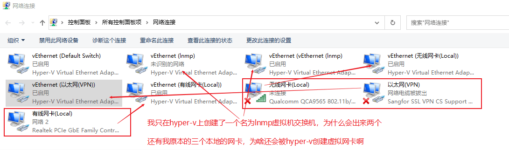

# 解决被HyperV搞坏热点的问题

[toc]

## 故事讲述

今日整虚拟机用的网卡，整着整着热点用不了了。手机连热点说无法访问互联网。就很郁闷。

一番查找，还是决定试试重置。

当我搜索：

> win10热点怎么重置

就看到了这么一项：


链接：[Link](https://www.uc23.net/jiaocheng/65456.html). [this](#1).

然后发现居然无法启动承载网络。我一看配置没了，虽然设置里还是有显示配置的。于是我手动打了一遍命令去配置好ssid和key，然后试图启动，失败。

然后我搜索：

> 无法启动承载网络。

看到这么一篇文章：[链接](https://blog.csdn.net/devilnov/article/details/51487472) [this](#2).

后面解决了之后还是看不懂它在说什么，但是感觉它说的好有道理。

然后看到了这么一份：[链接](https://zhuanlan.zhihu.com/p/28385289) [this](#3).

然而还是情况不符合，没卵用。

然后看到了这一篇号称完美解决的憨批：[憨憨发言](https://blog.csdn.net/pengjian444/article/details/50959766), [this](#4).

还有百度经验的：[链接](https://jingyan.baidu.com/article/3ea514898932ef52e71bba40.html).

究极没用，用Windows诊断功能修复，还有禁用再启用。这算什么？

然后简书上有一篇有一点用：[链接](https://www.jianshu.com/p/fc71d3d94949) [this](#5).

我试过了，最老的那个驱动是可以启用的，不过不支持WiFi5，也还是连不上互联网，只是那个无法启动承载网络的问题解决了。但是没用啊，上不了网。

到了这里我已经很崩溃了，明明我这些天都在用热点用的好好的，怎么突然就显示否了呢？这不科学！

于是我转换方向，直接搜索：

> 网卡驱动的是否支持承载网络变成了否

然后没有卵用，就是叫我多换驱动版本试试。

最后我恼了，攻击性拉满：

> hyperv把我的热点搞坏了

欸，这么一搜居然搜出好东西来：


我当即知道，有救了！放出两个的链接：[CSDN](https://blog.csdn.net/songtianlun/article/details/114140477), [Tencent Cloud](https://cloud.tencent.com/developer/article/1796902). 我跟你们讲，这是文贼见面：互抄。欸！这就很有趣，后者发布时间更晚，不仅内容和前者完全一致，甚至还加了个*CC4.0 NC SA*版权申明。

不调侃了，放文章：[this](#6).

但是呢，我虽然是照着它做的，但还是没看懂，胡乱操作了一番居然解决了。

## 我的过程

选择我的虚拟网卡，进入属性，共享internet，启用并连到了WLAN。发现没用，取消掉。然后换热点用的那个，同样地启用并连到了WLAN，然后没用，又取消掉，然后就好了。

啊，好是好了，可是我再去看驱动信息，支持承载网络这一项仍然是：**否**。但就是能用了。欸！真是奇妙。

另外呢，我中途还真卸载了我的无线网卡驱动，然后就找不到了。重启后它又回来了，WiFi也是自动连接的。解决是后来的事情。后来再重启就总是一开始莫得使用WiFi，刚才检查发现就是一个服务没在运行，启动选项变成了"手动"。这个服务就是：*wlansvc*。把它调成自动应该就不会有问题了。当它运行起来了，我发现我的WiFi也自动连上了。哦对了，如果你卸载了无线网卡驱动，那么保存的网络似乎都会被忘记。wrink~

## 有用的拓展阅读

1. [MS的帖子](https://answers.microsoft.com/zh-hans/windows/forum/all/%E5%A6%82%E4%BD%95%E8%AE%A9-hyper-v-default/8703ffa4-1796-441f-88b9-0566eaeff1bf) [this](#Extend 1)

### Extend 1

**如何让 Hyper-v Default Switch适配器 和 移动热点虚拟适配器 同时共享主机的有线网卡适配器的宽带，以及其他两个关于hyper-v的问题**

> 系统是win10专业版，因为工作需要，我的PC主机必须设置为静态IP
>
> 我的开发环境是用的是hyper-v搭建的lnmp环境，项目中有与其他系统交互，因此需要能访问外网，
>
> 因为环境wifi信号太差，所以平常需要用电脑开热点给手机用，这两个是刚性需求
>
> 但是后来发现，只要我开了移动热点，开发环境虚拟机中就没网了，
>
> 试过cmd执行命令手动创建热点，
>
>    发现只要 手动 把有线网卡的网络共享给 Microsoft Wi-Fi Direct Virtual Adapter，Hyper-v 的Default Switch适配器就会断网，不共享网络wifi就没网
>
> 后来又试了下win10自带的移动热点功能，
>
>    发现打开热点后，即使没有手动把有线网卡的带宽共享给Microsoft Wi-Fi Direct Virtual Adapter，Default Switch适配器依然会断网
>
> 还试过用外接的USB网卡创建wifi热点
>
>    也是一样的结果，只要热点一创建，Default Switch就会断网
>
> 因此可以断定，问题就出在一个实体有线网卡的网络，不能同时分享给两个以上的适配器，
>
> 当然这不单单是在共享网络页面加个多选的问题，我有尝试手动将有线网卡的宽带共享给Default Switch，发现会强制更改Default Switch分配的ip；
>
> 其他关于hyper-v的的问题，
>
> 在主机防火墙全部关闭的情况下，虚拟机刚问不到主机，
>
> 反之在Ubuntu Server虚拟机中防火墙关闭，iptable放行端口的情况下，主机仍然只能访问80和22端口，其他端口均不通；
>
> [](https://filestore.community.support.microsoft.com/api/images/fc776d79-35f9-4870-8115-50f1193891cb?upload=true)
>
> 更新之后Hyper-v新建虚拟机会出来两个虚拟适配器，并且会为我 本地已有的实体适配器 创建新的虚拟适配器；
>
> [](https://filestore.community.support.microsoft.com/api/images/078efb7f-194a-47ea-b4d1-cfb1ee51f3ab?upload=true)
>
> 以上，就是我关于hyper-v的三个问题，如果没有办法解决，就当做bug提交或者建议来处理吧（如果是建议的希望能尽快实现）
>
> 在此先谢过各位大佬。
>
>  此会话已锁定。 可关注问题或投赞成票，但不能回复此会话。
>
> 我有相同问题 (3)

[**回复 (3) **](https://answers.microsoft.com/zh-hans/windows/forum/all/如何让-hyper-v-default/8703ffa4-1796-441f-88b9-0566eaeff1bf?tab=AllReplies#tabs)

> [A Big 蓝鲸](https://answers.microsoft.com/zh-hans/profile/08eafb85-b633-4a68-b918-99738177f6b1) [独立顾问](http://answers.microsoft.com/zh-hans/page/faq#faqWhosWho1)
>
>回复日期 2021/05/07
>
>您好
>
>欢迎咨询微软社区，我是独立顾问(Independent Advisor) Zhang
>
>请您尝试在创建Hyper-V虚拟交换机的时候，不要直接分享物理网卡，而是通过热点的本地连接分享。
>或者，看到您有深信服的代理，您也可以连接上代理后，尝试分享深信服的网络给Hyper-V
>
>如果您有回复请在48小时之内进行回复，超时问题会被关闭

> [on_road](https://answers.microsoft.com/zh-hans/profile/153d5817-c979-4644-9fab-ac315a6fa191)
>
> 回复日期 2021/05/07
>
>  2021/05/07 中对 A Big 蓝鲸 文章的回复
>
> 您好，感谢您的回答，
>
> 您的思路应该是正确的，先把“有线网卡的网络”分享给 “热点的虚拟交换机”，然后再新建一个hyper-v虚拟交换机引用 “热点的虚拟交换机”
>
> 但是default switch 是hyper-v虚拟机内置的虚拟适配器，无法操作，且创建虚拟交换机不能选择 “通过热点的本地连接分享”
>
> 深信服的网络我们本身并没有在用，因此也没办法用它来分享网络，而且问题好像与这个深信服的vpn没关系，不出在这里，
>
> 请问您那边还有其他的解决办法吗？
>
> [](https://filestore.community.support.microsoft.com/api/images/dfcd436e-8841-416f-a50c-cb7010949e06?upload=true)
>
> [](https://filestore.community.support.microsoft.com/api/images/1d397a9d-90f4-4fbb-aa71-b29961a153c0?upload=true).
>
> 1 人认为此回复有帮助

>  [A Big 蓝鲸](https://answers.microsoft.com/zh-hans/profile/08eafb85-b633-4a68-b918-99738177f6b1) [独立顾问](http://answers.microsoft.com/zh-hans/page/faq#faqWhosWho1)
>
> 回复日期 2021/05/08
>
> > 您可以按Win+F进行反馈。
> >
> > 感谢你的反馈。
>

End.

## 链接

### 1

　随着电脑的使用率越来越高，我们有时候可能会遇到对[win10](https://www.uc23.net/xitong/win10/)系统笔记本开启自带的WiFi热点进行设置，如果我们需要对[win10](https://www.uc23.net/xitong/win10/)系统笔记本开启自带的WiFi热点进行设置时，要怎么处理[win1](https://www.uc23.net/xitong/windows-win1-yuanban/)0系统笔记本开启自带的WiFi热点呢？我们按照

1、使用快捷键Windows+R，在运行窗口中，输入“cmd”，点击确定; 

2、输入netsh wlan set hostednetwork mode=allow ssid=name(无线名字) key=00000000(8位以上密码);就搞定了;接下来给大家带来[win1](https://www.uc23.net/xitong/windows-win1-yuanban/)0系统笔记本开启自带的WiFi热点的详细步骤：

　　具体方法如下:

　　1、使用快捷键Windows+R，在运行窗口中，输入“cmd”，点击确定;


　　2、输入netsh wlan set hostednetwork mode=allow ssid=name(无线名字) key=00000000(8位以上密码);


　　3、按下回车键后再输入：netsh wlan start hostednetwork;


　　4、按下回车键后，会提示“已启动承载[网络](https://www.uc23.net/lishi/wlls/)”，虚拟无线热点创建完成。


　　Win10系统[笔记本电脑](https://www.uc23.net/lishi/bjbdnls/)开启WiFi热点的步骤其实并不复杂，我们只能轻松设置几步就能马上体验超便捷的上网过程了。

### 2

cmd中执行netsh wlan start hostednetwork 无法启动承载网络。 组或资源的状态不是执行请求操作的正确状态。

解决办法：


1、打开网络共享中心，点击“更改适配器”，如果没有看到“无线网络连接2”的网络连接，请尝试以下步骤，希望能帮到大家


2、如没有，则将带有“共享的”字样的网络连接禁用，再启用；（这步骤中的网络连接：无线网络或本地网络，要看个人设置）


3、启用后按F5刷新，“无线网络连接2”会重新出现


4、然后在cmd中执行netsh wlan start hostednetwork，成功启动！


出现此情况的原因：手提进行休眠后，断网导致的
------------------------------------------------
版权声明：本文为CSDN博主「DevilNoV」的原创文章，遵循CC 4.0 BY-SA版权协议，转载请附上原文出处链接及本声明。
原文链接：https://blog.csdn.net/devilnov/article/details/51487472

### 3

link: [link](https://zhuanlan.zhihu.com/p/28385289).

### 4

> 这是个玩树莓派但是仍然是个憨批的作者，所谓的办法就是卸载了换驱动。还是靠别家软件提供的驱动。

怎么办，怎么办。我要去把驱动卸载了重新安装么？卸载了不就连不上网了么？
去驱动精灵的官网上瞧瞧，果然有发现啊。有一个网卡版的哎，下载 + 安装。任性的卸载了网卡驱动。果然无线都检测不到了，断网模式。打开驱动精灵，开始修复，修复成功，重启系统。
输入上面的东东，成功。

简直艰辛。。。。。。。。

这说明了什么？说明我换的系统里面的网卡驱动有问题。
------------------------------------------------
版权声明：本文为CSDN博主「PJZero」的原创文章，遵循CC 4.0 BY-SA版权协议，转载请附上原文出处链接及本声明。
原文链接：https://blog.csdn.net/pengjian444/article/details/50959766

### 5

先查看一下自己当前的无线驱动是否支持“承载网络”。
 将以下命令输入到cmd命令窗口中，按回车键

```dart
netsh wlan show drivers
```


如上图所示，一般会是不支持承载网络。
 这说明该无线驱动程序不支持承载网络，并不是说咱们的电脑不支持无线热点，所以，我们只要更新一个能够支持承载网络的无线驱动，就可以启动WiFi啦。

**第一步：设备管理**
 从桌面调出我的小电脑图标，鼠标右键单击选择设备管理


**第二步：无线网卡**
 打开设备管理器，--》网络适配器--》找到无线网卡驱动


一般情况下，无线网卡驱动程序的名字和文中第二张图中查到的名称是一致的。
 **第三步：更新驱动程序**
 选中该驱动程序--》右键--》更新驱动程序


选择第二项，浏览我的计算机以查找驱动程序软件


选择：让我从计算机上的可用驱动程序列表中选取
 从双频驱动中选择比较旧的版本进行更新


安装成功
 **第四步：启用无线网络**
 再次从桌面调出我的小电脑图标，右键--》命令提示符（管理员）

```undefined
netsh wlan start hostednetwork
```

回车之后，启动成功。


打开手机WiFi，找到你设置的WiFi名称，输入密码即可联网


作者：Marydon
链接：https://www.jianshu.com/p/fc71d3d94949
来源：简书
著作权归作者所有。商业转载请联系作者获得授权，非商业转载请注明出处。

### 6

最近给 Win10 电脑加装了一个无线网卡，想要开热点使用，但是发现手机连上之后显示无法联网，在这里记录解决办法。

首先查看一下当前电脑上网使用的网卡是哪一张，我当前使用的是 Hyper-V 虚拟的一个桥接网卡 `vEthernet (NetBridge)` 开启 wifi 热点后新增的网卡是 ` 本地连接* 12` 。

现在进入上网网卡的属性，进入共享标签，发现 Internet 连接共享是关闭状态，现在将它打开，并将家庭网络连接指定为 wifi 热点的网卡，确认即可。

再次尝试连接即可。

> 补充：开启连接共享时报错 "无法启用 internet 连接共享，为 lan 连接配置的 ip 地址需要使用自动 ip 寻址" ，将不需要的 Vmware 虚拟网卡卸载后解决，猜测可能是占用了某些共享需要用到的网段导致。

**参考文献**

- [解决使用 Win10 共享移动热点无法连接互联网的问题](https://github.com/Ruikuan/blog/issues/51)
- [win10 无法启用 internet 连接共享，为 lan 连接配置的 IP 地址需要使用自动 ip 寻址。](https://www.cnblogs.com/handsome1013/p/13957581.html)

### 解决

看[我的过程](#我的过程).