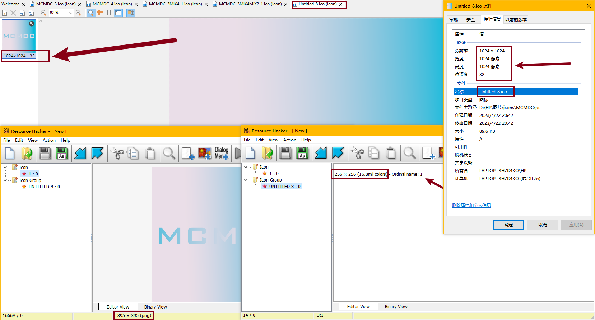
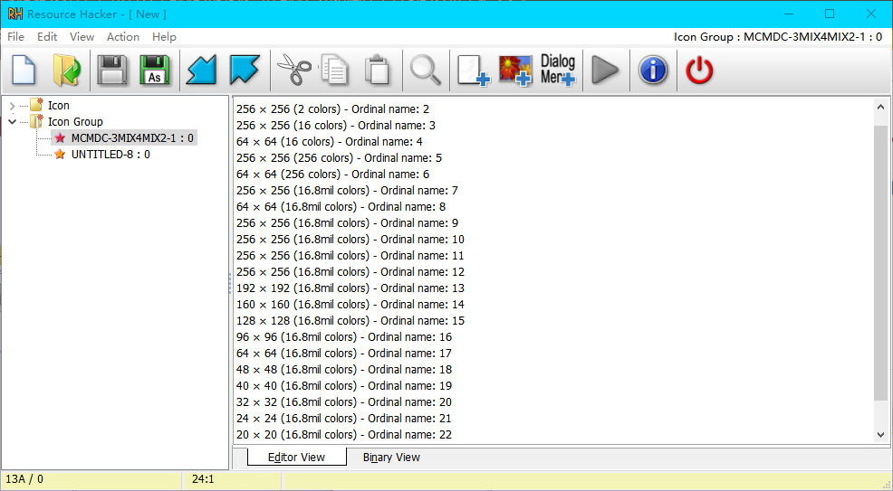

# icon大小问题

至少在Windows平台，对于`.ico`文件，最大支持的是$256×256$，<del>或着$384×384$，</del>所以用$256×256$就足够了。

我试过$1024×1024$的文件，但所有大于$256$的都会被当作$256$，无论属性中看到的分辨率是多少。

注意到左下角的数值，我们可以大致认为最多支持到$395$，超过的被当作这个大小，但在识别出的列表中都是$256$。有图为证，这张图本来是有$384$、$512$、$1024$规格的，但是列表中一律变成$256$，查到的图虽然完整，但显示$384$和$395$：

