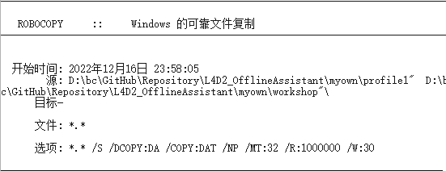
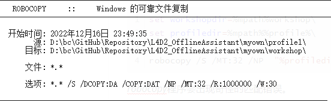

# robocopy的那些事

## 复制目录之反斜杠问题

情景：我要复制目录。

**结论**：不管是不是文件夹，确保结尾不带反斜杠，如果有，再加一个反斜杠。

详细如下：

如果这样：

``` bash
set workshopdir=%mpath%workshop
set profiledir=%mpath%%profile%
...
robocopy /S /MT:32 /NP  "%profiledir%"  "%workshopdir%"
```

是对的。

错误写法：

如果这样：

``` bash
set workshopdir=%mpath%workshop\
set profiledir=%mpath%%profile%\
...
robocopy /S /MT:32 /NP  "%profiledir%"  "%workshopdir%"
```

或这样：

``` bash
set workshopdir=%mpath%workshop
set profiledir=%mpath%%profile%
...
robocopy /S /MT:32 /NP  "%profiledir%\"  "%workshopdir%\"
```

*robocopy*程序会出现奇怪的匹配错误。如图：



但是如果再这样：

``` bash
set workshopdir=%mpath%workshop\
set profiledir=%mpath%%profile%\
...
robocopy /S /MT:32 /NP  "%profiledir%\"  "%workshopdir%\"
```

就又对了。如图：

