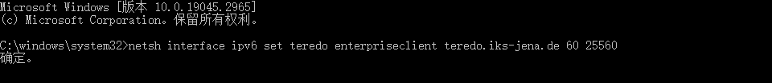
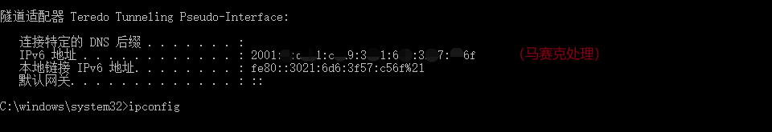
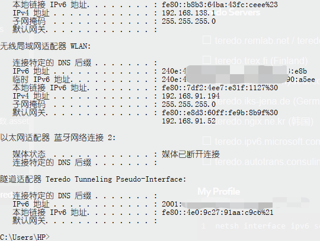
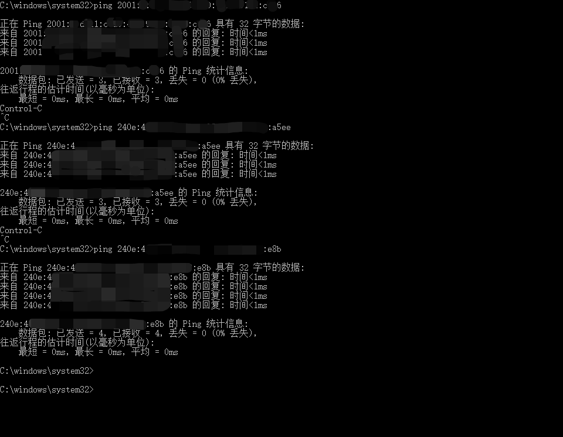

# Windows配置Teredo

links:

1. <https://www.lesca.cn/archives/how-to-build-ipv6-tunnel-on-windows.html>
2. <https://blog.csdn.net/sunny05296/article/details/124881333>
3. <https://www.ipv6bbs.cn/thread-151-1-1.html>
4. <https://www.ipv6bbs.cn/thread-168-1-1.html>

## Mine

### DNS Recommended

- **Quad9 DNS**(IBM 发起的 Quad9 提供的公共免费 DNS 服务，同时包含 IPv4/IPv6/DoT/DoH.)
  - `2620:fe::fe`
  - `2620:fe::9`
- **DNS.SB**(德国的一个公共 DNS 服务商 提供的 DNS 服务器，除了德国之外，还在荷兰/英国/爱沙尼亚/俄罗斯/美国/加拿大/日本/新加坡/印度/韩国/香港/澳大利亚等很多国家和地区有服务器，同时提供 IPv4/IPv6/DoT/DoH 服务。)
  - `2a09::`
  - `2a11::`

### Teredo Servers

#### Oversea

- [ ] teredo.remlab.net / teredo-debian.remlab.net (法国)
- [ ] teredo.trex.fi (Finland)
- [ ] teredo.managemydedi.com (USA, Chicago)
- [x] teredo.iks-jena.de (Germany)
- [ ] teredo.ngix.ne.kr (韩国)
- [ ] teredo.ipv6.microsoft.com (美国 雷蒙德) (Windows XP/2003/Vista/7/2008 系统默认设置)
- [ ] teredo.autotrans.consulintel.com (西班牙)
- [ ] teredo.ginzado.ne.jp
- [ ] debian-miredo.progsoc.org
- [ ] teredo.managemydedi.com
- [ ] teredo.ipv6.microsoft.com
- [ ] win8.ipv6.microsoft.com
- [ ] teredo2.remlab.net
- [x] win10.ipv6.microsoft.com (<100ms, 25% Loss)
- [x] win1710.ipv6.microsoft.com
- [x] win1711.ipv6.microsoft.com
- [x] win1807.ipv6.microsoft.com
- [x] win1901.ipv6.microsoft.com (<200ms, 0% Loss)

#### Homeland

(not found)

### My Profile

``` shell
netsh interface ipv6 set teredo enterpriseclient teredo.iks-jena.de 60 25560
```





#### Ping Test





可以看到，全部都通了。如果其他设备无法ping通，可能是网络问题，因为这里使用的都不是国内的服务器。

若要关闭，输入此命令：

``` shell
netsh interface teredo set state disabled
```

