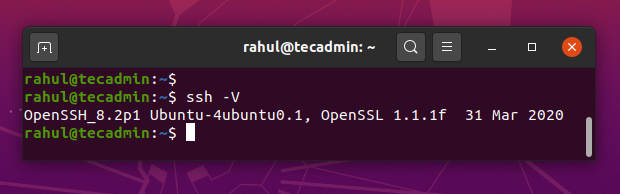
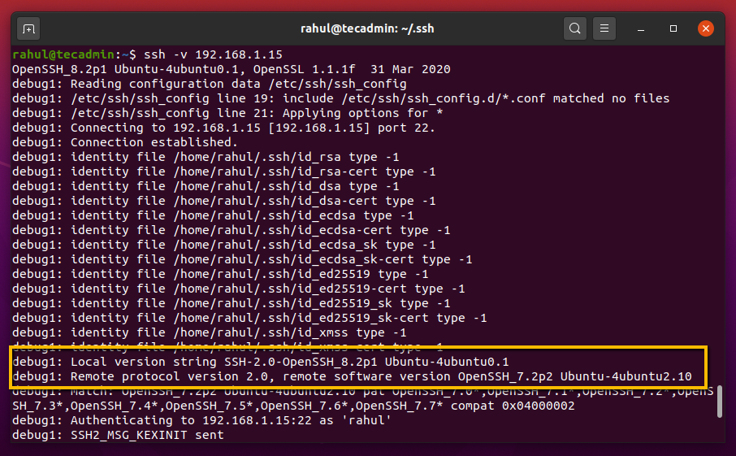
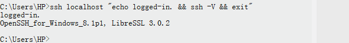

# How to check OpenSSH version

Partially sourced from: <https://tecadmin.net/check-openssh-version/>

Enter the command in terminal:

``` shell
ssh -V
```



But to see the ssh version of a remote device, we can see that in the verbose

``` shell
ssh -v 192.168.1.15
```



But if you have pubkey authenticated on the remote side, you will soon get logged-in and have a clear screen with nothing about verbose. SO HERE IS A BETTER COMMAND:

``` shell
ssh -Nv 192.168.1.15
```

But the con is: it's gonna stuck and you will have to break it and no pipeline will have a seat.

Also, if you're sure you can login with pubkey authentication, HERE IS A BETTER*2 COMMAND:

``` shell
@REM This is for Windows:
ssh 192.168.1.15 "echo logged-in. && ssh -V && exit"

# This is for Linux:
ssh 192.168.1.15 "echo logged-in.; ssh -V; exit;"
```



You may test these with `localhost`. 

Have a good day!