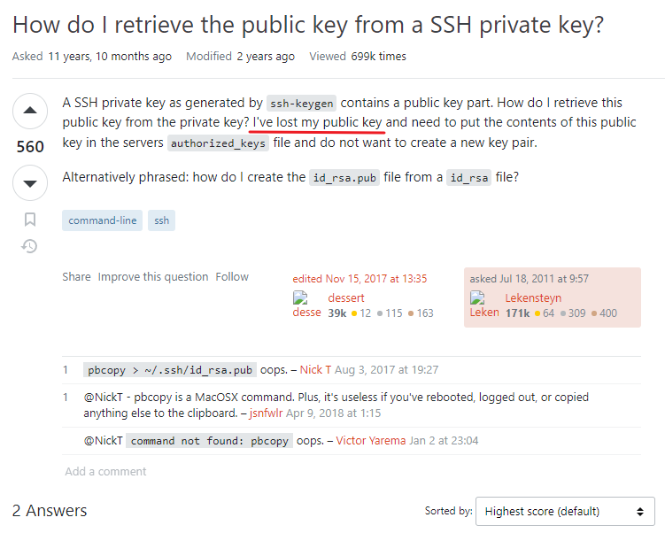
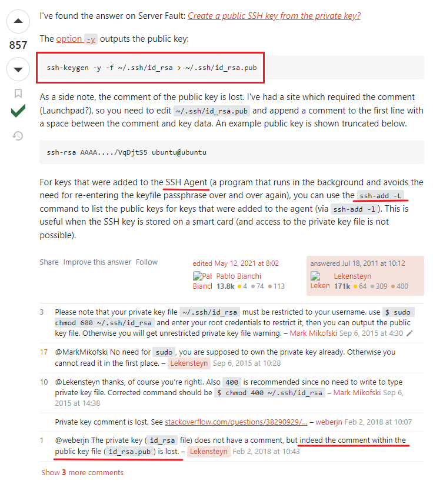
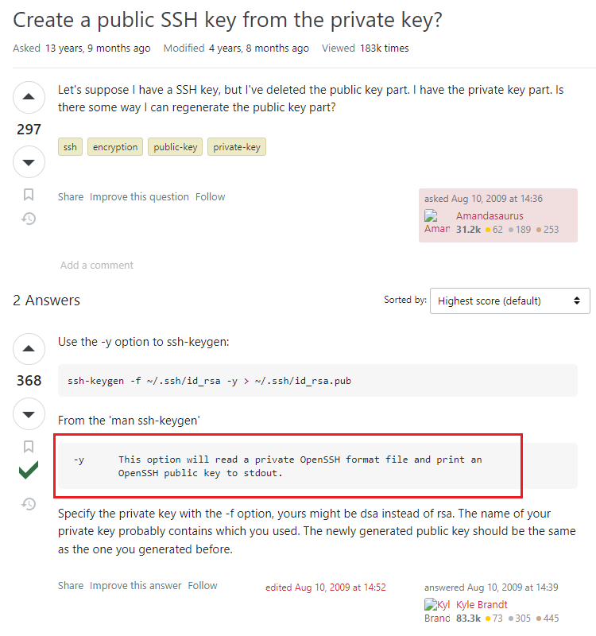

# SSH: Retrieve Public Key

> Also named: "Retrieve SSH Public Key"

links: 

1. <https://askubuntu.com/questions/53553/how-do-i-retrieve-the-public-key-from-a-ssh-private-key>
2. <https://serverfault.com/questions/52285/create-a-public-ssh-key-from-the-private-key>

## 1

Problem Description:

Best Answer:

## 2

