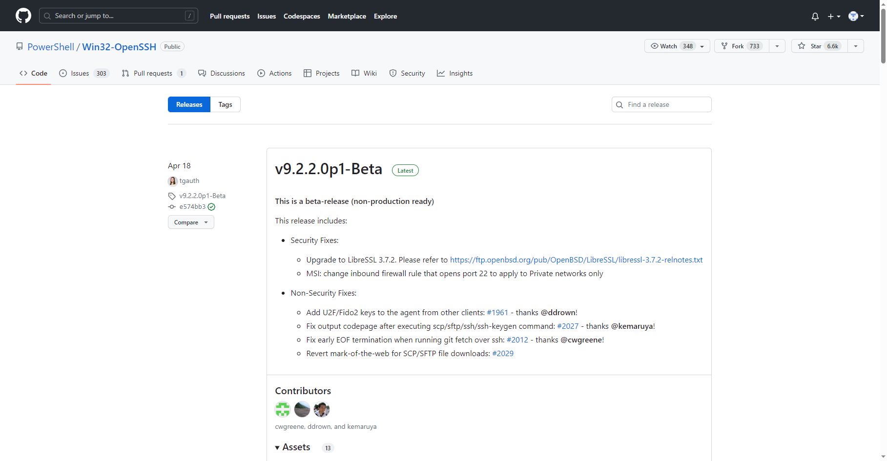
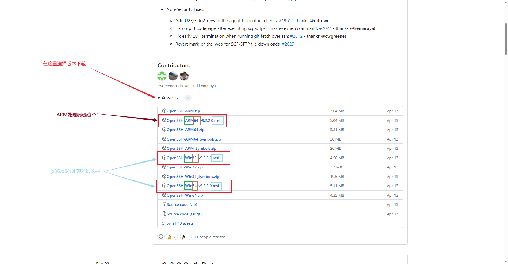

# Windows 7安装SSH

相比Win10和Win11的推荐方法，Win7上安装的方法就更加传统和常见了。对于网络通畅的人来说，可能Win10和Win11的方法更轻松。不过很可惜，中国的网络似乎不太通畅。

现在要讲的方法也是需要你网络通畅一点，不然其实也有点折腾，而且可能同样无法保证安全性。原因在于：

1. 你可能无法访问Github.com
2. 如果无法访问，你就要找别人要安装程序或自己上网寻找，而这么做要保证安全性是相当麻烦的，除非你赌了。

第一点和Win10上的一样，需要网络通畅；第二点其实就是Win10的传递优化功能，而且相比之下，可能“传递优化”功能还更安全（我也不知道它会不会检验hash）。

> 如果你在使用Win10或者Win11，请转到[这篇文章](Windows添加OpenSSH Server.md)。

## 正文

1. 获取安装程序：
   浏览器打开网址：<https://github.com/PowerShell/Win32-OpenSSH/releases>，选择一个版本（Win7的命令行可能太老了，我的电脑通过密钥登录其他系统或版本回显有些错乱，不太能用，考虑1.0.0版本吧），选择64位或32位的`.msi`文件下载（右键“我的电脑”，属性中查看）。
   
   
2. 然后运行`.msi`即可。期间可能会有安全卫士之类的防病毒软件警告，建议不清楚的朋友直接关闭防病毒软件再开始安装。
3. 安装完成后，按`Win+R`调出“运行”，输入`cmd`并回车以打开*cmd*。（在Win7上它默认就是有管理员权限的。）
4. 启动SSH服务端：（输入此命令并回车）`net start sshd`。

完事！