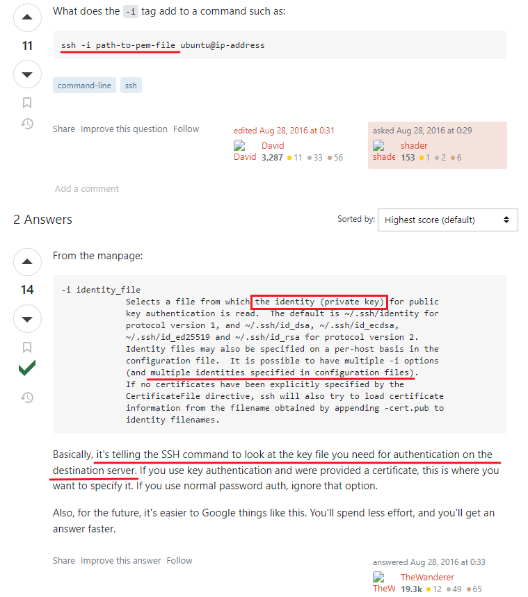

# ssh -i option

links:

1. <https://askubuntu.com/questions/817626/whats-the-meaning-of-i-in-ssh>

## Notes

It's reachable that retrieving public key from a private key. So the client doesn't need you tell it the content or location of the public key to send. For more details, read [this document](Retrieve SSH Public Key.md)👈.

## 1

