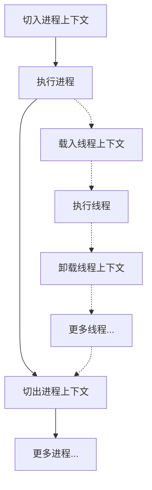
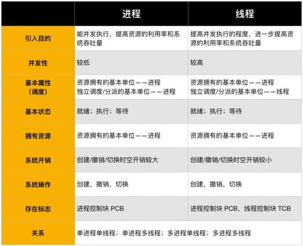

# 进程与线程是什么

Links:

1. <https://www.zhihu.com/question/25532384>
2. <https://www.zhangshilong.cn/work/29436.html>

## Mine

进程（Process），线程（Thread）。

至于子进程，那还是个进程，只是具有隶属关系而已，不是在于同一个进程之下，只是逻辑上可能会有控制上的隶属。在实际开发中，也有可能指的是线程而不是进程，看具体情况。辨别是进程还是线程看怎么创建的，进程都是`fork()`的，线程都是`proceed_c,,.()`的。

进程和线程其实都是CPU执行时间中的时间段概念，不过进程通常的意义不太一样，是编程语言对其具体实现的隐藏。简单来说，理解成*1*的比喻是可以的：<mark style="color:red">**进程=火车，线程=车厢**</mark>。

事实上，两者的执行都有一个“执行环境”，也叫做“上下文”。所有线程共用进程的上下文，并拥有自己的上下文。在执行时间开销上，也是切换线程上下文的比切换进程的要少的多。

详细信息见*2*，具象化比喻见*1*。

另外，在Linux系统上有些不一样，Linux系统没有线程，只有进程：

> 但是，**Linux只支持轻量级进程，不支持线程**。 在Linux上：
>
> 系统启动后的第一个进程是init，其PID为1。 init是系统内核直接运行的唯一进程。 除了init之外，每个进程还有一个父进程(PPID )。 每个进程有四个与用户和组相关联的标识号(real user ID、RUID ) real group ID、RGID有效用户标识号) effect user ID。 EUID )有效的组标识号(effect group ID，EGID )，<mark>在Linux内核2.4之前，线程的实现和管理方式完全是通过进程方式实现的。 从2.6版内核开始，可以实现独立的线程。 为了弥补不支持线程的缺点，Linux引入了线程组的概念。</mark> 这意味着<u>**该组中**</u>第一个轻量级进程的PID存储在进程描述符的tgid字段中。 getpid ) )系统调用返回当前进程的tgid值而不是pid值。 因此，多线程APP应用程序中的所有线程共享相同的pid。
>
> > 啊，这不就是把进程打包做了一个分组嘛。。。然后所谓“线程”的进程使用`getpid()`返回的是`tgid`，而组内的进程都共用一个`pid`。所以在linux下，使用`getpid()`的值关闭的是单独的线程，也就是组内的一个进程，而不会关闭整个线程组，也就是进程。

## 1

看了一遍排在前面的答案，类似”**进程是资源分配的最小单位，线程是CPU调度的最小单位“**这样的回答感觉太抽象，都不太容易让人理解。

做个简单的比喻：<mark>进程=火车，线程=车厢</mark>

- 线程在进程下行进（单纯的车厢无法运行）
- 一个进程可以包含多个线程（一辆火车可以有多个车厢）
- 不同进程间数据很难共享（一辆火车上的乘客很难换到另外一辆火车，比如站点换乘）
- 同一进程下不同线程间数据很易共享（A车厢换到B车厢很容易）
- 进程要比线程消耗更多的计算机资源（采用多列火车相比多个车厢更耗资源）
- 进程间不会相互影响，一个线程挂掉将导致整个进程挂掉（一列火车不会影响到另外一列火车，但是如果一列火车上中间的一节车厢着火了，将影响到所有车厢）
- 进程可以拓展到多机，进程最多适合多核（不同火车可以开在多个轨道上，同一火车的车厢不能在行进的不同的轨道上）
- 进程使用的内存地址可以上锁，即一个线程使用某些共享内存时，其他线程必须等它结束，才能使用这一块内存。（比如火车上的洗手间）－"互斥锁"
- 进程使用的内存地址可以限定使用量（比如火车上的餐厅，最多只允许多少人进入，如果满了需要在门口等，等有人出来了才能进去）－“信号量”

作者：知乎用户
链接：https://www.zhihu.com/question/25532384/answer/411179772
来源：知乎
著作权归作者所有。商业转载请联系作者获得授权，非商业转载请注明出处。

## 2

这个答案是好多年前写的，当时是在上下班路上的公车上，手机上敲打的，其实很多谬误的地方。文字也很多不准确，有歧义的地方。看到这么多朋友点赞，我尽量修正一下文字，希望更准确的表达我个人的理解吧。 2020年7月30日

___________________________

不请自来。
看见上面几位的回答我真的是醉了。说几句我的理解。
首先来一句概括的总论：**进程和线程都是一个时间段的描述，是CPU工作时间段的描述。是运行中的[程序指令](https://www.zhihu.com/search?q=程序指令&search_source=Entity&hybrid_search_source=Entity&hybrid_search_extra={"sourceType"%3A"answer"%2C"sourceId"%3A81152571})的一种描述，这需要与程序中的代码区别开来。**

另外注意这里我说的[进程线程](https://www.zhihu.com/search?q=进程线程&search_source=Entity&hybrid_search_source=Entity&hybrid_search_extra={"sourceType"%3A"answer"%2C"sourceId"%3A81152571})概念，和编程语言中的API接口对应的进程/线程是有差异的。

**下面细说背景**：
CPU+RAM+各种资源（比如显卡，光驱，键盘，GPS, 等等外设）构成我们的电脑，但是电脑的运行，实际就是CPU和相关[寄存器](https://www.zhihu.com/search?q=寄存器&search_source=Entity&hybrid_search_source=Entity&hybrid_search_extra={"sourceType"%3A"answer"%2C"sourceId"%3A81152571})以及RAM之间的事情。

**一个最最基础的事实**：CPU太快，太快，太快了，寄存器仅仅能够追的上他的脚步，RAM和别的挂在各[总线](https://www.zhihu.com/search?q=总线&search_source=Entity&hybrid_search_source=Entity&hybrid_search_extra={"sourceType"%3A"answer"%2C"sourceId"%3A81152571})上的设备则难以望其项背。那当多个任务要执行的时候怎么办呢？轮流着来?或者谁优先级高谁来？不管怎么样的策略，一句话就是在CPU看来就是轮流着来。而且因为速度差异，CPU实际的执行时间和等待执行的时间是数量级的差异。比如工作1秒钟，休息一个月。所以多个任务，轮流着来，让CPU不那么无聊，给流逝的时间增加再多一点点的意义。这些任务，在外在表现上就仿佛是同时在执行。

**一个必须知道的事实**：执行一段程序代码，实现一个功能的过程之前 ，当得到CPU的时候，相关的资源必须也已经就位，就是万事俱备只欠CPU这个东风。所有这些任务都处于就绪队列，然后由操作系统的调度算法，选出某个任务，让CPU来执行。然后就是PC指针指向该任务的代码开始，由CPU开始取指令，然后执行。

这里要引入一个概念：除了CPU以外所有的[执行环境](https://www.zhihu.com/search?q=执行环境&search_source=Entity&hybrid_search_source=Entity&hybrid_search_extra={"sourceType"%3A"answer"%2C"sourceId"%3A81152571})，主要是寄存器的一些内容，就构成了的进程的上下文环境。进程的上下文是进程执行的环境。当这个程序执行完了，或者分配给他的CPU时间片用完了，那它就要被切换出去，等待下一次CPU的临幸。在被切换出去做的主要工作就是保存程序上下文，因为这个是下次他被CPU临幸的运行环境，必须保存。

**串联起来的事实**：前面讲过在CPU看来所有的任务都是一个一个的轮流执行的，具体的轮流方法就是：***先加载进程A的上下文，然后开始执行A，保存进程A的上下文，调入下一个要执行的进程B的进程上下文，然后开始执行B,[保存进程](https://www.zhihu.com/search?q=保存进程&search_source=Entity&hybrid_search_source=Entity&hybrid_search_extra={"sourceType"%3A"answer"%2C"sourceId"%3A81152571})B的上下文\*。。。\*。

\*========= 重要的东西出现了========
**进程和线程*就是这样的背景出来的****，两个名词不过是对应的CPU时间段的描述，名词就是这样的功能。\***

- **进程就是上下文切换之间的程序执行的部分。是运行中的程序的描述，也是对应于该段CPU执行时间的描述。**
- **在软件编码方面，我们说的进程，其实是稍不同的，编程语言中创建的进程是一个[无限loop](https://www.zhihu.com/search?q=无限loop&search_source=Entity&hybrid_search_source=Entity&hybrid_search_extra={"sourceType"%3A"answer"%2C"sourceId"%3A81152571})，对应的是tcb块。这个是操作系统进行调度的单位。所以和上面的cpu执行时间段还是不同的。**
- **进程，与之相关的东东有寻址空间，寄存器组，[堆栈空间](https://www.zhihu.com/search?q=堆栈空间&search_source=Entity&hybrid_search_source=Entity&hybrid_search_extra={"sourceType"%3A"answer"%2C"sourceId"%3A81152571})等。即不同的进程，这些东东都不同，从而能相互区别。**

***线程是什么呢？
\***进程的颗粒度太大，每次的执行都要进行进程上下文的切换。如果我们把进程比喻为一个运行在电脑上的软件，那么一个软件的执行不可能是一条逻辑执行的，必定有多个分支和多个[程序段](https://www.zhihu.com/search?q=程序段&search_source=Entity&hybrid_search_source=Entity&hybrid_search_extra={"sourceType"%3A"answer"%2C"sourceId"%3A81152571})，就好比要实现程序A，实际分成 a，b，c等多个块组合而成。那么这里具体的执行就可能变成：

程序A得到CPU =》CPU加载上下文，开始执行程序A的a小段，然后执行A的[b小段](https://www.zhihu.com/search?q=b小段&search_source=Entity&hybrid_search_source=Entity&hybrid_search_extra={"sourceType"%3A"answer"%2C"sourceId"%3A81152571})，然后再执行A的c小段，最后CPU保存A的上下文。

这里a，b，c的执行是共享了A进程的上下文，CPU在执行的时候仅仅切换线程的上下文，而没有进行进程上下文切换的。进程的上下文切换的时间开销是远远大于线程上下文时间的开销。这样就让CPU的有效使用率得到提高。这**里的a，b，c就是线程，也就是说线程是共享了进程的上下文环境，的更为细小的CPU时间段。线程主要共享的是进程的[地址空间](https://www.zhihu.com/search?q=地址空间&search_source=Entity&hybrid_search_source=Entity&hybrid_search_extra={"sourceType"%3A"answer"%2C"sourceId"%3A81152571})。**

**到此全文结束，再一个总结：**

**进程和线程都是一个时间段的描述，是CPU工作时间段的描述，不过是颗粒大小不同。**

**注意这里描述的进程线程概念和实际代码中所说的进程线程是有区别的。编程语言中的定义方式仅仅是语言的实现方式，是对进程线程概念的物化**。

作者：zhonyong
链接：https://www.zhihu.com/question/25532384/answer/81152571
来源：知乎
著作权归作者所有。商业转载请联系作者获得授权，非商业转载请注明出处。