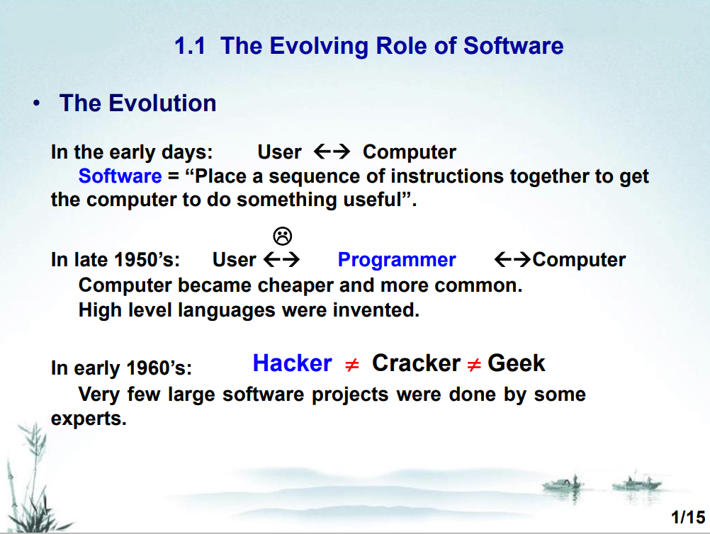
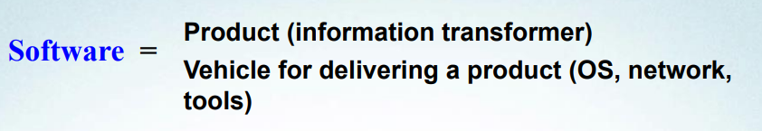
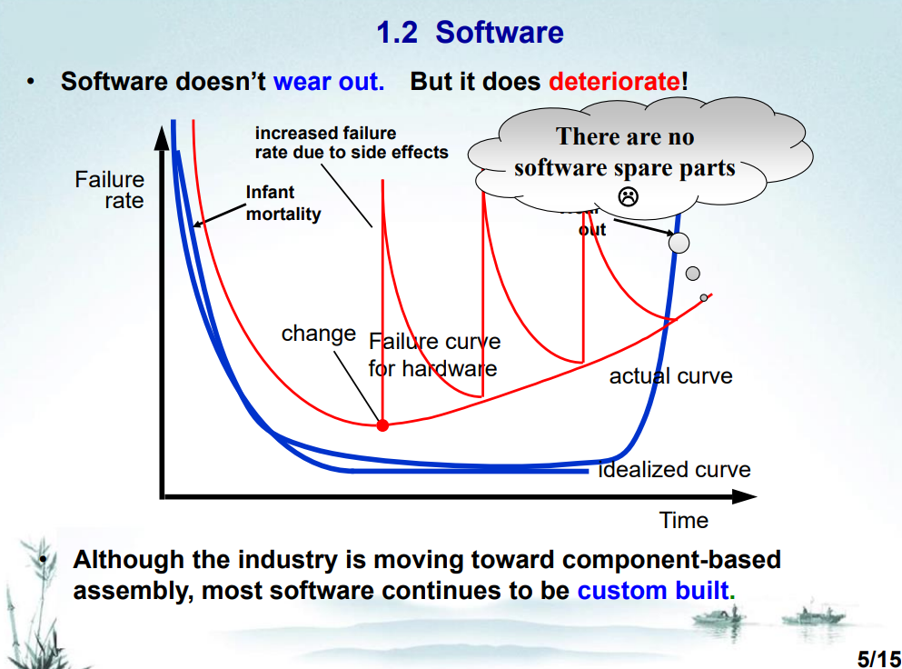

# EE308FZ 笔记A

## Ch.1 Introduction to Software Engineering

### 软件的角色发展

#### 交互关系发展

第一阶段：用户 ←→ 计算机
第二阶段：用户 ←→ 程序员 ←→ 计算机

关于黑客骇客：[view](../关于黑客骇客极客.md)

#### 软件角色

产品或产品的传递者
Product or Carrier of Product

### Software

软件由：指令、数据结构和文档等 组成。

软件不会过时，但会恶化(deteriorate)。尽管逐渐转向模块化组建软件，但大部分软件仍然是定制的。

infant mortality: 早期故障

### The Changing Nature of Software

#### 软件类型

1. 系统软件
2. 应用软件
3. 工程/科学软件
4. 嵌入式软件
5. 生产线软件
6. 网页应用
7. 人工智能软件

