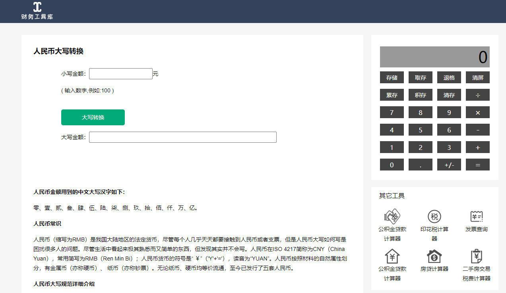

# 大写数字

**人民币金额用到的中文大写汉字如下：**

零、壹、贰、叁、肆、伍、陆、柒、捌、玖、拾、佰、仟、万、亿。

零、壹、贰、叁、肆、伍、陆、柒、捌、玖、拾、佰、仟、万、亿、元、角、分、整(正)。

链接：[Here](https://tool.gaodun.com/rmb.html)


<iframe style="width:100%; height:600px" src="https://tool.gaodun.com/rmb.html"/>



预览：

